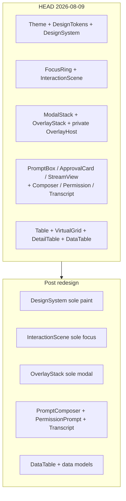
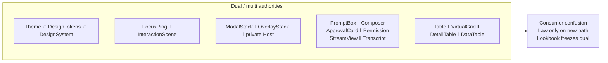
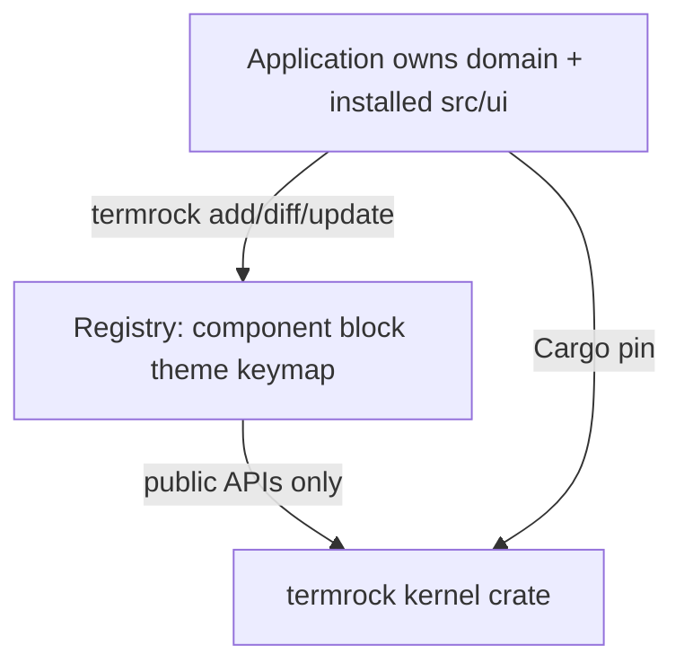
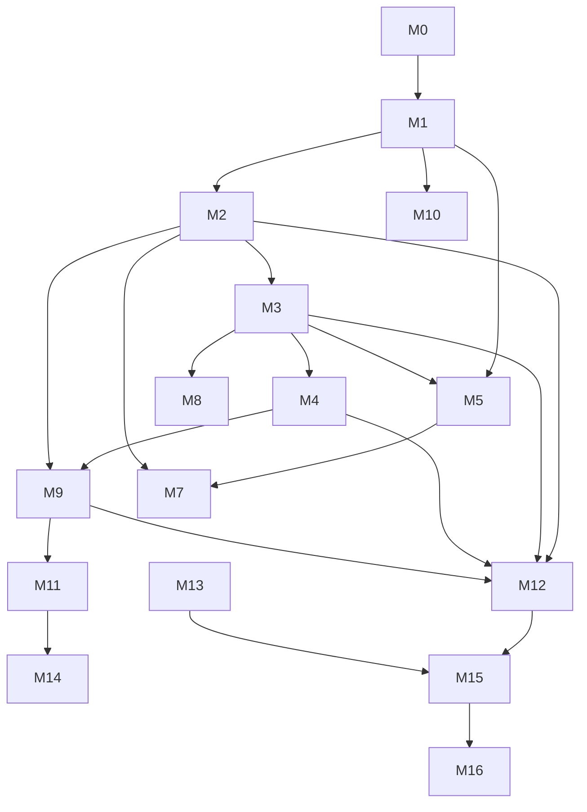

# Pre-1.0 Deliberate Breaking-Change Proposal for TermRock

| Field | Value |
|-------|-------|
| **Title** | Pre-1.0 public API redesign (deliberate breaks) |
| **Date** | 2026-08-09 |
| **Status** | Accepted execution SoT — **M1–M3 landed** (`0060`–`0062`); next M4 OverlayStack-only / Form interim remainder |
| **Author** | TermRock architecture (elevated from `docs/design/pre-1.0-api-redesign.md`) |
| **Scope** | Every public module / major type in `termrock` + `termrock-lookbook` (+ future `termrock-studio`) |
| **Authority** | `Agents.md` forward-only; hybrid kernel + source-owned registry |
| **Inventory basis** | Live tree as of migrations `0001`–`0059`; `docs/api/public-api.txt` (~27k lines / ~13.5k `pub` items); verified against source 2026-08-09 |
| **Prior draft** | `docs/design/pre-1.0-api-redesign.md` (~1169 lines) — elevated, not copied; stale claims corrected below |
| **Next migration number** | `0060` = **M1/Break A** (M0 never takes a migration number) |
| **Non-goal** | Compatibility facades, long-lived deprecated aliases, parallel old/new public APIs |

---

## Overview

TermRock’s public surface grew by **accretion**: each v0.12 slice introduced a better abstraction **beside** an older one. Consumers face dual (sometimes triple) authorities for paint, focus, modals, prompts, permissions, streams, and grids. The crate root re-exports five modules wholesale, teaching that TermRock is a flat bag of types rather than a layered capability system.

This proposal is a **deliberate pre-1.0 redesign**. Every major public type gets an action: Preserve / Rename / Move / Split / Redesign / Deprecate (one milestone max) / Remove / Install (source-owned). Weak abstractions die even when lookbook still uses them.

**End state in one sentence:** one paint authority (`DesignSystem`), one focus+hit authority (`InteractionScene` **HEAD API**, C0), one modal authority (`OverlayStack::open`), one grid (`DataTable` + `data::*` after parity matrix), one prompt (`PromptComposer`), one trust surface (`PermissionPrompt`), one stream (`Transcript`), module-path imports only, product chrome in the source-owned registry, Studio dogfooding public APIs only.

**Critical ordering:** M3 deletes FocusRing **and** collection focus flags **and** Form field focus (interim contract) together; M5 lands UiIntent table variants before KD-19 DataTable bridge; M7 deletes old grids only after parity matrix P1–P18.



---

## Background

### Binding laws (Agents.md)

1. **Forward-only, modern-first** — choose the better API; never keep weak shapes for compatibility.
2. **One authority per concern** — dual stacks are defects, not features.
3. **Phosphor default stays shippable** and fully re-themable; mono/narrow first-class.
4. **Domain-neutral kernel** — product chrome → source-installed registry when appropriate.
5. **Every break** ships with next sequential `migrations/00xx-*.md` + `MIGRATING.md` row same commit.
6. **Work lands on `main`**, independently green gates, DCO sign-off (`git commit -s`).
7. **Focus-visible panel hierarchy** — single-line borders; focus via `Role::BorderFocused`, never border weight.
8. **Cross-surface consistency** — one shared abstraction beats local one-offs.

### Related design SoTs (must stay consistent after each milestone)

| Doc | Role after this proposal |
|-----|--------------------------|
| `docs/design/terminal-design-system.md` | Paint taxonomy target; `DesignSystem` sole root |
| `docs/design/semantic-interaction-architecture.md` | FocusGraph-in-scene; kill public FocusRing |
| `docs/design/overlay-stack.md` | OverlayStack sole modal Esc/geometry |
| `docs/design/component-anatomy-spec.md` | Part×state recipes |
| `docs/design/source-owned-registry.md` | Kernel vs install boundary |
| `docs/design/data-presentation.md` | DataTable + data models |
| `docs/design/showcase-workbench.md` | GAP-WB-1 dual ApprovalCard / PromptBox |
| `docs/design/termrock-agent.md` | Agent chrome authority |
| `docs/design/termrock-studio.md` | Lookbook → Studio |
| `MIGRATING.md` + `migrations/*` | Agent-migratable history |

### Verified HEAD inventory claims (corrects draft staleness)

| Claim in older draft / docs | Verified HEAD (2026-08-09) |
|-----------------------------|----------------------------|
| `FocusRing` public? | **Yes.** `interaction/mod.rs` re-exports `FocusRing`, `FocusTarget`, `FocusOutcome`. Lookbook `app.rs` + `focus.rs` are ring-based. Comment: “remains for lookbook until fully migrated”. |
| `ModalStack` public? | **Yes.** Re-exported; lookbook `app.rs` owns `ModalStack<PrototypeModal>`. |
| `OverlayHost` public? | **No.** Private module `interaction/overlay.rs` (`OverlayHost`, private `OverlayId`/`OverlayKind`/`OverlayLayer`). Not in `pub use`. Architecture foundation doc still names it — **doc lag**. |
| Dual `OverlayId`? | **Yes, in-tree.** Private `overlay.rs` and public `overlay_stack.rs` each define `OverlayId` + `OverlayKind` — dead dual type, not dual public API. |
| `EscCascade` / `OverlayController` public? | **No.** Private modules; controller still takes `FocusRing` for restore. |
| `DesignSystem` sole paint? | **No.** Thin wrapper (`DesignSystem { tokens: DesignTokens }`). Widgets are Theme/Tokens-heavy: many public constructors take `&Theme` and/or `&DesignTokens` (e.g. PermissionPrompt, List, Panel, PromptComposer takes **both**); DesignSystem is rarely the constructor type. Exact match counts drift — do not treat numeric “~N” as a gate. |
| `PanelEmphasis` vs `PanelChrome`? | **Both live.** Widget enum maps to token enum via `PanelEmphasis::chrome()`. |
| Dual agent stacks? | **Both public.** `ApprovalCard`/`PromptBox`/`StreamView` + `PermissionPrompt`/`PromptComposer`/`Transcript`. Lookbook still has ApprovalCard + PromptBox interactors/stories. |
| AgentWorkbench seed? | Still wires **PromptBox + ApprovalCard** (`GAP-WB-1` in showcase-workbench). |
| Quad grids? | **Yes.** `Table`, `VirtualGrid`, `DetailTable`, `DataTable` + `data_view::*` models all public. |
| Collection intents? | List/Tree have `handle_intent` + `handle_key` bridge. **DataTable only `handle_key`**. |
| Widget focus flags? | List/Tree/Table/Form state store `focused` / own focus ids — **second focus truth** vs scene. |
| Root re-exports? | `lib.rs` blanket `pub use` of capability, interaction, layout, perf, style. Entry doc still says “Entry point: Theme”. |
| `public-api.txt` size | ~27 091 lines; ~13 499 `pub` lines (draft said ~13.8k lines — undercount; surface grew through 0059). |
| Latest migration | `0059-v0.12.0-overlay-stack-helpers.md` |

### Structural diagnosis (why break hard)



| Symptom | Evidence | Cost |
|---------|----------|------|
| Dual paint | Nested Theme/Tokens/System; many widgets take `&Theme` and/or `&DesignTokens` (DesignSystem barely used as constructor param) | Density/glyphs/recipes optional; phosphor RGB leaks |
| Dual focus | FocusRing public + scene; widget `*State.focused` | Two truths; Esc restore split across controller+ring |
| Dual modal | ModalStack public; OverlayStack public; Host private leftover | Esc law bypass; lookbook on old stack |
| Dual product widgets | Agent duals + StreamView | Safety law (default-deny) only on PermissionPrompt path |
| Quad data grids | Four public widgets + shared models under-used | No single consumer path for large data |
| Crate-root dump | Five module re-export blocks | Flat namespace; no ownership signal; unreadable public-api |
| Scroll free-fn sprawl | ~18 `pub fn` helpers plus structs/re-exports; `scroll` root + `scroll::render` near-duplicates | Unclear math vs paint vs policy |
| Chrome enum clones | `PanelEmphasis` (widget) vs `PanelChrome` (tokens) | Same meaning, two names |
| Doc lag | `architecture-foundation.md` cites OverlayHost + FocusRing | Agents implement wrong contract |

**Principle:** one authority per concern. Weak public abstractions die even if lookbook still uses them.

---

## Goals & Non-Goals

### Goals

1. **One authority** for paint, focus, overlays, agent prompt/trust/stream, and tabular data.
2. **Module-path imports** as the only public discovery path (no root dump).
3. **Intent-first interaction** for collections; keymaps dispatch intents; widgets pure outcomes.
4. **Scene-owned focus**; widgets receive `focused: bool` for the frame; no internal focus authority.
5. **Kernel vs registry** boundary explicit and enforceable.
6. **Independently green milestones** M0…Mn; lookbook/tests migrate same commit as each break.
7. **CI denylist** so dual authorities cannot re-enter.
8. **Migration docs** agent-complete for every break (`0060+`).

### Non-Goals

- Stable 1.0 freeze (still pre-stable after these breaks until a later freeze decision).
- Multi-crate kernel split (`termrock-core` etc.) — optional later.
- Windows/ConPTY completeness as a redesign driver.
- Long deprecation windows or eternal `#[deprecated]` aliases.
- Preserving weak APIs because Tailrocks apps use them — apps pin and migrate.
- Implementing registry CLI completeness before dual-stack deletion (pilot only after agent duals die).

---

## Full Inventory Matrix

**Legend:** **P** reserve · **R** ename · **M** ove · **S** plit · **D** esign · **Dep** one-milestone deprecate then remove · **X** remove · **I** nstall (source-owned)

### Crate root (`crates/termrock/src/lib.rs`)

| Surface | Action | Target |
|---------|--------|--------|
| `pub mod {ansi_text, capability, input, interaction, keymap, layout, osc, patterns, perf, runtime, scroll, style, text, widgets, crossterm}` | **P** modules | Keep tree; tighten interiors; consider `pub mod data` |
| Blanket `pub use capability::{…}` | **X** | Module path only |
| Blanket `pub use interaction::{…}` | **X** | Module path only |
| Blanket `pub use layout::{…}` | **X** | Module path only |
| Blanket `pub use perf::{…}` | **X** | Module path only |
| Blanket `pub use style::{…}` | **X** | Module path only |
| Doc “Entry point: Theme” | **R** | Entry: `style::DesignSystem` + `interaction::InteractionScene` + `runtime::run` |

### `style/`

| Surface | Action | Target |
|---------|--------|--------|
| `Role` | **P** (+ small **S** if surface ladder expands) | Kernel semantic roles; keep exhaustiveness macro tests |
| `Theme` | **R** + **D** | → `RolePalette` (Role → Style only). Not frame authority |
| `DesignTokens` | **M** into `DesignSystem` | Collapse nested wrapper; delete public type |
| `DesignSystem` | **D** | **Sole** paint authority: palette + density + motion + glyphs + spacing + selection + capability + recipes |
| `Density`, `Motion`, `GlyphSet`, `SelectionChrome`, `SpacingScale` | **P** | Nested under system / `style::tokens` |
| `PanelChrome`, `PanelRecipe`, `ListRowRecipe`, `ListRowVisualState` | **P** | Recipes stay; only chrome enum for panels |
| `Rgb`, `color()`, public phosphor consts (`PHOSPHOR_GREEN`, `PHOSPHOR_DARK`, `PREVIEW_CARD`) | **M** / **I** | `style::palette` (crate-internal for default builder); brand pack → registry; `DesignSystem::phosphor()` stays in crate |
| `faded` | **P** | Utility |
| `ColorCapability`, `quantize_*` | **P** | Prefer `DesignSystem::quantize`; drop bare `quantize_theme` as primary |
| `Appearance`, `AppearanceThemeMap`, `theme_for_appearance` | **R** | Map returns `DesignSystem`; rename fn → `system_for_appearance` |
| `CapabilityPreviewHost` + preview types | **M** | `capability::preview` (not style) |

### `interaction/`

| Surface | Action | Target |
|---------|--------|--------|
| `InteractionScene`, layers, elements, outcomes, `SceneError` | **P** + **D** (absorb focus) | **Sole** focus + hit + layer + Esc-for-layers authority |
| `UiIntent`, `NavigationMove`, `PageMove` | **P** | Expand as needed |
| `default_list_intent` / `_table_` / `_tree_` | **R** | `keymap::defaults::{list,table,tree}` or `intent::defaults` |
| `OverlayStack`, `OverlaySpec`, `OverlayPolicy`, placement types, `place_overlay` | **P** + **S** | Placement math → `layout::overlay`; stack owns law |
| `OverlayId`, `OverlayKind` (stack) | **P** | Single definition |
| Private `overlay::{OverlayHost, OverlayId, OverlayKind, OverlayLayer}` | **X** | Delete after zero internal refs |
| `FocusRing`, `FocusTarget`, `FocusOutcome` | **X** public | C0 uses **existing** InteractionScene API; lookbook same MS as F |
| `ModalStack`, `classify_click`, `render_backdrop` | **X** / **M** | ModalStack **X**; classify_click **X**; render_backdrop → stack-aware paint helper |
| `EscCascade`, `OverlayController` | **X** (already private) | Delete when zero refs |
| `SemanticScene` | **X** public same MS as C0 | Parallel register stack dies |
| `SemanticElement`, `SemanticRole` | **P** | View data; optional C1 `semantics()` later |
| `HitRegion`, `HoverState` | **P** | Widget-local hover ok; may later attach to scene |
| `Outcome<T>` | **R** | `widgets::Outcome` or `interaction::WidgetOutcome` — stop dual name with scene outcomes |
| `dispatch_keymap_action` | **M** | `keymap::dispatch` |

### `input/` / `keymap`

| Surface | Action | Target |
|---------|--------|--------|
| Neutral `Event`, key/mouse types | **P** | Kernel |
| `Keymap`, `KeyBinding`, `KeyChord`, `Visibility`, glyph helpers | **P** | Kernel |
| App-default agent/vim maps | **I** | Registry packages when extracted |

### `layout/`

| Surface | Action | Target |
|---------|--------|--------|
| Responsive: `ViewportClass`, `ContractionStage`, `ResponsiveSurface`, … | **P** | Kernel grammar |
| `WorkSurface`, `RegionSpec`, workspace tree | **P** | Kernel |
| `DialogSpec`, `resolve_dialog`, `centered_rect`, `place_overlay` callers | **M** / unify | One placement API under `layout` |
| `Slots` | **R** | → `VerticalSlots` (clash with `PanelSlots`) |
| `bottom_rows` | **P** | |
| `render_dialog_shell`, `render_scrollable_dialog_body` | **M** | `widgets::dialog` paint helpers or `layout::dialog` |

### `scroll/`

| Surface | Action | Target |
|---------|--------|--------|
| Math free-fns (`max_offset`, `apply_delta_*`, thumb, track) | **S** | `scroll::math` — single impls |
| Paint (`render_scrollbar`, line offset render) | **S** | `scroll::paint` |
| Policies (`TailScroll`, `DialogScroll`, follow glue) | **S** | `scroll::policy` |
| Duplicate `apply_scroll_delta` / `apply_delta_u16` / render variants | **X** merge | One typed API |
| `scroll_selectable_list`, `scroll_hint_spans` | **M** | Widget or keymap defaults |
| `Measured`, `ScrollAxes`, `ScrollAxis`, `ScrollDelta`, `ScrollSpan` | **P** after cleanup | |

### `runtime/` / `crossterm/`

| Surface | Action | Target |
|---------|--------|--------|
| `run`, `RunOptions`, `FrameTick` | **P** + minor **D** | Resolve caps at enter; optional `caps` on tick |
| `Session`, `SessionOptions` | **P** | Independent options stay |
| `CrosstermBackend` re-export | **P** | Feature-gated |

### `capability/` / `perf/`

| Surface | Action | Target |
|---------|--------|--------|
| Profiles, doctor, `resolve_capabilities`, env hints, `SessionFlags` | **P** | Kernel |
| Stream coalescer, budgets, follow mode, dirty flags | **P** | Kernel kits; hot-path widgets must use |
| `widgets::data_view::bench` (`data_view_bench` re-export) | **M** | `#[cfg(feature = "bench")]` or tests-only; **not** under `perf/` |
| `CapabilityPreviewHost` (after move from style) | **P** under capability | |

### `text/` / `ansi_text/` / `osc/`

| Surface | Action | Target |
|---------|--------|--------|
| Display cols, clip, sanitize, fixed-prefix segments | **P** | Unicode kernel |
| `ansi_text` | **M** optional | Under `text::ansi` |
| OSC encode + request types | **P** | |

### `patterns/`

| Surface | Action | Target |
|---------|--------|--------|
| `layout_agent_shell`, agent_workbench, ops, resource, studio | **I** | Source-owned blocks |
| Interim | **X** after J (M11) | Prefer hard remove; feature default-off only if dual-free |

### Widgets — primitives (kernel)

| Surface | Action | Target |
|---------|--------|--------|
| `Panel`, `PanelSlots` | **P** + **R** chrome | Drop `PanelEmphasis`; use `PanelChrome` only; take `&DesignSystem` |
| `List`, `ListRow`, `ListState`, `RowRole` | **P** + **D** state | Selection/scroll only; focus from scene |
| `Tree`, `Tabs`, `SplitPane`, `Progress` | **P** | |
| `TextInput`, `TextArea`, edit core | **P** | |
| `Dialog` + overlay openers | **P** + stack-only | No non-stack modal path |
| `Picker`, `CommandPalette`, `CompletionMenu` | **P** | OverlayStack clients |
| `HintBar` + helpers | **P** | Driven by `Keymap` |
| `ActionBar`, `StatusBar` | **P** | |
| `Toast` | **P** | |
| `Viewport` | **R** / **D** | Clarify vs Panel content; or fold |
| `Selection` | **P** | Shared multi-select model |
| `EmptyState`, `LoadingView`, `ErrorView`, `Skeleton`, `Banner` | **P** | View-state chrome |
| `JumpOverlay` | **P** (neutral) or **I** skins | Stack story |
| `ImageSurface` | **P** | Capability-gated |
| `CodeBlock`, `MarkdownView`, `DiffView` | **P** | |
| `LogPane` | **P** | Bound scrollback stays |
| `ComposedRow` | **P** | Anatomy |
| Charts / meters | **P** | Neutral viz |
| Controls (Checkbox, Select, …) | **P** | |
| Content (Heading, Paragraph, Surface, Alert, …) | **P** | Take `DesignSystem` |

### Widgets — data presentation

| Surface | Action | Target |
|---------|--------|--------|
| `data_view::{VirtualWindow, ColumnModel, SelectionModel, LoadState, …}` | **P** + **M** | Module `termrock::data` |
| `DataTable` + state/outcome | **D** | Canonical interactive grid |
| `Table` + `TableState` + `resolve_widths` | **X** as public name | Absorbed; width solver → `data::resolve_widths` |
| `VirtualGrid` | **X** public name | Implementation detail inside DataTable |
| `DetailTable` | **I** or mode | Product detail layout → registry or DataTable row template |

### Widgets — agent / permission / prompt

| Surface | Action | Target |
|---------|--------|--------|
| `PromptComposer` + state/outcome | **P** | Flagship |
| `PromptBox*` | **X** | Stories → Composer |
| `PermissionPrompt` + queue + request model | **P** | Trust authority |
| `ApprovalCard*` | **X** crate public | Optional **I** skin on PermissionPrompt |
| `Transcript` | **P** | Stream authority |
| `StreamView`, `StreamItem*` | **X** or **I** | → Transcript projection |
| `ToolCard`, `ThinkingBlock`, `TokenMeter`, `Timeline*` | **I** | Product chrome |
| `ModeRibbon`, `PlanReview`, `QuestionFlow`, `SessionPicker`, `TaskRail`, `WorkbenchMode` | **I** | Agent blocks |
| `session_picker_handle_key` | **X** / absorb | Block-local |

### Widgets — forms / misc

| Surface | Action | Target |
|---------|--------|--------|
| `Form`, `FormField`, `FormSection`, `FormState`, `FormOutcome` | **D** | Composed controls + scene focus + validation display |
| `ThemePicker`, presets | **I** | Theme pack + Studio |
| `DesignInspector` | **M** | Studio crate |
| `FormWizard`, `OpsDashboard*`, `ResourceBrowser*`, `SettingsShell*` (blocks) | **I** | Application blocks |
| `BlockChrome` | **P** or fold into Panel recipes | |

### Lookbook / Studio

| Surface | Action | Target |
|---------|--------|--------|
| `termrock-lookbook` story/interactor/svg | **D** → Studio | Story contract; public APIs only |
| Lookbook `focus.rs` FocusRing | **X** | Scene-only |
| Lookbook ModalStack | **X** | OverlayStack |
| Dual stories PromptBox/ApprovalCard | **X** | Composer + Permission only |
| Story render `fn(&mut Frame, Rect, &Theme)` | **R** | `&DesignSystem` + scene/overlay in context |

### Docs / contracts

| Surface | Action | Target |
|---------|--------|--------|
| `architecture-foundation.md` OverlayHost/FocusRing | **Update** | Scene + OverlayStack only |
| Quality / handbook / contracts | **P** | Bind to new names per MS |
| `public-api.txt` | Regen each MS | CI snapshot |

---

## Kernel vs registry distribution rule (binding)

| Lives in crate (kernel) | Source-installed (registry / app-owned) |
|-------------------------|----------------------------------------|
| `InteractionScene`, `OverlayStack`, intents, hit regions | Agent chrome skins, approval **wording** layouts |
| `DesignSystem` / roles / recipes / quantize | Brand themes, phosphor **marketing pack** variants |
| Unicode text, scroll math, input, session | App keymaps, vim collection maps |
| Neutral primitives: Panel, List, Tree, Text*, Dialog shell, controls | Patterns (`AgentShell`, Workbench, OpsDashboard, StudioShell, …) |
| Data models + **one** DataTable | ToolCard / Timeline product chrome; DetailTable product layout |
| Capability detection + doctor | Showcase / Studio app code |
| PromptComposer engine, Permission model, Transcript engine | ThemePicker UI, DesignInspector (Studio), ModeRibbon packs |
| Perf coalescer / budgets / follow | Demo runtimes |

**Rule of thumb:** bugfix must reach every consumer without merge conflict → crate. Changing code is how you brand → registry.



---

## Proposed Design — Break Chapters

Each chapter is shippable as one or more migrations. **No chapter leaves two public authorities for the same concern.**

---

### Break A — Crate root re-export purge

#### 1. What is structurally wrong

Root re-exports teach consumers that TermRock is a bag of types. Ownership (who owns focus? paint? placement?) is invisible. `public-api.txt` becomes a 27k-line flat dump; accidental coupling thrives. Doc still claims “Entry point: Theme”.

#### 2. New API

```rust
// crates/termrock/src/lib.rs — modules only
//! termrock: domain-neutral TUI kernel.
//! Entry: [`style::DesignSystem`], [`interaction::InteractionScene`],
//! [`interaction::OverlayStack`], [`runtime::run`].

pub mod ansi_text;
pub mod capability;
// pub mod data;  // lands with Break H / M7 — do not introduce empty root module in Break A
pub mod input;
pub mod interaction;
pub mod keymap;
pub mod layout;
pub mod osc;
// patterns: feature-gated then removed (Break M)
pub mod perf;
pub mod runtime;
pub mod scroll;
pub mod style;
pub mod text;
pub mod widgets;

#[cfg(feature = "crossterm")]
pub mod crossterm;

// No blanket pub use.
```

#### 3. Before / after

```rust
// Before
use termrock::{Theme, OverlayStack, UiIntent, DesignTokens, List, Density};

// After
use termrock::style::{DesignSystem, Density};
use termrock::interaction::{OverlayStack, UiIntent};
use termrock::widgets::List;
```

#### 4. Migration path

1. Stop adding new root re-exports immediately (policy).
2. Migration **`0060`** (M1/A fixed number): delete all root `pub use`; fix in-tree lookbook/tests/docs/examples.
3. Consumer file: search-replace import paths; no logic change.

#### 5. What becomes simpler

One import path per type; rustdoc modules match mental model; public-api inventory is navigable by module.

#### 6. New constraints

- No `termrock::Theme` at root (type may still exist under `style` until Break B rename).
- CI fails on new root re-exports.

#### 7. Required tests

- `public_api_no_root_reexports` — parse `lib.rs` / snapshot root items.
- Full `cargo test` + lookbook compile with module paths only.
- Regen `docs/api/public-api.txt` without root type dumps.

**Risks:** Low. Mechanical. Severity: L — miss in-tree import. Mitigation: full workspace compile.

---

### Break B — Theme/DesignTokens → single DesignSystem; styling recipes

#### 1. What is structurally wrong

Three nested “systems” (`Theme` ⊂ `DesignTokens` ⊂ `DesignSystem`) and most widgets still take bare `&Theme` or `&DesignTokens`. Recipes duplicate chrome enums (`PanelEmphasis` / `PanelChrome`). Phosphor RGB constants are public API surface. Capability quantize applies to Theme only, not whole system. Spec (`terminal-design-system.md`) already names DesignSystem sole root — tree lags.

```text
HEAD:
  Theme { role → Style }
  DesignTokens { theme, density, motion, glyphs, spacing, selection }
  DesignSystem { tokens: DesignTokens }   // thin alias

Target:
  RolePalette { role → Style }            // rename of Theme
  DesignSystem {
    palette, density, motion, glyphs, spacing, selection, capability, …
    // recipes methods live here
  }
```

#### 2. New API

```rust
/// Role → Style map only (was Theme).
pub struct RolePalette { /* … */ }

impl RolePalette {
    pub fn style(&self, role: Role) -> Style { /* … */ }
    pub fn phosphor() -> Self { /* … */ }
}

/// Sole paint authority for a frame / app shell.
pub struct DesignSystem {
    pub palette: RolePalette,
    pub density: Density,
    pub motion: Motion,
    pub glyphs: GlyphSet,
    pub spacing: SpacingScale,
    pub selection: SelectionChrome,
    pub capability: ColorCapability,
    // polarity/breakpoints/recipe book grow per terminal-design-system.md
}

impl DesignSystem {
    pub fn phosphor() -> Self { /* … */ }
    pub fn from_palette(palette: RolePalette) -> Self { /* … */ }
    pub fn density(self, d: Density) -> Self { /* … */ }
    pub fn style(&self, role: Role) -> Style { self.palette.style(role) }
    pub fn panel_recipe(&self, chrome: PanelChrome) -> PanelRecipe { /* … */ }
    pub fn list_row_recipe(&self, state: ListRowVisualState) -> ListRowRecipe { /* … */ }
    pub fn quantize(self, cap: ColorCapability) -> Self { /* … */ }
}

// Widgets
impl<'a> Panel<'a> {
    pub fn new(system: &'a DesignSystem) -> Self { /* … */ }
    pub fn chrome(self, chrome: PanelChrome) -> Self { /* … */ }
}
impl<'a, Id> List<'a, Id> {
    pub fn new(rows: &'a [ListRow<'a, Id>], system: &'a DesignSystem) -> Self { /* … */ }
}
```

**Removed public:** `DesignTokens`, `PanelEmphasis`, dual constructors taking Theme+Density separately as the primary path.

**Renamed:** `Theme` → `RolePalette` (hard rename; no long alias).

#### 3. Before / after

```rust
// Before
let theme = Theme::default();
let tokens = DesignTokens::new(theme.clone(), Density::Comfortable);
let sys = tokens.design_system();
Panel::new(&tokens).emphasis(PanelEmphasis::Focused);
List::new(&rows, &tokens);
PermissionPrompt::new(&theme);

// After
let system = DesignSystem::phosphor().density(Density::Comfortable);
Panel::new(&system).chrome(PanelChrome::Focused);
List::new(&rows, &system);
PermissionPrompt::new(&system);
```

#### 4. Migration path

1. Add `DesignSystem` methods covering every Theme/Tokens use (recipes, quantize).
2. Convert every widget constructor/render: `&Theme` / `&DesignTokens` → `&DesignSystem` (same commit as lookbook).
3. Delete `DesignTokens`, `PanelEmphasis`, dual constructors.
4. Rename `Theme` → `RolePalette`; update `AppearanceThemeMap`.
5. Handbook + recipes + contract matrix.

**No dual-constructor green commit.** Splitting B is allowed only as multiple commits inside **one** MS if each intermediate commit still fails denylist CI **or** is not merged to main alone. Exit of M2 is mechanical:

- Zero public fn signatures in `widgets/**` taking `&Theme` or `&DesignTokens` (or owned Theme for paint).
- Zero public types `DesignTokens`, `PanelEmphasis`.
- `Theme` either renamed to `RolePalette` same MS or **gone** from public API (no “primary path” leftover).
- PromptComposer HEAD `new(tokens, theme)` → `new(system)` only.

#### 5. What becomes simpler

One object passed down the tree; density/glyphs affect list rows without extra params; quantize once at frame edge.

#### 6. New constraints

- Widgets **must not** hardcode phosphor RGB in public paint paths.
- Custom brands: build `RolePalette` then `DesignSystem::from_palette`.
- Public signatures: no `&Theme` widget params.

#### 7. Required tests

- Role exhaustiveness + phosphor role snapshots.
- `panel_recipe_focus_uses_border_focused_not_heavy_glyphs`.
- `list_row_recipe_gutter_default_phosphor`.
- Quantize preserves non-color cues (selection gutter still present in mono).
- **Denylist CI (M2 exit):** no `Theme` / `DesignTokens` / `PanelEmphasis` in public widget signatures; public-api free of those names (RolePalette may remain).
- Lookbook SVG gate green under DesignSystem stories.

**Risks:** High mechanical churn. Severity: H — miss a constructor. Mitigation: rustc fix + denylist CI; do after A so import churn is separate; host shell frozen early (see Host contract).

---

### Break C — FocusRing → InteractionScene sole focus (HEAD API; C0 + C1)

> **M3 ships C0 + Break F together** (Issue 2): deleting public `FocusRing` without deleting public widget `set_focused`/`is_focused` would leave a dual focus authority across merges. See Break F and milestone table.

#### 1. What is structurally wrong

Two focus stacks. Lookbook and private `OverlayController` still depend on FocusRing. Architecture docs still name FocusRing as contract. Widget states store `focused: bool` / own focus ids (Break F). Public `SemanticScene` is a **parallel registration stack** with its own `begin_frame` / `register` / `focus_order` / `hit_test` — second discovery path even when InteractionScene is used for focus.

Verified: `interaction/mod.rs`:

```rust
// FocusRing remains for lookbook until fully migrated onto InteractionScene.
pub use focus::{FocusOutcome, FocusRing, FocusTarget};
// …
pub use scene::{… SemanticElement, SemanticRole, SemanticScene, …};
```

#### 2. API: existing HEAD vs optional reshape

**M3 strategy is C0, not a silent second redesign.** Call sites must compile against **today’s** `InteractionScene` surface (plus deletions). Any nicer API is **C1**, labeled as new work, not assumed.

##### 2.1 Existing public API (HEAD — use this in M3)

From `crates/termrock/src/interaction/scene.rs`:

```rust
// EXISTING (HEAD) — sole focus authority after C0
pub struct InteractionScene<Id, LayerId, Action> { /* … */ }

impl<Id, LayerId, Action> InteractionScene<Id, LayerId, Action> {
    pub const fn new() -> Self;
    pub fn begin_frame(&mut self); // clears elements; keeps focus + layers
    pub fn ensure_root(&mut self, layer: InteractionLayer<LayerId, Id>)
        where LayerId: Clone + PartialEq;
    pub fn push_layer(&mut self, layer: InteractionLayer<LayerId, Id>)
        where LayerId: PartialEq;
    pub fn remove_layer(&mut self, id: &LayerId) -> bool where LayerId: PartialEq;
    pub fn layers(&self) -> &[InteractionLayer<LayerId, Id>];
    pub fn top_layer(&self) -> Option<&InteractionLayer<LayerId, Id>>;
    pub const fn focused(&self) -> Option<&Id>;
    pub fn elements(&self) -> &[InteractionElement<Id, LayerId, Action>];
    pub fn register(
        &mut self,
        element: InteractionElement<Id, LayerId, Action>,
    ) -> Result<(), SceneError>
        where Id: PartialEq, LayerId: PartialEq;
    pub fn reconcile(&mut self) where Id: Clone + PartialEq, LayerId: PartialEq;
    pub fn focus_order(&self) -> Vec<&Id>;
    pub fn hit_test(&self, position: Position) -> Option<&InteractionElement<…>>;
    pub fn get(&self, id: &Id) -> Option<&InteractionElement<…>>;
    pub fn available_actions(&self) -> Vec<Action> where Action: Clone;
    pub fn action_available(&self, action: &Action) -> bool where Action: PartialEq;
    pub fn focus_move(&mut self, reverse: bool) -> InteractionOutcome<…>
        where Id: Clone + PartialEq, LayerId: PartialEq;
    pub fn focus(&mut self, id: Id) -> InteractionOutcome<…>
        where Id: Clone + PartialEq, LayerId: PartialEq;
    pub fn handle_key_tab_esc(&mut self, key: KeyEvent) -> InteractionOutcome<…>
        where Id: Clone + PartialEq, LayerId: PartialEq;
    pub fn handle_escape(&mut self) -> InteractionOutcome<…>
        where Id: Clone + PartialEq, LayerId: PartialEq;
    pub fn handle_mouse(&mut self, event: MouseEvent) -> InteractionOutcome<…>
        where Id: Clone + PartialEq, LayerId: PartialEq;
    pub fn dispatch_action(&self, action: Action) -> InteractionOutcome<…>
        where Action: PartialEq + Clone, Id: Clone;
}

// Element construction (HEAD)
impl InteractionElement<Id, LayerId, Action> {
    pub fn control(id: Id, layer: LayerId, area: Rect) -> Self;
    pub fn actions(mut self, actions: Vec<Action>) -> Self;
    // … other builders as in scene.rs
}
```

**Not present on HEAD** (do **not** document as current): `register_layer`, `set_focused`, `is_focused`, generic `handle_key` / `handle_pointer`, `semantics()`.

**Focus mutation today:** `focus(id)`, `focus_move`, mouse handlers, `reconcile` — not `set_focused`. Query: `focused()`.

**Overlay cooperation (HEAD):** `OverlayStack::sync_scene_layers` / `sync_scene_layers_unit` push overlay layers onto a scene after `ensure_root`.

##### 2.2 C0 (M3) — authority kill only

| Action | Surface |
|--------|---------|
| **X** public | `FocusRing`, `FocusTarget`, `FocusOutcome` (+ delete `focus.rs` when zero refs) |
| **X** public register stack | `SemanticScene` (see §2.4) |
| **P** | `InteractionScene` methods above — **no required rename in M3** |
| **P** | `SemanticElement` / `SemanticRole` as **view data** if still useful for tooling, but no parallel `SemanticScene` owner |
| **Ship with F** | Delete public widget `set_focused` / `is_focused` (Break F) |

Optional tiny **helpers** allowed in C0 only if pure sugar (not a second stack), e.g.:

```rust
// NEW TO ADD IN M3 (optional sugar) — not required for FocusRing delete
impl<Id: PartialEq, LayerId, Action> InteractionScene<Id, LayerId, Action> {
    /// Convenience: `self.focused() == Some(id)`.
    pub fn is_focused(&self, id: &Id) -> bool {
        self.focused() == Some(id)
    }
}
```

##### 2.3 C1 (optional later MS — not M3) — scene API reshape

Only if still painful after C0. Each item is **new to add**, separately migrated:

| Proposed addition | Purpose | Notes |
|-------------------|---------|--------|
| `pub fn semantics(&self) -> impl Iterator<Item = SemanticHit<'_, Id>>` | Tooling query fold of SemanticScene | Replaces dual register |
| Broader key routing beyond Tab/Esc | Apps still own collection keys via intents | Do not invent `handle_key` that steals widget keys |
| FocusGraph naming | Per `semantic-interaction-architecture.md` | Grow **inside** `InteractionScene`; rename optional |

C1 must not reintroduce dual public focus stacks.

##### 2.4 SemanticScene (Issue 7) — explicit action **same MS as C0**

| Surface | Action | Detail |
|---------|--------|--------|
| `SemanticScene` | **X** public type + methods | No parallel `begin_frame`/`register` |
| `SemanticElement`, `SemanticRole` | **P** or **M** | Keep as structs; consumers build views from `scene.elements()` (map role/area/id) |
| Call sites | **In-tree only today** | `SemanticScene` appears in `scene.rs`, `interaction/mod.rs`, root re-export — **no lookbook consumer** found under `crates/`. M3 deletes export + type; tests that construct `SemanticScene` migrate to `InteractionScene` element queries. |
| `scene.semantics()` | **C1 optional** | Not required to delete SemanticScene |

##### 2.5 Mandatory host Esc / focus loop (post M3–M4)

```rust
// TARGET host loop (after M3+M4). OverlayStack + InteractionScene are HEAD types.
// Order is law: overlays peel first; scene handles Tab/Esc only when stack unhandled.

fn handle_event(
    key: KeyEvent,
    stack: &mut OverlayStack<FocusId>,
    scene: &mut InteractionScene<FocusId, String, Action>,
    // widget states when scene.focused() matches …
) {
    // 1) Overlay Esc / trap
    if key.code == KeyCode::Esc {
        match stack.handle_escape() {
            OverlayOutcome::Dismissed { focus, .. } => {
                if let Some(id) = focus {
                    let _ = scene.focus(id);
                }
                return;
            }
            OverlayOutcome::Ignored => {
                // Trap: forward Esc to trust/widget cancel helper — do NOT grant
                // (see named test permission_overlay_trap_esc_does_not_peel)
                return;
            }
            OverlayOutcome::UnhandledEscape => { /* fall through to scene */ }
            _ => {}
        }
    }

    // 2) If top overlay owns input, route to overlay widget; else scene chrome
    if stack.top_owns_input() {
        // overlay-local handle_intent / handle_key
        return;
    }

    // 3) Scene Tab / Esc layer policy
    match scene.handle_key_tab_esc(key) {
        InteractionOutcome::UnhandledEscape => { /* app quit / ignore */ }
        other => { /* FocusMoved, … */ }
    }

    // 4) Focused surface intents (collections) — gated by scene.focused()
    // if scene.focused() == Some(&list_id) { list_state.handle_intent(...) }
}
```

#### 3. Before / after (copy-pasteable against post-C0 API)

```rust
// Before (lookbook-style FocusRing)
let mut ring = FocusRing::new(FocusScope::Screen, Some(FocusId::Sidebar));
ring.begin_frame();
ring.register(FocusTarget {
    id: FocusId::Sidebar,
    scope: FocusScope::Screen,
    area: Some(sidebar_rect),
    enabled: true,
});
let _ = ring.handle_key(key);

// After C0 (EXISTING InteractionScene API — no invented builders)
use termrock::interaction::{
    InteractionElement, InteractionLayer, InteractionScene, LayerKind,
};

let mut scene: InteractionScene<FocusId, &'static str, ()> = InteractionScene::new();
scene.begin_frame();
scene.ensure_root(InteractionLayer {
    id: "root",
    kind: LayerKind::Root,
    // … remaining HEAD fields: dismiss policies, opener focus, etc.
    ../* construct per InteractionLayer definition in scene.rs */
});
scene
    .register(InteractionElement::control(
        FocusId::Sidebar,
        "root",
        sidebar_rect,
    ))
    .expect("register");
scene.reconcile();
let _ = scene.handle_key_tab_esc(key);
// focused query
assert_eq!(scene.focused(), Some(&FocusId::Sidebar));
// paint chrome
let list_focused = scene.focused() == Some(&FocusId::FileList);
```

> Implementers: construct `InteractionLayer` with the **actual** field set from HEAD `scene.rs` (id, kind, esc/outside dismiss, etc.) — do not invent fields from this sketch. Unit tests in `scene.rs` are the golden construction examples.

#### 4. Migration path

1. **Same commit (M3):** lookbook `focus.rs` / `app.rs` → `InteractionScene` using HEAD methods; delete FocusRing exports; delete SemanticScene public type; **Break F** remove widget focus flags; fix all in-tree tests.
2. Port private `OverlayController` FocusRing restore → `OverlayStack` opener_focus + `scene.focus` (may complete in M4 if still private-only; must not keep public FocusRing).
3. Delete `interaction/focus.rs` when zero refs.
4. Docs: `architecture-foundation.md` drops FocusRing/OverlayHost wording.
5. **C1 later** only if tooling still needs `semantics()` iterator.

#### 5. What becomes simpler

One registration + focus owner. Lookbook matches production host. No ring/scene dual. No SemanticScene second register.

#### 6. New constraints

- Widgets **do not** own focus authority (Break F, same MS).
- Per-frame `register` after `ensure_root` / `push_layer` / overlay `sync_scene_layers`.
- Apps **must not** call collection `handle_key`/`handle_intent` without gating on `scene.focused()` (or overlay ownership).
- Trap overlays: Esc is `Ignored` from stack — host forwards to widget cancel; never silent grant.

#### 7. Required tests

- Existing scene tab order + mouse hit suites stay green.
- FocusRing parity cases ported to scene (lookbook + unit).
- Layer push/pop + `reconcile` restores valid focus.
- `host_esc_overlay_before_scene` integration test (minimal host loop above).
- No `FocusRing` / `SemanticScene` in `public-api.txt`.
- Lookbook builds without `focus.rs` ring alias.
- Multi-panel: at most one `BorderFocused` via `scene.focused()`-driven render params (with F).
- Public API denylist: `set_focused` / `is_focused` on collection states (with F).

**Risks:** Medium-High. Lookbook is main ring consumer. Severity: H — focus restore. Mitigation: port FocusRing tests before delete; ship F same MS.

---

### Break D — Overlay: ModalStack/OverlayHost → OverlayStack only

#### 1. What is structurally wrong

Historical private `OverlayHost` + `EscCascade` + `OverlayController` remain in tree with **duplicate** `OverlayId`/`OverlayKind` types (`interaction/overlay.rs` vs public `overlay_stack.rs`). Public `ModalStack` still used by lookbook. Placement split across `place_overlay`, dialog helpers, per-widget geometry. Easy to open dialogs without stack (Esc law bypass). OverlayStack helpers (0059) are correct path; dual remains.

#### 2. New API (HEAD OverlayStack — authority kill only)

**M4 does not invent a new stack.** Public surface after M4 is the existing `OverlayStack` API with ModalStack/private duals removed.

```rust
// EXISTING (HEAD) — crates/termrock/src/interaction/overlay_stack.rs
pub struct OverlayStack<FocusId = ()> { /* … */ }
pub struct OverlaySpec<FocusId = ()> { /* id, kind, parent, anchor, size, opener_focus, policy */ }
pub struct OverlayId(pub String);
// OverlayKind, OverlayPolicy, OverlaySize, OverlayOutcome, …

impl<FocusId: Clone> OverlayStack<FocusId> {
    pub fn open(&mut self, bounds: Rect, spec: OverlaySpec<FocusId>) -> OverlayOutcome<FocusId>;
    pub fn handle_escape(&mut self) -> OverlayOutcome<FocusId>;
    pub fn handle_outside_click(&mut self, position: Position) -> OverlayOutcome<FocusId>;
    pub fn dismiss(&mut self, id: &OverlayId) -> OverlayOutcome<FocusId>;
    pub fn reflow(&mut self, bounds: Rect);
    pub fn promote_top_fullscreen(&mut self, bounds: Rect) -> OverlayOutcome<FocusId>;
    pub fn sync_scene_layers<Id, Action>(&self, scene: &mut InteractionScene<Id, String, Action>);
    // … entries/top/contains/backdrop_policy/…
}

impl<FocusId> OverlaySpec<FocusId> {
    pub fn dialog(id: impl Into<OverlayId>, size: OverlaySize, opener_focus: Option<FocusId>) -> Self;
    pub fn alert_dialog(/* … */) -> Self;
    pub fn command_palette(/* … */) -> Self;
    pub fn completion(/* … */) -> Self;
    // menu, context_menu, tooltip, popover, select, drawer, fullscreen, …
}

// layout math (existing free fn)
pub fn place_overlay(/* … */) -> Rect;

// widgets — existing stack-backed openers (keep)
// open_dialog_overlay, open_command_palette_overlay, open_completion_overlay,
// open_drawer_overlay, open_popover_overlay, open_tooltip_overlay, open_jump_overlay, …
```

| Surface | Action | Target |
|---------|--------|--------|
| `ModalStack` | **X** | Lookbook → OverlayStack |
| `classify_click` | **X** public | Use `OverlayStack::handle_outside_click` + entry `rect`; no parallel click classifier |
| `render_backdrop` | **M** then paint-only helper | Prefer stack-driven: if `stack.backdrop_policy() != None`, paint once via `layout`/`widgets::dialog` helper taking `&DesignSystem` (post M2). **No** free-standing modal path that paints backdrop without a stack entry |
| Private `overlay.rs` dual types + `OverlayHost` | **X** | Delete when zero refs |
| `EscCascade`, `OverlayController` | **X** private | Delete when zero refs; restore uses `opener_focus` + `scene.focus` |

#### 3. Before / after

```rust
// Before — lookbook ModalStack
modals: ModalStack::new(),
// render_backdrop(frame, area);
modal.push(MyModal);

// After — EXISTING OverlayStack::open (not push)
use termrock::interaction::{
    OverlayId, OverlaySize, OverlaySpec, OverlayStack, OverlayOutcome,
};

let mut stack = OverlayStack::<FocusId>::new();
let bounds = frame.area(); // full terminal / work area
let outcome = stack.open(
    bounds,
    OverlaySpec::dialog(
        OverlayId::from_static("confirm"),
        OverlaySize::dialog(48, 12), // HEAD helper on OverlaySize
        Some(opener_focus_id),
    ),
);
// Or widget helper:
// open_dialog_overlay(&mut stack, bounds, /* … */);

match stack.handle_escape() {
    OverlayOutcome::Dismissed { focus, .. } => { /* scene.focus(focus) */ }
    OverlayOutcome::Ignored => { /* Trap — forward to permission cancel */ }
    OverlayOutcome::UnhandledEscape => { /* scene.handle_escape() */ }
    _ => {}
}

// Backdrop: only if stack requests it
if stack.backdrop_policy() != BackdropPolicy::None {
    // paint helper over bounds (moved from render_backdrop free dual)
}
```

#### 4. Migration path

1. Lookbook app: ModalStack → OverlayStack (same commit as delete).
2. Replace `classify_click` call sites with stack outside-click / rect contains.
3. Move or fold `render_backdrop` into stack-aware paint helper; delete free dual.
4. Delete private `overlay.rs`, `esc_cascade.rs`, `overlay_controller.rs` when zero refs.
5. Dialog/palette/completion/prompt/drawer openers remain the only public open paths.

#### 5. What becomes simpler

One Esc law, one z-order, one focus trap policy, one id namespace, one open verb (`open`).

#### 6. New constraints

- Every floating UI registers via `stack.open(bounds, spec)` (or widget openers wrapping it).
- Duplicate ids replaced (HEAD retain-by-id behavior) — document as stack law.
- No public path that paints modal chrome without a stack entry.
- Host Esc order: see Break C §2.5.

#### 7. Required tests

- Stack: open/replace/dismiss/esc peel (0043 suite).
- Dialog/palette/completion/prompt/drawer/popover/tooltip/jump openers only via stack.
- Named: `permission_overlay_trap_esc_does_not_peel` — `LayerDismissPolicy::Trap` → `Ignored`; host must not treat as grant.
- Named: `host_esc_overlay_before_scene` (with C).
- `rg 'ModalStack|OverlayHost'` zero in public API and lookbook.
- Backdrop paint matches terminal Reset law (existing).

**Risks:** Medium. Severity: M — Esc double-peel or miss. Mitigation: single host integration test in lookbook.

**Depends:** After or with M3 (focus restore via `opener_focus` + `scene.focus`).

---

### Break E — Events + Keymaps (intent-first)

#### 1. What is structurally wrong

Collections mix models: List/Tree have `handle_intent`; DataTable only `handle_key`. Defaults are free functions at interaction root (`default_list_intent`). Bridge `dispatch_keymap_action` lives under interaction not keymap. Product keymaps risk bloating the crate.

#### 2. New API

```rust
// Collections
impl ListState<Id> {
    pub fn handle_intent(&mut self, intent: UiIntent, rows: &[ListRow<'_, Id>]) -> Outcome<Id>;
    /// Thin bridge: resolves via keymap::defaults::list only.
    pub fn handle_key(&mut self, key: KeyEvent, rows: &[ListRow<'_, Id>]) -> Outcome<Id>;
}
// Same for TreeState, DataTableState, FormState (where applicable)

// keymap
pub mod defaults {
    pub fn list() -> Keymap<UiIntent>;
    pub fn table() -> Keymap<UiIntent>;
    pub fn tree() -> Keymap<UiIntent>;
    pub fn dialog() -> Keymap<UiIntent>;
}
pub fn dispatch<A: Clone + PartialEq>(
    map: &Keymap<A>,
    key: KeyEvent,
) -> Option<A>;

// Prefer app-owned Keymap<UiIntent> stacked over defaults
```

**Optional later:** `KeymapStack` (app map → surface map → defaults) if apps need layered remap without manual `or_else`. Only add if proven; do not invent premature stack.

**Thin `handle_key` retention (KD-19 / OQ-1 resolved):** Keep forever as **defaults bridge only**. Structural law:

1. Public `handle_key` body may **only**: map key → intent via `keymap::defaults::*` (or private equivalent table identical to defaults), then call `handle_intent`; return Ignored if no intent.
2. **Forbidden:** unique key branches that do not exist on the intent path (DataTable today embeds sort/filter chars in `handle_key` — M5 must move those to intents + defaults map).
3. CI test: AST or source policy on `handle_key` methods in collection states — only intent map + `handle_intent` call (no parallel behavior).

##### 2.1 NEW TO ADD (M5) — `UiIntent` expansion for DataTable / table defaults

HEAD `UiIntent` (`interaction/intent.rs`) is only:

`Move(NavigationMove)` · `Page(PageMove)` · `Activate` · `Toggle` · `Open` · `Close` · `Cancel` · `Submit` · `Expand` · `Collapse`

HEAD `DataTableState::handle_key` encodes many branches **not** covered. **One authority:** extend **`UiIntent`** (preferred over a parallel `DataTableIntent` enum). Optional type alias `pub type DataTableIntent = UiIntent` is **not** a second stack.

```rust
// EXISTING (HEAD) — keep
pub enum UiIntent {
    Move(NavigationMove), // Previous/Next/First/Last — row focus in tables
    Page(PageMove),       // Backward/Forward — row window page
    Activate,
    Toggle,               // multi-select row (DataTable Space; list Space)
    Open, Close, Cancel, Submit,
    Expand, Collapse,     // tree; also map Shift+h/l expand toggle → Expand/Collapse or ToggleExpand
}

// NEW TO ADD IN M5 — non_exhaustive additions on UiIntent
pub enum UiIntent {
    // …existing…

    /// Move focus across columns (DataTable h/l, ←/→ without Shift).
    MoveColumn(NavigationMove), // Previous=left, Next=right; First/Last = first/last visible col if needed

    /// Scroll virtual row window to start/end (DataTable Ctrl+Home / Ctrl+End).
    ScrollExtent(NavigationMove), // First=offset 0, Last=max_offset (+ clamp focus_row)

    /// Request sort on focused (or primary) column; consumer applies SortSpec.
    SortToggle,

    /// Begin / focus filter chrome (DataTable `/`); consumer owns filter string edits.
    FilterFocus,

    /// Copy focused row projection (CopyPayload).
    Copy,

    /// Start inline edit on focused cell.
    Edit,

    /// Open context menu for focused row.
    ContextMenu,

    /// Select-all **projected/visible scope only** (never invent unloaded rows).
    SelectAllVisible,

    /// Retry load when LoadState is Empty/Error/Loading.
    RetryLoad,
}
```

**HEAD key → intent → outcome map (M5 must implement; defaults::table / `default_table_intent` cover):**

| HEAD key (press) | NEW/EXISTING intent | DataTableOutcome (HEAD spirit) |
|------------------|---------------------|--------------------------------|
| `j` / Down | `Move(Next)` | FocusChanged / row move |
| `k` / Up | `Move(Previous)` | FocusChanged |
| Home | `Move(First)` | focus_row = 0 |
| End | `Move(Last)` | focus_row = last |
| PgDn | `Page(Forward)` | Scrolled or move |
| PgUp | `Page(Backward)` | Scrolled or move |
| Ctrl+Home | **`ScrollExtent(First)`** NEW | window.offset=0; Scrolled |
| Ctrl+End | **`ScrollExtent(Last)`** NEW | max offset; Scrolled |
| `h` / Left | **`MoveColumn(Previous)`** NEW | focus_col-- / col scroll |
| `l` / Right | **`MoveColumn(Next)`** NEW | focus_col++ / col scroll |
| Shift+h / Shift+Left | `Expand` or `Collapse` (toggle → **`Expand`** if collapsed else **`Collapse`**, or single **`Toggle`** on expand state — pick one in M5: prefer **Expand/Collapse** pair with state inspect) | ExpandToggled |
| Shift+l / Shift+Right | same expand toggle | ExpandToggled |
| Enter (ready) | `Activate` | Activate(row) |
| Space | `Toggle` | ToggleRow |
| Ctrl+a | **`SelectAllVisible`** NEW | SelectAllRequested |
| `s` | **`SortToggle`** NEW | SortSpec |
| `/` | **`FilterFocus`** NEW | FilterChanged |
| `c` (no Ctrl) | **`Copy`** NEW | Copy |
| `e` | **`Edit`** NEW | EditStarted |
| `x` | **`ContextMenu`** NEW | ContextMenu |
| `r` / Enter on Empty\|Error\|Loading | **`RetryLoad`** NEW | RetryLoad |
| unmapped | — | Ignored |

Notes:

- **`default_table_intent` HEAD** is list-minus-Toggle — **wrong for DataTable** (DataTable uses Space=Toggle). M5: `keymap::defaults::table()` / `default_table_intent` become the **DataTable** map above; legacy `Table` widget (until M7 delete) uses same map or a slim subset.
- List/Tree maps stay on EXISTING variants only.
- `handle_key` on DataTable after M5: **only** `defaults::table().resolve(key)` → `handle_intent` (KD-19).
- Break H P2–P3 gate on this table being green.

#### 3. Before / after

```rust
// Before
list_state.handle_key(&rows, key);
// defaults scatter: default_list_intent(key)

// After
let intent = app_keymap
    .dispatch(key)
    .or_else(|| keymap::defaults::list().dispatch(key));
if let Some(intent) = intent {
    list_state.handle_intent(intent, &rows);
}
// or thin bridge for prototypes:
list_state.handle_key(&rows, key); // documented as defaults::list only
```

#### 4. Migration path

1. Add `handle_intent` to DataTable (and any collection missing it).
2. Move `default_*_intent` → `keymap::defaults`; move `dispatch_keymap_action` → `keymap::dispatch`.
3. Keep thin `handle_key` as convenience forever under KD-19 structural constraint (defaults map + `handle_intent` only).
4. Extract agent/vim packs to registry when agent blocks move (Break M/J).

#### 5. What becomes simpler

Rebinding, testing (inject intents), vim packs as data, contract “intent coverage” rows.

#### 6. New constraints

- New interactive widgets must define intent coverage in contract matrix.
- Unknown key → Ignored, never panic.
- Shown Keymap bindings ⊆ handled intents (property).

#### 7. Required tests

- Intent tables list/tree/table (0038) + DataTable.
- Keymap round-trip: Shown ⊆ handled.
- Unknown key → Ignored.
- Defaults module paths appear in public-api under keymap, not interaction root.
- `handle_key_is_defaults_bridge_only` (source/AST policy on List/Tree/DataTable).

**Risks:** Low-Medium. Severity: L.

---

### Break F — Widget state model (focused flags vs scene; pure outcomes)

> **Ships in M3 with Break C0.** Not deferred. Leaving public collection `set_focused`/`is_focused` after FocusRing deletion is a dual focus authority (KD-16).

#### 1. What is structurally wrong

Public focus flags gate input on many states — second truth vs `InteractionScene::focused()`:

| Type | Public focus API (HEAD) |
|------|-------------------------|
| `ListState` | `set_focused` / `is_focused` + early-return in handlers |
| `TreeState` | same |
| `TableState` | same |
| `VirtualGridState` | same |
| `FormState` | owns `focused: Option<Id>` + `active` / `set_active`; Tab/Enter → FocusChanged/Activated |
| Editors / controls / chrome | residual table §2.3 |

Consumers sync flags manually with ring/scene. Lookbook/tests call `set_focused(true)` before keys. HEAD List paint uses **`state.focused`** (no `List::focused` builder).

#### 2. New API

##### 2.1 Collections (List / Tree / Table / VirtualGrid) — M3

```rust
// TARGET state (M3): no focus authority
pub struct ListState<Id> { /* selection, scroll, hover, regions — NOT focused: bool */ }

impl ListState<Id> {
    // REMOVED: set_focused, is_focused
    pub fn handle_intent(&mut self, intent: UiIntent, rows: &[ListRow<'_, Id>]) -> Outcome<Id>;
    // handle_intent applies when called — host gates on scene.focused()
}

// NEW TO ADD IN M3 (paint chrome — pick one style, same for Tree/Table/VirtualGrid paint):
// Option A (preferred): builder on the widget
impl<'a, Id> List<'a, Id> {
    pub const fn focused(mut self, focused: bool) -> Self { /* stores frame flag for underline/Border */ }
}
// Option B: render method param / separate chrome helper
// List::new(rows, system).render(area, buf, state, ListChrome { focused: bool, … })

// NOT HEAD today:
// List::new(rows, &DesignTokens)  // EXISTING until M2
// focus chrome from state.focused  // EXISTING until M3
```

```rust
// TARGET after M2+M3 (tagged — not HEAD copy-paste)
// system: DesignSystem (M2); .focused(bool) NEW TO ADD M3
if scene.focused() == Some(&list_id) {
    state.handle_intent(intent, &rows);
}
List::new(&rows, &system) // TARGET M2: &DesignSystem (HEAD: &DesignTokens)
    .focused(scene.focused() == Some(&list_id)) // NEW TO ADD M3
    .render(area, buf, &mut state);
```

##### 2.2 M3 Form **interim contract** (until M8 composed Form) — dual-free

Full composed `FieldControl` is **M8 / Break I**. M3 must still **kill Form focus authority** without leaving a dual and without waiting for M8.

| Concern | HEAD | M3 interim (ship in F) | M8 |
|---------|------|------------------------|-----|
| Field focus id | `FormState.focused` | **`InteractionScene::focused()`** only | same |
| Tab / BackTab / Up / Down / Home / End between fields | `FormState::handle_key` → `FocusChanged` | **Host only:** `scene.handle_key_tab_esc` / `focus_move` / `focus(id)` after registering each enabled field | same |
| Enter activate Line field | `FormOutcome::Activated` | **Keep** `Activated(Id)` when host calls form with scene-focused id | may become FieldEdited / Submit |
| `FocusChanged` outcome | yes | **Removed** public (scene is truth; click focuses via `scene.focus`) | gone |
| Paint focused field chrome | `state.focused` | **NEW TO ADD:** `Form::focused_field(Option<&Id>)` or paint param from `scene.focused()` | same + child controls |
| `FormState.active` | surface enable | Host-driven **accepts_input** for whole form surface (like list gate), not field focus | same |
| Field values | `Line` display | unchanged interim | FieldControl compose |
| Tests `tests/form.rs` | drive FormState focus | Rewrite to scene + interim API (below) | composed |

**M3 interim public surface sketch:**

```rust
// NEW TO ADD / CHANGED IN M3
pub struct FormState {
    // scroll, regions, field_regions, hover
    // REMOVED: focused: Option<Id>
    // KEEP (rename OK): active / set_active → accepts_input (host sets from scene surface id)
}

pub enum FormOutcome<Id> {
    Ignored,
    // REMOVED: FocusChanged(Id),
    Activated(Id), // Enter or second-click activate on focused Line field
}

impl FormState<Id> {
    /// Keys that are **not** scene Tab-order. Tab/arrows between fields → Ignored
    /// (host must use scene). Enter activates `focused_field` if enabled.
    pub fn handle_key(
        &mut self,
        sections: &[FormSection<'_, Id>],
        key: KeyEvent,
        focused_field: Option<&Id>, // from scene.focused()
    ) -> FormOutcome<Id>;

    /// Pointer: does **not** store focus. Returns Activated if click on already
    /// scene-focused field; otherwise Ignored and host should `scene.focus(id)`
    /// using hit regions (or return a pure Hit(Id) if we add it — prefer host
    /// reads regions() and calls scene.focus).
    pub fn click(
        &mut self,
        position: Position,
        focused_field: Option<&Id>,
    ) -> FormOutcome<Id>;
}

// Paint — NEW TO ADD focused_field frame param
impl Form {
    pub fn focused_field(self, id: Option<&Id>) -> Self;
}
```

**Mandatory host loop (form surface) after M3:**

```text
1. scene.begin_frame(); ensure_root / push form layer
2. Paint Form with focused_field = scene.focused()
3. For each FormState.regions() / field_regions: scene.register(InteractionElement::control(field_id, form_layer, area))
4. scene.reconcile()
5. On key:
   a. overlay stack first (global)
   b. scene.handle_key_tab_esc(key)  // field Tab order
   c. if scene.focused() is Some(field) && form surface owns input:
        form_state.handle_key(sections, key, scene.focused())
6. On click:
   a. if hit field id: scene.focus(id); if already focused → form click Activated
```

**`tests/form.rs` + lookbook Form stories at M3 exit:** must use scene (or a tiny test helper that owns `InteractionScene` + registers field rects). No test may call `FormState::focus` / depend on `FocusChanged`. Migration file lists exact test rewrites.

**Forbidden interim:** keeping private `FormState.focused` that `handle_key` still mutates for Tab while scene also owns focus (dual).

##### 2.3 Residual public `set_focused` / `is_focused` inventory (non-collection)

M3 denylist **must** kill collection + Form field authority. Other surfaces:

| Type | HEAD API | M3 action | Later |
|------|----------|-----------|-------|
| `ListState`, `TreeState`, `TableState`, `VirtualGridState` | set/is_focused | **X delete** | — |
| `FormState` field focus | focused / focus() / FocusChanged | **X delete** + interim §2.2 | M8 compose |
| `TextAreaState`, `TextInputState` (if any) | set/is_focused | **Rename** → `accepts_input` / `set_accepts_input` (host-driven) **or** delete + frame param | OQ-11 closed: **rename in M3** to avoid teaching “focus” |
| `PromptComposerState` | set/is_focused | **Rename** `accepts_input` M3 (host/scene/overlay) | M9 if dual agent dies with PromptBox path |
| `PromptBoxState` | set/is_focused | **X with J (M9)** — until then treat as product dual stack, not focus SoT | M9 delete type |
| `TranscriptState` | set/is_focused | **Rename** accepts_input M3 **or** frame param on Transcript paint | — |
| Controls (`Checkbox`, `Select`, …) | set_focused | **Rename** accepts_input M3 **or** paint `.focused(bool)` NEW + delete state flag | prefer paint param + no state flag by M3 if cheap; else rename |
| Primitives (`Button`, …) | set/is_focused | same as controls | — |
| `SplitPaneState` | set/is_focused | **Rename** or scene side-id; pane focus is scene | M3: no authority — host passes focused side for chrome |
| `content::Section` / similar | set_focused | paint param / rename | M3 |
| `agent_blocks::*` state | set_focused | **Defer to M9/M11** (blocks leave kernel); until then **not** focus SoT — lookbook must not use them as FocusRing substitute; denylist **warn** | M9/M11 **X** or registry |

**CI:** after M3, **fail** on `set_focused`/`is_focused` for List/Tree/Table/VirtualGrid/FormState; **fail** on remaining `set_focused` names **or** allow only `set_accepts_input` after rename. Prefer fail on `set_focused` crate-wide after M3 renames.

#### 3. Before / after

```rust
// Before (HEAD)
state.set_focused(true);
state.handle_key(&rows, key);
// Form:
form_state.handle_key(&sections, key); // Tab mutates form_state.focused

// After M3 — collections (TARGET labels)
// NEW TO ADD: List::focused(bool); M2: &DesignSystem
if scene.focused() == Some(&list_id) {
    state.handle_intent(intent, &rows);
}
List::new(&rows, &system)
    .focused(scene.focused() == Some(&list_id))
    .render(area, buf, &mut state);

// After M3 — form interim
// Tab:
let _ = scene.handle_key_tab_esc(key);
// Activate Line field:
if scene.focused().is_some() {
    let _ = form_state.handle_key(&sections, key, scene.focused());
}
Form::new(&sections, &system)
    .focused_field(scene.focused())
    .render(area, buf, &mut form_state);
// register field regions on scene each frame
```

#### 4. Migration path (same commit as C0)

1. NEW TO ADD collection/widget `.focused(bool)` (or chrome struct) for List/Tree/Table/VirtualGrid paint.
2. Delete collection `set_focused`/`is_focused`; gate handlers at host.
3. Implement Form interim §2.2; rewrite `tests/form.rs` + Form stories.
4. Rename editor/control `set_focused` → `set_accepts_input` (or paint-only) per §2.3.
5. Denylist CI as above.

#### 5. What becomes simpler

No double focus bugs; scene is inspector-visible truth; Form Tab unified with app Tab; multi-panel tests trivial.

#### 6. New constraints

- Frame param / builder `focused: bool` for collection chrome.
- **Form interim** until M8: scene owns field ids; no FormState focus field.
- Residual `accepts_input` is **not** app-wide focus SoT.
- **No multi-MS residual dual** for collection or Form field focus.

#### 7. Required tests

- List chrome from passed `focused`, not internal flag.
- Multi-widget one BorderFocused via scene.
- `handle_intent` without prior `set_focused`.
- public-api free of collection `set_focused`.
- **Form interim:** Tab via scene changes focused field chrome; Enter → Activated; no FocusChanged; `tests/form.rs` green.
- Lookbook Form story green under HostFrame scene.

**Risks:** Medium. Form interim is the sharp edge — specify in migration `0062` with test rewrite list. **Coupled to C0.**

---

### Break G — Panel / surface APIs

#### 1. What is structurally wrong

`PanelEmphasis` vs `PanelChrome`. `layout::Slots` vs `PanelSlots`. `Viewport` role unclear vs Panel content. Multiple “surface” types (`WorkSurface`, `ResponsiveSurface`, content `Surface`) without a doc map. Agent widgets still map risk → PanelEmphasis::Danger (chrome enum clone).

#### 2. New API

```rust
// widgets
Panel::new(&system)
    .chrome(PanelChrome::Focused) // Normal | Focused | Danger
    .slots(PanelSlots { title: Some("Files"), ..Default::default() });

// layout
pub struct VerticalSlots { /* renamed from Slots */ }
// WorkSurface = multi-region app chrome
// ResponsiveSurface = contraction policy
// Panel = single bordered container
// content::Surface = elevation fill helper (not focus chrome)
```

**Remove:** `PanelEmphasis`. Clarify or remove ambiguous `Viewport` (rename `ContentViewport` if scroll coupling justifies type).

#### 3. Before / after

```rust
// Before
Panel::new(&tokens).emphasis(PanelEmphasis::Focused).title("Files");

// After
Panel::new(&system)
    .chrome(PanelChrome::Focused)
    .slots(PanelSlots { title: Some("Files".into()), ..Default::default() });
```

#### 4. Migration path

Tied tightly to Break B (Panel takes DesignSystem + PanelChrome). Rename `Slots` → `VerticalSlots` can ship same MS or adjacent. Document surface taxonomy in handbook.

#### 5. What becomes simpler

One chrome enum; slots naming no longer collides; surface docs match types.

#### 6. New constraints

Border weight never encodes focus (unchanged law). Danger chrome uses `Role::Danger` border, not heavy glyphs.

#### 7. Required tests

- Focused vs normal border roles (phosphor green vs gray).
- Narrow `PanelSlots` drop order (existing).
- `VerticalSlots` rename compile surface.
- No `PanelEmphasis` in public-api.

**Risks:** Low if batched with B.

---

### Break H — List/Tree/Table/DataTable consolidation

#### 1. What is structurally wrong

Four public grids. Consumers cannot know which is canonical. HEAD sizes (approx LOC): `table.rs` ~1511, `virtual_grid.rs` ~1434, `detail_table.rs` ~830, `data_table.rs` ~688. DataTable already uses `data_view` models (`ColumnModel`, `VirtualWindow`, `LoadState`, `SelectionModel`, …) and outcomes for sort/filter/copy/expand — but interactive parity vs Table/VirtualGrid is incomplete:

| Capability | Table | VirtualGrid | DetailTable | DataTable (HEAD) |
|------------|-------|-------------|-------------|------------------|
| `handle_key` | Y | Y | Y | Y (inline keys; **no** `handle_intent`) |
| `handle_intent` | Y | Y | N | **N — gap** |
| `handle_mouse` / click / hover | Y | Y | hover/click/link | **N — gap** |
| `set_focused` dual | Y | Y | N (own model) | N |
| Width resolve | `resolve_widths` | column widths on state | layout-local | via ColumnModel |
| Virtual window / large data | limited | resident projection | N | **Y** (`VirtualWindow`) |
| Load/skeleton/error | partial | partial | N | **Y** (`LoadState`) |
| Copy payload | partial | partial | mark_copied / links | **Y** (`CopyPayload`) |
| Sort/filter chrome | sort dir | partial | N | **Y** (specs; consumer applies) |
| Detail/link product layout | N | N | **Y** (unique) | expand toggle only |
| Composed row | TableRow composed | cells | custom rows | via projection |
| Stories / tests | many | many | some | fewer |

**Delete gate:** public Table/VirtualGrid/DetailTable die only when the parity matrix below is green on DataTable (+ registry for product DetailTable).

#### 2. New API

```rust
// termrock::data  (NEW MODULE IN M7 — elevated from widgets::data_view)
pub struct VirtualWindow { … } // EXISTING types, new path
pub struct ColumnModel<Id> { … }
pub struct SelectionModel<RowId> { … }
pub enum LoadState { … }
pub fn resolve_widths(/* ColumnWidth-compatible */) -> Vec<u16>; // moved from widgets::table

// termrock::widgets
pub struct DataTable<'a, RowId, ColId> { /* … */ }
pub struct DataTableState<RowId, ColId> { … }

impl DataTableState<RowId, ColId> {
    // NEW TO ADD IN M7 (before delete of old grids)
    pub fn handle_intent(
        &mut self,
        intent: UiIntent,
        visible_rows: &[RowId],
        columns: &ColumnModel<ColId>,
    ) -> DataTableOutcome<RowId, ColId>;

    // NEW TO ADD IN M7 — parity with Table/VirtualGrid pointer surface
    pub fn handle_mouse(
        &mut self,
        event: MouseEvent,
        /* hit regions from last paint */,
        visible_rows: &[RowId],
        columns: &ColumnModel<ColId>,
    ) -> DataTableOutcome<RowId, ColId>;
    // or split: hover / click returning outcomes — match Table’s shape if simpler

    // handle_key becomes defaults bridge only (KD-19)
}
```

**Remove public names:** `Table`, `VirtualGrid`, `DetailTable` (after matrix green).

**DetailTable product layout:** default **I** (registry) for link-region / copy-mark chrome; kernel keeps expand + copy outcomes on DataTable. If a thin “detail projection” mode is needed in-kernel, it is a **row template / projection**, not a second public widget name.

#### 3. Before / after

```rust
// Before
Table::new(&theme, &cols, &rows).render(area, buf, &mut table_state);
VirtualGrid::new(...).render(...);

// After (TARGET paint authority from M2 already applied)
let columns = ColumnModel::new(cols);
DataTable::new(&system, &columns, /* projected slice */)
    .toolbar(toolbar)
    .render(area, buf, &mut state);
// state.window / state.load drive virtualization — consumer projects visible rows only
```

#### 4. Migration path + **parity matrix gate** (Issue 3)

**Rule:** internal extraction of VirtualGrid paint into DataTable is fine; **public dual names are not** mid-M7. Prefer one MS: reach gate → delete. If parity needs multiple commits, all commits stay on a single logical MS / do not re-export old names as “stable.”

##### Parity matrix (must be green before delete)

| # | Capability | Source of truth tests today | DataTable target test | Done? |
|---|------------|----------------------------|------------------------|-------|
| P1 | Keyboard move / page / home-end within projected window | table/virtual_grid key tests | `data_table_intent_move_page` | |
| P2 | `handle_intent` covers all default table intents | table/virtual_grid `handle_intent` | `data_table_handle_intent_*` | |
| P3 | `handle_key` = defaults bridge only (KD-19) | — | `handle_key_is_defaults_bridge_only` | |
| P4 | Mouse click selects / activates row | `TableState::click` | `data_table_click_activates` | |
| P5 | Hover updates chrome without selection clobber | Table/VirtualGrid hover | `data_table_hover` | |
| P6 | Header click / sort request | Table header regions | `data_table_sort_requested` | |
| P7 | Width resolve parity | `resolve_widths` goldens | same goldens under `data::resolve_widths` | |
| P8 | Virtual window clamp + append stability | VirtualGrid resident / data_view | streaming append tests | |
| P9 | LoadState empty/loading/error/retry chrome | DataTable existing | keep + expand stories | |
| P10 | Selection model multi/single + select-all **visible only** | DataTable SelectAllRequested | keep law tests | |
| P11 | Copy payload for focused row | DataTable Copy | keep + table parity cases | |
| P12 | Expand/collapse detail rows | DataTable ExpandToggled | keep | |
| P13 | Column hide/pin via ColumnModel | data_view | story + unit | |
| P14 | Composed / projected row paint | Table composed / grid cells | DataTable projection story | |
| P15 | Perf: projected slice only (no full-scan select-all) | data_table law comments | `data_table_no_full_scan_select_all` | |
| P16 | Lookbook stories migrated | table/grid/detail story IDs | map each ID → DataTable or registry | |
| P17 | DetailTable link regions / mark_copied | detail_table tests | **registry fixture** OR documented DataTable projection sample | |
| P18 | Focus chrome via scene `focused` param (post M3) | — | no `set_focused` on DataTableState | |


##### P16 appendix — lookbook story ids (HEAD grep 2026-08-09)

Migrate or replace at M7; keep DataTable stories; map Table/VirtualGrid → DataTable; DetailTable → registry or DataTable projection sample.

| Component | Story id | Title |
|-----------|----------|-------|
| Table | `table/basic` | Data table |
| Table | `table/sorted` | Sorted table |
| Table | `table/narrow` | Narrow table |
| Table | `table/unicode` | Unicode table |
| Table | `table/disabled` | Disabled table row |
| Table | `table/empty` | Empty table |
| VirtualGrid | `virtual-grid/basic` | Virtual grid |
| VirtualGrid | `virtual-grid/million` | Virtual grid million-row window |
| VirtualGrid | `virtual-grid/narrow` | Virtual grid narrow |
| VirtualGrid | `virtual-grid/unicode` | Virtual grid Unicode |
| DetailTable | `detail-table/basic` | Detail table |
| DetailTable | `detail-table/unicode` | Unicode detail table |
| DetailTable | `detail-table/narrow` | Narrow DetailTable |
| DataTable | `data-table/toolbar` | DataTable |
| DataTable | `data-table/rows-10` | DataTable 10 rows |
| DataTable | `data-table/rows-10k` | DataTable 10k virtual |
| DataTable | `data-table/rows-1m-virtual` | DataTable 1M virtual |
| DataTable | `data-table/wide-64` | DataTable wide |
| DataTable | `data-table/cjk` | DataTable CJK |
| DataTable | `data-table/combining` | DataTable combining |
| DataTable | `data-table/stream-partial` | DataTable streaming |
| DataTable | `data-table/narrow-priority` | DataTable narrow priority |
| DataTable | `data-table/loading` | DataTable loading |
| DataTable | `data-table/error` | DataTable error |
| DataTable | `data-table/narrow` | Narrow DataTable |
| DataTable | `data-table/unicode` | Unicode DataTable |
| DataTable | `data-table/empty` | Empty data table |

Interacted stories: `TableInteractor`, `VirtualGridInteractor` (lookbook) → DataTable interactors at M7.

**Story ID map (lookbook):** maintain a table in the M7 migration file listing every story currently tagged Table/VirtualGrid/DetailTable → new story id or “deleted product demo.”

#### 5. What becomes simpler

One width solver, one selection model, one load/skeleton path, one copy payload, one intent surface.

#### 6. New constraints

Large data **must** use `VirtualWindow` + perf budgets. List/Tree stay separate (1-D / hierarchy ≠ grid). No public encouragement to load all rows.

#### 7. Required tests

- All P1–P18 green.
- `public-api` free of `VirtualGrid`, `DetailTable`, and old `widgets::Table` type (careful string match vs DataTable).
- Contract matrix row for DataTable complete.

**Risks:** High feature-parity work. Severity: H. Mitigation: matrix gate; do not delete early.

---

### Break I — Form architecture

#### 1. What is structurally wrong

HEAD Form (`widgets/form.rs`, `tests/form.rs`) is a navigable labeled list of pre-rendered `Line` values (`FormField::{label,value}`). Outcomes: `Activated` / `FocusChanged` / `Ignored`. State owns `focused: Option<Id>` and `active` — second focus authority (removed for collections in M3; Form redesign completes composition). Activation forces apps to open editors out-of-band. Duplicates List navigation.

#### 2. New API (v1 constrained)

**v1 field set (explicit — no open-ended trait object):** `Display` | `Text` | `Select` only. Checkbox/Switch/Area deferred to v1.1 via enum extension (same MS only if free; else later).

```rust
// TARGET (M8)
pub enum FieldControl<'a, Id> {
    /// Read-only projected value.
    Display(Line<'a>),
    /// Single-line editor; app owns TextInputState storage.
    Text(&'a TextInputState),
    /// Discrete options; app owns SelectState.
    Select(&'a SelectState<Id>),
}

pub struct FormField<'a, Id> {
    pub id: Id,
    pub label: Line<'a>,
    pub control: FieldControl<'a, Id>,
    pub help: Option<Line<'a>>,
    pub error: Option<Line<'a>>, // form-level validation display (app-owned strings)
    pub required: bool,
    pub enabled: bool,
}

pub struct FormState {
    // scroll + layout metrics + hit regions only
    // NO focused: Option<Id> authority
}

pub enum FormOutcome<Id> {
    Ignored,
    Submit,
    Cancel,
    FieldEdited(Id),
    // FocusChanged removed — scene owns focus
}
```

##### Ownership table

| Concern | Owner |
|---------|--------|
| Stable field id | App / form field list |
| Which field is focused | **`InteractionScene`** (register each enabled field id on form layer) |
| `TextInputState` / `SelectState` storage | **App** (or parent model) |
| Paint of child control | **Form** widget (delegates to TextInput/Select render with `focused` param) |
| Domain validation | **App** (sets `error` lines; may set `TextInputValidity` on child) |
| Scroll of long form | **FormState** |
| Submit/Cancel policy | **App** via outcomes / keymap |

##### Key dispatch order (host)

```text
1. OverlayStack Esc / owns_input (global host)
2. If scene.focused() is a Form field id F:
   a. If control is Text/Select and key is edit/nav local to control
      → child handle_key / handle_intent
      → FormOutcome::FieldEdited(F) if changed
   b. Else if key is form-level (Submit/Cancel / next-field Tab already in scene)
      → scene.handle_key_tab_esc OR form submit map
3. Never: FormState stores focus and Tab independently of scene
```

##### Validation display

- Form shows `field.error` with `Role::InputInvalid` / danger text.
- Child `TextInputValidity` may mirror for cursor chrome; app keeps them consistent — Form does not run validators.

#### 3. Before / after (app loop sketch)

```rust
// Before
FormField::new(id, label, value_line).error(err);
// on Activated → app focuses external TextInput

// After
// model
email: TextInputState::new(),
// fields each frame
FormField {
    id: FieldId::Email,
    label: "Email".into(),
    control: FieldControl::Text(&model.email),
    error: model.email_err.as_ref().map(Line::from),
    ..
};
// scene.register(InteractionElement::control(FieldId::Email, form_layer, region));
// if scene.focused() == Some(&FieldId::Email) {
//     model.email.handle_key(key); // or intent
// }
```

#### 4. Migration path

**Starts from M3 interim** (Break F §2.2): scene already owns field ids; `FocusChanged` already gone; `Activated` still for Line fields.

M8 replaces Line-only controls with `FieldControl` compose in **one** MS. No public dual Form types. Migrate stories. Apps keep scene registration; swap Display lines for Text/Select states.


#### 5. What becomes simpler

Real forms; less glue; validation display unified; focus consistent with scene.

#### 6. New constraints

v1 controls only Display/Text/Select. Domain validation app-owned. No second List-like focus ring inside Form.

#### 7. Required tests

- Tab order across fields via scene.
- Disabled field skips focus registration.
- Error role uses InputInvalid.
- Narrow contraction of help/error.
- Submit/Cancel intents.
- Text edit when focused does not steal Tab from scene (Tab → scene).

**Risks:** Medium product redesign. Severity: M.

---

### Break J — Agent dual stacks cutover

#### 1. What is structurally wrong

Two prompts, two permissions, two streams. Quality and law (default-deny, composer policy, variable-height follow) live only on the new stack; old stack still exported and story-backed. AgentWorkbench pattern still seeds PromptBox + ApprovalCard (**GAP-WB-1**). Showcase design bans dual path; crate still exports it.

#### 2. New API

| Concern | Sole public type |
|---------|------------------|
| Prompt | `PromptComposer` + state/outcome |
| Permission | `PermissionPrompt` + `PermissionQueue` + request/provenance model |
| Stream | `Transcript` (+ perf follow/coalesce kits) |
| Product chrome | **I**: ToolCard, ThinkingBlock, Timeline, TokenMeter, agent_blocks |

#### 3. Before / after

```rust
// Before (HEAD shapes)
PromptBox::new(&theme).render(..., &mut prompt_box_state);
ApprovalCard::new(..., &theme).render(..., &mut approval_state);
StreamView::new(items).render(...);
// PromptComposer HEAD today: PromptComposer::new(&tokens, &theme)
// PermissionPrompt HEAD today: PermissionPrompt::new(&theme)

// After M2 paint + M9 agent dual delete (TARGET constructors)
PromptComposer::new(&system).render(..., &mut composer_state);
PermissionPrompt::new(&system).render(..., &mut perm_state); // + request/state as HEAD requires
Transcript::new(&system, blocks).render(..., &mut transcript_state);
// ToolCard: installed source under src/ui/agent/tool_card.rs
```

Tag: Composer/Permission constructor arity follows **post-M2** DesignSystem conversion; do not invent extra `&mut state` in `new` unless HEAD already uses that pattern — state remains `StatefulWidget` state param on render.

#### 4. Migration path

1. Lookbook: delete PromptBox/ApprovalCard/StreamView stories/interactors; fill Composer/Permission/Transcript gaps if any.
2. Elevate AgentWorkbench (or remove pattern to registry) to Composer + Permission + OverlayStack.
3. Remove types from `widgets/mod.rs` + `agent.rs` public exports.
4. Optionally publish registry items with last known source for ApprovalCard skin.
5. Migration `00xx` with replacements table.
6. Showcase compile gate: no ApprovalCard/PromptBox imports.

#### 5. What becomes simpler

One law for submit policy, one law for default-deny, one variable-height stream; GAP-WB-1 closes.

#### 6. New constraints

No reintroduction of parallel “simple” prompt without Composer policy hooks. Agent demos use PermissionPrompt on OverlayStack only.

#### 7. Required tests

- Composer submit policy + large paste threshold (existing).
- Permission default-deny + stale generation (existing).
- Named: `permission_overlay_trap_esc_does_not_peel` (with D) — Trap Esc does not dismiss grant path.
- Named: `no_approval_card_or_prompt_box_in_workbench_or_lookbook` — in-tree proxy when showcase crate is external/out-of-repo.
- Transcript anchor/follow; StreamView parity cases ported if any unique.
- `public-api.txt` free of PromptBox/ApprovalCard/StreamView.
- Lookbook story inventory: zero dual names.

**Showcase note:** `termrock-showcase` may live outside this repo; M9 exit uses **in-tree** workbench pattern + lookbook denylist as proxy. Showcase design (SKD-5) still bans dual imports when that crate exists.

**Risks:** Medium-High consumer impact. Severity: H for agent apps. Mitigation: complete migration table; registry skin optional.

---

### Break K — Lookbook stories migration → Studio host

#### 1. What is structurally wrong

Lookbook host today (`app.rs`, `focus.rs`, `interactors.rs`, `stories.rs`): `FocusRing` + `ModalStack` + `Theme` + dual agent interactors. Story paint type is `RenderFn = fn(&mut Frame, Rect, &Theme)`. DesignInspector is a Studio concern exported as a general widget. Freezing dual authorities by dogfooding them.

**Contradiction to fix:** older prose said “migrate host first (C+D+B) in place” while milestones sequenced B then C then D as separate green merges — that forces three host rewrites. **Resolved host plan below.**

#### 2. Host contract freeze (binding)

Introduce an **in-lookbook** host shell shaped like production **once**, then only swap authorities under it:

```rust
// TARGET host context — may live in lookbook as private types from M2 onward
pub struct HostFrame<'a> {
    pub system: &'a DesignSystem,           // after M2 (until M2: Theme+Tokens only inside adapter)
    pub scene: &'a mut InteractionScene<StoryFocusId, LayerId, Action>,
    pub overlays: &'a mut OverlayStack<StoryFocusId>,
    pub caps: &'a EffectiveCapabilities,    // optional until M13/M14
}

// EXISTING story entry evolves:
// Before: fn(&mut Frame, Rect, &Theme)
// After M2: fn(&mut Frame, Rect, &DesignSystem)  // minimal
// After M3+: stories that need interaction take &mut HostFrame
```

| MS | Host change (one design, incremental fill) |
|----|-----------------------------------------------|
| **M2** | Introduce `HostFrame` / story ctx with `DesignSystem`; static stories use system only; scene/overlay fields present but may be empty stubs |
| **M3** | Wire real `InteractionScene`; delete FocusRing; widget focus flags gone |
| **M4** | Wire real `OverlayStack`; delete ModalStack |
| **M9** | Delete dual agent interactors |
| **M12** | Rename crate → `termrock-studio`; public `Story` trait; move DesignInspector |

#### 3. New API (Studio — M12)

```rust
// TARGET termrock-studio (greenfield trait; map from current interactors)
pub struct StoryContext { /* system, scene, overlays, caps, knobs */ }
pub trait Story {
    fn id(&self) -> &str;
    fn render(&mut self, ctx: &mut StoryContext, frame: &mut Frame<'_>, area: Rect);
    fn handle(&mut self, event: Event, ctx: &mut StoryContext) -> StoryControl;
}
```

Mapping from HEAD:

| HEAD | Studio |
|------|--------|
| `RenderFn` static | `Story::render` without handle |
| `StoryInteraction` interactors | `Story` with `handle` |
| `focus.rs` FocusRing alias | deleted M3 |
| `ModalStack` in app | OverlayStack M4 |

Stories use **only** public termrock APIs (no `pub(crate)` hooks).

#### 4. Before / after

```rust
// Before
type RenderFn = fn(&mut Frame<'_>, Rect, &Theme);
focus: FocusRing, modals: ModalStack, theme: Theme

// After M4 (in lookbook, pre-rename)
host: HostFrame { system, scene, overlays, .. }
// After M12
StoryContext { … }; impl Story for PromptComposerStory { … }
```

#### 5. Migration path

1. **M2:** HostFrame + DesignSystem stories (SVG).
2. **M3–M4:** fill scene/overlay; delete ring/modal (same host type).
3. **M9:** agent dual stories gone.
4. **M12:** crate rename; DesignInspector move; inventory test.

#### 6. What becomes simpler

One host pattern; Studio dogfoods real APIs; dual paths lose last production-like consumer.

#### 7. New constraints

Studio/lookbook **must not** use `pub(crate)` termrock hooks. Missing API → fix kernel.

#### 8. Required tests

- Compile on public API only.
- SVG snapshot gate green each MS that touches paint.
- Every catalog component ≥1 story (inventory) by M12.
- No FocusRing/ModalStack/PromptBox/ApprovalCard in studio/lookbook sources at respective MS exits.

**Risks:** Medium. Severity: M. Host freeze reduces rewrite thrash.

---

### Break L — Runtime / session management

#### 1. What is structurally wrong

`run` is solid but session enter does not establish capability profile. Capability module is parallel to session; apps must wire `resolve_capabilities` manually. `FrameTick` is time-only. Perf kits optional discipline. `RunOptions` has only `session` + `poll_timeout`.

#### 2. New API

```rust
pub struct RunOptions {
    pub session: SessionOptions,
    pub poll_timeout: Duration,
    pub capabilities: CapabilityOverrides, // EXISTING type; default Default; runner detect+resolve
}

pub struct FrameTick {
    pub now: Instant,
    pub frame: u64,
    pub caps: EffectiveCapabilities, // or Arc/handle; generation for re-detect
}

pub fn run<Model>(/* … */) -> io::Result<()> {
    // resolve EffectiveCapabilities once at enter; doctor optional log
}
```

#### 3. Before / after

```rust
// Before
run(&mut model, RunOptions::default(), |m, f, tick| {
    let theme = Theme::default();
    // …
}, update, deadline);

// After M13 (TARGET RunOptions/FrameTick fields NEW TO ADD in L)
// EXISTING resolve path (HEAD):
//   detect_environment() + CapabilityOverrides::from_env_keys(...)
//   + resolve_capabilities(profile, detection, overrides) → EffectiveCapabilities
// There is NO CapabilityOverrides::from_env() on HEAD.

let detection = termrock::capability::detect_environment();
let overrides = termrock::capability::CapabilityOverrides::from_env_keys(
    std::env::var("TERMROCK_COLOR").ok().as_deref(),
    std::env::var("TERMROCK_GLYPHS").ok().as_deref(),
    std::env::var("TERMROCK_PROFILE").ok().as_deref(),
);
// Or Default overrides + doctor; wire into RunOptions.capabilities (NEW field)

run(&mut model, RunOptions {
    capabilities: overrides, // NEW TO ADD field on RunOptions (M13)
    ..Default::default()
}, |m, f, tick| {
    // tick.caps: NEW TO ADD on FrameTick (M13) — filled via resolve_capabilities at enter
    // DesignSystem::quantize: TARGET post-M2 (Break B)
    let sys = DesignSystem::phosphor().quantize(tick.caps.set /* or color ladder field */);
    // …
}, update, deadline);
```

Prefer implementing `RunOptions` so runner calls `resolve_capabilities` once using `options.capabilities` + detect — apps pass **EXISTING** `CapabilityOverrides` / `from_env_keys`, not a fictional `from_env()`.

#### 4. Migration path

Extend `FrameTick` / `RunOptions` (breaking field add OK pre-1.0). Wire doctor recommendation into Studio. Document “detect never silent-fail to Modern when NO_COLOR”.

#### 5. What becomes simpler

One place to resolve caps; widgets receive already-quantized `DesignSystem`.

#### 6. New constraints

Detection never upgrades past env forbids (NO_COLOR, TERM dumb, etc.). Session options stay independently constructible for tests.

#### 7. Required tests

- Doctor + resolve integration (0050) via RunOptions.
- FrameTick mono-time properties (existing).
- NO_COLOR → mono quantize path.

**Risks:** Low. Severity: L.

---

### Break M — Patterns → source-installed

#### 1. What is structurally wrong

Patterns are product layouts in the kernel crate (`layout_agent_shell`, workbench, ops, resource, studio). AgentWorkbench freezes dual agent stacks. These belong in registry/app per `source-owned-registry.md`.

#### 2. New API

```text
crates/termrock              — kernel only (no patterns module public)
registry://blocks/agent-workbench
registry://blocks/ops-dashboard
registry://blocks/agent-shell
// Studio fixtures may vendor copies until registry CLI mature
```

#### 3. Before / after

```rust
// Before
use termrock::patterns::{layout_agent_shell, agent_workbench_layout};

// After
// src/ui/blocks/agent_shell.rs (installed)
// or showcase-owned Workspace composition from layout primitives
```

#### 4. Migration path

1. **M9 (J) first:** elevate or delete AgentWorkbench dual seed (PromptBox/ApprovalCard). No default-on feature may keep dual seed.
2. Copy remaining patterns into Studio fixtures / registry fixtures (`registry/fixtures/*` already has ops-dashboard, form-wizard, …).
3. **M11:** remove `patterns` from public crate (or feature default **off** only after J, then delete same MS preferred). **Forbidden:** feature default-on that still exports workbench duals.
4. Document install paths in migration.

#### 5. What becomes simpler

Kernel size; product layouts forkable; no dual agent seed in crate.

#### 6. New constraints

Patterns must not reintroduce dual stacks. Registry items depend on public kernel only.

#### 7. Required tests

- Kernel public-api free of `patterns::`.
- Registry fixture compile against public APIs.
- Showcase builds without kernel patterns (uses layout primitives).

**Risks:** Medium. Severity: M.

---

### Break N — Scroll free-fn consolidation

#### 1. What is structurally wrong

~18 `pub fn` helpers plus structs/re-exports; `scroll` root vs `scroll::render` near-duplicates; widget-specific helpers mixed with pure math; scrollbar paint takes `&Theme` (→ DesignSystem post M2).

#### 2. New API

```rust
pub mod scroll {
    pub mod math {
        pub fn max_offset(content_len: usize, viewport_len: usize) -> usize;
        pub fn apply_delta(/* typed */) -> /* … */;
        pub fn thumb_geometry(/* … */) -> /* … */;
        pub fn offset_for_track_position(/* … */) -> usize;
    }
    pub mod paint {
        pub fn scrollbar(buffer: &mut Buffer, area: Rect, spec: ScrollbarSpec, system: &DesignSystem);
        pub fn lines_with_offset(/* … */);
    }
    pub mod policy {
        pub struct TailScroll { /* … */ }
        pub struct DialogScroll { /* … */ }
        // FollowMode glue with perf stays coordinated
    }
    pub use math::*; // optional — prefer explicit paths
}
```

#### 3. Before / after

```rust
// Before
scroll::apply_delta_u16(...);
scroll::render::apply_scroll_delta(...); // sibling duplicate
render_scrollbar(..., &theme);

// After
scroll::math::apply_delta(...);
scroll::paint::scrollbar(..., &system);
```

#### 4. Migration path

Single rename migration + fix all call sites in-tree. **No** re-export of old paths.

#### 5. What becomes simpler

Clear math vs paint vs policy; one thumb implementation; DesignSystem paint.

#### 6. New constraints

No new free-fn at scroll root without module home. u16 helpers either generic or clearly named.

#### 7. Required tests

- Math golden tests under new paths.
- No duplicate symbols in public-api.
- Scrollbar mono non-color cues.

**Risks:** Low. Severity: L. Can parallelize after A.

---

### Break O — Source-install registry pilot

#### 1. What is structurally wrong

Kernel still ships product layouts (`patterns`) and agent chrome that belong in the hybrid registry model (`docs/design/source-owned-registry.md`). CLI spike exists (`crates/termrock-cli`, `registry/fixtures/*`) but success criteria for a **library redesign MS** were unspecified (letter O referenced without a chapter).

#### 2. New API / process (not a second kernel API)

Pilot uses existing CLI + fixtures; may extend CLI only as needed for dry-run install:

```text
# EXISTING spike surfaces (verify at M14)
crates/termrock-cli          # plan/add/diff/check offline
registry/fixtures/
  tiny-component/
  demo-block/
  ops-dashboard/
  form-wizard/
  resource-browser/
  settings-shell/
```

**Kernel export rule:** installed sources depend on **public** `termrock` modules only (post A: module paths). No `pub(crate)`.

#### 3. Before / after

```text
// Before
use termrock::patterns::layout_ops_dashboard;
use termrock::widgets::ToolCard; // if still in kernel pre-I

// After pilot
// src/ui/blocks/ops_dashboard.rs  (installed from registry/fixtures/ops-dashboard)
// src/ui/agent/tool_card.rs       (installed agent chrome item)
// Cargo.toml pins termrock kernel only
```

#### 4. Migration path

1. Choose **three** pilot items (fixed list for M14 exit):
   - **T1 Theme pack:** phosphor role snapshot / brand map as installable theme item (or `tiny-component` if theme pack not ready — then document substitute).
   - **T2 Block:** `registry/fixtures/ops-dashboard` (or agent-shell after extract).
   - **T3 Agent chrome or keymap:** ToolCard **or** a minimal keymap package + one agent block from fixtures.
2. `termrock-cli` plan/add into a throwaway app or `registry/fixtures` self-check.
3. Digest verify + `diff` clean on re-plan.
4. Migration file documents consumer install commands.

#### 5. What becomes simpler

Proof that kernel shrink + install path works before declaring patterns fully external.

#### 6. New constraints

Registry content untrusted; digests; no script execution. Pilot does not require production registry.termrock.dev.

#### 7. Required tests / validation commands

```bash
# illustrative — adjust to actual CLI flags at M14
cargo test -p termrock-cli
cargo run -p termrock-cli -- plan --fixture registry/fixtures/ops-dashboard
cargo run -p termrock-cli -- check --fixture registry/fixtures/tiny-component
# digest verify path as implemented by CLI spike
```

- ≥3 items plan/check green.
- Installed sample compiles against public termrock only.

**Risks:** Medium if CLI incomplete. Severity: M. Mitigation: fixtures-only offline pilot; may demote to process MS if CLI blocked — then M14 exit is “fixtures compile as path deps” without full add.

---

## Migration milestones (buildable sequence)

Each milestone: **one logical break**, `cargo test` green, lookbook green, `public-api` regen, **one** new `migrations/00xx-…md` + `MIGRATING.md` row (multi-file only when one commit has multiple independent public removals — prefer one file per MS), commit on `main`, DCO.

### Migration number map (0060+)

| MS | Break | Migration stub (filename) | Notes |
|----|-------|---------------------------|-------|
| M0 | — | **No migration file** (doc-only SoT / warn denylist) | **Never** consumes a `migrations/00xx` number |
| M1 | A | `0060-v0.x-root-reexport-purge.md` | **Fixed:** first public break is always `0060` |
| M2 | B + G chrome | `0061-…-design-system-sole-paint.md` | Includes PanelEmphasis delete + Theme→RolePalette |
| M3 | **C0 + F** (+ SemanticScene X) | `0062-…-scene-sole-focus.md` | **No residual widget focus dual** |
| M4 | D | `0063-…-overlay-stack-only.md` | |
| M5 | E | `0064-…-intent-keymap-homes.md` | KD-19 handle_key bridge |
| M6 | G residual | `0065-…-layout-surface-taxonomy.md` | VerticalSlots/Viewport only |
| M7 | H | `0066-…-datatable-sole-grid.md` | Parity matrix gate; may be multi-commit **one** MS |
| M8 | I | `0067-…-form-composed-controls.md` | |
| M9 | J | `0068-…-agent-dual-removal.md` | |
| M10 | N | `0069-…-scroll-modules.md` | |
| M11 | M | `0070-…-patterns-source-install.md` | After J; feature default-off forbidden with duals |
| M12 | K | `0071-…-termrock-studio.md` | |
| M13 | L | `0072-…-runtime-capabilities.md` | |
| M14 | O | `0073-…-registry-pilot.md` | |
| M15 | docs | `0074-…-architecture-doc-sync.md` if public claims change | |
| M16 | denylist fail | process / CI only | |

If a break needs two migration files in one commit (rare), use sequential numbers same commit and one MIGRATING row each.

### Milestone table

| MS | Name | Breaks | Exit criteria |
|----|------|--------|----------------|
| **M0** | Inventory freeze | — | This proposal accepted; CI denylist **warn** on dual symbols |
| **M1** | Root hygiene | A | No blanket root `pub use`; module-path imports in-tree |
| **M2** | DesignSystem paint | B (+ **G chrome only**) | Denylist: no widget `&Theme`/`&DesignTokens`; no public DesignTokens/PanelEmphasis; Theme→RolePalette; HostFrame introduced with system; SVG green |
| **M3** | Scene sole focus | **C0 + F** | FocusRing + SemanticScene public gone; no collection `set_focused`; **Form interim contract** (scene-owned field ids; no FormState focus / FocusChanged; tests/form.rs green); residual renames per F §2.3; lookbook scene host; host Esc test |
| **M4** | Overlay-only | D | ModalStack/Host duals gone; lookbook OverlayStack; `open` path only; trap Esc named test |
| **M5** | Intent-first | E | DataTable `handle_intent` + **UiIntent NEW variants** (Break E §2.1 map); `defaults::table` complete; handle_key bridge-only CI |
| **M6** | Layout naming / surface taxonomy | G residual | `VerticalSlots`; Viewport clarified; **not** PanelEmphasis (already dead M2) |
| **M7** | DataTable sole grid | H | **Parity matrix P1–P18 green**; Table/VirtualGrid/DetailTable public names gone; `data` module |
| **M8** | Form redesign | I | Composed Display/Text/Select Form; scene field focus |
| **M9** | Agent dual removal | J | No PromptBox/ApprovalCard/StreamView; workbench elevated; lookbook denylist |
| **M10** | Scroll modules | N | math/paint/policy; no duplicate free-fns |
| **M11** | Patterns extract | M | patterns public gone; fixtures/registry; **after** J |
| **M12** | Studio crate | K | termrock-studio; DesignInspector moved; Story trait |
| **M13** | Runtime caps | L | RunOptions + FrameTick caps |
| **M14** | Registry pilot | O | ≥3 fixtures plan/check; public-API-only install |
| **M15** | Doc sync | — | foundation/handbook names match |
| **M16** | Denylist fail | — | CI **fail** on dual symbols |

### Host bundle note (Issue 10)

M2→M4 are **tightly sequenced** under one HostFrame design (Break K). They remain separate green commits but **must not** invent a second host shell each time. Prefer landing M2–M4 in rapid succession.

### Dependency graph



### Hard rules

1. **Never leave two public authorities for the same concern** across a merged MS exit (KD-16). M3 forbids FocusRing-gone / widget-flags-stay.
2. **Lookbook + tests migrate same commit** as the break.
3. **No long deprecation.** One-MS feature gate only if default **off** and not exporting dual agent seeds.
4. **Migration file mandatory** for each public break (`0060+` map above).
5. Prefer **delete same MS as replacement** when replacement already exists.
6. New API samples must tag **EXISTING (HEAD)** vs **NEW TO ADD IN Mn** vs **TARGET**.

### Per-milestone test bundles (minimum)

| MS | Must pass |
|----|-----------|
| M1 | full lib + lookbook; public-api; no root reexports |
| M2 | style tokens; widget smoke; phosphor snapshots; paint denylist; SVG |
| M3 | scene suites; FocusRing/SemanticScene gone; no collection set_focused; **Form interim + tests/form.rs**; host focus chrome |
| M4 | overlay_stack; esc law; ModalStack gone; trap test |
| M5 | intent tables + **DataTable UiIntent map §2.1**; handle_key bridge-only |
| M6 | layout rename tests |
| M7 | **parity matrix P1–P18**; data module; stories |
| M8 | form scene + validation display |
| M9 | composer/permission/transcript; agent dual denylist; workbench proxy |
| M10 | scroll goldens |
| M11–M12 | studio SVG; public-API-only |
| M13 | capability + runner |
| M14 | registry plan/check ×3 |
| M16 | denylist fail |

---

## CI gates (enforce new invariants)

| Gate | Mechanism | Enforces |
|------|-----------|----------|
| **No root re-exports** | `rg`/`cargo` test on `lib.rs` AST or line policy | Break A |
| **No FocusRing import** | denylist on public-api + sources | Break C |
| **No ModalStack / OverlayHost public** | denylist | Break D |
| **No &Theme / DesignTokens widget params** | `rg` on `widgets/**/*.rs` signatures + public-api | Break B |
| **No PanelEmphasis** | denylist | Break G |
| **No agent duals** | denylist PromptBox, ApprovalCard, StreamView | Break J |
| **No collection set_focused** | public-api / rg on List/Tree/Table/VirtualGrid | Break F / M3 |
| **No old grids** | denylist VirtualGrid, DetailTable, widgets::table::Table | Break H |
| **handle_key bridge-only** | AST/source policy collections | Break E |
| **public-api.txt regen** | CI fails if dirty after `cargo public-api` / project script | All |
| **Lookbook/Studio public-only** | separate crate depends on published API surface only | K |
| **Story inventory** | every catalog component has story | K |
| **SVG gate** | deterministic snapshots | K |
| **Migration index** | every break PR/commit includes migrations row | process |
| **DCO + conventional commits** | existing | process |

Suggested denylist file (post M16 fail; M0 warn). Paths match **module** homes after Break A (not crate-root re-exports):

```text
# tools/api-denylist.txt (illustrative — match public-api.txt paths)
termrock::interaction::FocusRing
termrock::interaction::FocusTarget
termrock::interaction::FocusOutcome
termrock::interaction::ModalStack
termrock::interaction::SemanticScene
termrock::style::DesignTokens
termrock::style::PanelEmphasis
termrock::widgets::PanelEmphasis
termrock::widgets::PromptBox
termrock::widgets::ApprovalCard
termrock::widgets::StreamView
termrock::widgets::VirtualGrid
# Table: match widgets::table::Table carefully vs DataTable
termrock::widgets::DetailTable
# Collection focus duals (M3+)
# set_focused/is_focused on ListState/TreeState/TableState/VirtualGridState
```

Also gate: no new `pub use` in `lib.rs` beyond modules; no widget params `&Theme` / `&DesignTokens` after M2.

---

## Security considerations

| Topic | Note |
|-------|------|
| Permission default-deny | Sole path is PermissionPrompt; deleting ApprovalCard reduces dual-truth safety class |
| Registry install | Untrusted input; digests + no script execution — **M14** pilot (Break O) |
| Capability detection | Never silent-upgrade past NO_COLOR / env forbids |
| Overlay Esc | Single peel law; Trap → widget cancel helper — never grant on peel |
| Secrets / executors | Remain consumer-owned |

**Named integration tests (in-tree):**

| Test name | MS | Asserts |
|-----------|-----|---------|
| `permission_overlay_trap_esc_does_not_peel` | M4/M9 | `handle_escape` Trap → `Ignored`; cancel ≠ Allow |
| `host_esc_overlay_before_scene` | M3–M4 | Overlay UnhandledEscape before scene Esc |
| `no_approval_card_or_prompt_box_in_workbench_or_lookbook` | M9 | In-tree proxy; showcase crate may be external |

---

## Observability

| Signal | Use |
|--------|-----|
| `public-api.txt` diff size per MS | Detect accidental surface growth |
| Denylist CI (module paths) | Dual authority regression |
| Studio SVG drift | Visual regression on chrome recipes |
| Doctor report in Studio | Capability matrix for demos |
| Perf budgets on Transcript/DataTable | Streaming honesty |
| DataTable parity matrix P1–P18 | Gate for M7 delete |

---

## Rollout

1. Land this proposal as design SoT (M0).
2. M1 root hygiene.
3. M2 DesignSystem + HostFrame (mechanical denylist exit).
4. M3 scene sole focus **with** widget collection focus-flag delete (C0 + F).
5. M4 OverlayStack-only (`open`).
6. M9 agent dual delete after overlays solid.
7. M7 DataTable only when parity matrix green.
8. Do **not** expand registry CLI before M9–M11 unless needed for pattern extract.

**Consumer playbook:** pin rev → walk `MIGRATING.md` → module imports → DesignSystem → Scene (no FocusRing, no `set_focused`) → `OverlayStack::open` → delete dual widgets → pass `focused` from scene → install patterns from registry.

---

## Risks (severity + mitigation)

| Risk | Severity | Mitigation |
|------|----------|------------|
| Mechanical churn | H | One concern per MS; lookbook same commit; denylist CI |
| Focus restore after FocusRing delete | H | Parity tests; host integration; **F same MS as C0** |
| DataTable parity incomplete | H | **Matrix P1–P18** gate before delete |
| Agent apps lose PromptBox | M | Migration maps to Composer; registry skin optional |
| Lookbook multi-rewrite | M | **HostFrame freeze M2**; M3–M4 fill only |
| Doc lag recreates duals | M | M15 architecture sync |
| Registry immature | M | Fixtures offline pilot M14 |
| Invented API samples mislead implementers | H | EXISTING vs NEW TO ADD vs TARGET labels (C0/D) |

---

## Alternatives considered

| Alternative | Decision | Why rejected |
|-------------|----------|--------------|
| Keep Theme as peer paint API | Reject | Dual authority |
| Long `#[deprecated]` aliases | Reject | Agents.md forbids facades |
| FocusRing forever “for simple apps” | Reject | Second focus truth |
| Keep PromptBox as thin Composer wrapper | Reject | Parallel law surface |
| Keep Table + DataTable | Reject | Quad grid confusion |
| Multi-crate kernel now | Defer | API clarity first |
| Soft Dep for entire redesign | Reject | Dual public mid-flight |
| KeymapStack mandatory | Defer | Only if proven |
| Rename InteractionScene → FocusGraph immediately | Optional | Grow graph inside scene |
| Invent new InteractionScene methods to kill FocusRing | Reject | **C0 uses HEAD API**; C1 optional (KD-24) |
| Defer widget focus flags until after FocusRing delete | Reject | Dual multi-MS (KD-20) |
| Delete Table before DataTable mouse/intent parity | Reject | Parity matrix (KD-7) |
| B1 merge with dual paint constructors | Reject | KD-21 denylist exit |

---

## Open Questions

| ID | Question | Status |
|----|----------|--------|
| OQ-1 | Keep thin `handle_key`? | **Resolved KD-19** — bridge-only + CI |
| OQ-2 | Theme→RolePalette same MS as DesignSystem? | **Resolved KD-21** — same M2 |
| OQ-3 | `Outcome<T>` rename home? | **Resolved KD-28** — `widgets::Outcome` only |
| OQ-4 | DetailTable registry vs mode? | **Resolved KD-23** — registry product layout |
| OQ-5 | JumpOverlay kernel vs install? | **Resolved KD-29** — kernel engine; product skins install |
| OQ-6 | When rename lookbook → studio? | **M12** after host clean (no dual crate forever) |
| OQ-7 | `data` module timing? | **Resolved** — with H/M7 only |
| OQ-8 | KeymapStack? | **Resolved KD-30** — land `KeymapStack` at M5 with intent-first |
| OQ-9 | Full RecipeBook in M2? | **Resolved KD-31** — M2 sole paint + RecipeBook skeleton |
| OQ-10 | Agent blocks I timing? | **Resolved KD-32** — duals die at M9; no soft path |
| OQ-11 | TextArea accepts_input naming? | **Resolved F §2.3** — `set_accepts_input` in M3 |

---

## References

- Live draft elevated: `docs/design/pre-1.0-api-redesign.md`
- `docs/design/terminal-design-system.md`
- `docs/design/semantic-interaction-architecture.md`
- `docs/design/overlay-stack.md`
- `docs/design/component-anatomy-spec.md`
- `docs/design/source-owned-registry.md`
- `docs/design/data-presentation.md`
- `docs/design/showcase-workbench.md` (GAP-WB-1)
- `docs/design/termrock-agent.md`
- `docs/design/termrock-studio.md`
- `MIGRATING.md`, `migrations/0001`–`0059`
- `docs/api/public-api.txt`
- Source: `crates/termrock/src/lib.rs`, `interaction/{mod,scene,overlay_stack}.rs`, `style/{mod,tokens}.rs`, `widgets/{mod,list,table,virtual_grid,data_table,form,agent}.rs`, `runtime/runner.rs`, `scroll/mod.rs`, `patterns/*`
- Lookbook: `crates/termrock-lookbook/src/{app,focus,interactors,stories}.rs`
- Registry spike: `crates/termrock-cli`, `registry/fixtures/*`
- Agents.md (repo + product laws)

---

## Key Decisions

| ID | Decision | Rationale |
|----|----------|-----------|
| **KD-1** | `DesignSystem` sole paint; `DesignTokens` deleted; `Theme` → `RolePalette` same M2 | Ends nested triple |
| **KD-2** | `InteractionScene` **HEAD API** sole public focus; `FocusRing` deleted in C0 | No invented scene API required |
| **KD-3** | `OverlayStack` sole modal; API is `open` / `handle_escape` / … | One Esc law |
| **KD-4** | No crate-root re-exports | Module ownership |
| **KD-5** | Collection widget state does not own focus | One truth |
| **KD-6** | Collections intent-first | Rebindable |
| **KD-7** | One grid after **parity matrix P1–P18** | Feasible sole grid |
| **KD-8** | Agent duals die | GAP-WB-1 class |
| **KD-9** | Patterns source-installed **after** J | No dual seed behind feature |
| **KD-10** | Hard breaks + migration files | Agents.md |
| **KD-11** | Lookbook same commit as break | No dual freeze |
| **KD-12** | CI denylist module paths | Anti-accretion |
| **KD-13** | Phosphor default via `DesignSystem::phosphor()` | Law |
| **KD-14** | PanelChrome only in M2; M6 = layout naming only | Split G chrome vs residual |
| **KD-15** | Runtime caps on FrameTick | Session truth |
| **KD-16** | MS **exit** never leaves dual public authorities (incl. multi-MS gaps) | Closes M3/M6 hole |
| **KD-17** | main + DCO + Conventional Commits | Repo law |
| **KD-18** | Migrations from `0060` per map | After 0059 |
| **KD-19** | `handle_key` = defaults→`handle_intent` only; CI | OQ-1 resolved |
| **KD-20** | M3 = C0 + F + SemanticScene X | Focus dual closed |
| **KD-21** | M2 denylist: zero dual paint constructors; RolePalette same MS | B footgun closed |
| **KD-22** | HostFrame freeze at M2; M3–M4 fill scene/overlay | Lookbook thrash closed |
| **KD-23** | DetailTable product → registry; expand/copy on DataTable | OQ-4 |
| **KD-24** | C1 scene reshape optional; not required for FocusRing delete | Stops silent redesign |
| **KD-25** | M3 Form **interim contract** (scene field focus; Activated kept; FocusChanged gone; compose at M8) | Dual-free Form before M8 |
| **KD-26** | M5 extends **UiIntent** (not parallel DataTableIntent) per Break E §2.1 key map | KD-19 completable |
| **KD-27** | M0 never consumes migration numbers; **0060 = M1/A** fixed | Numbering hard rule |
| **KD-28** | `Outcome<T>` lives at `widgets::Outcome` | Ends dual name with scene outcomes |
| **KD-29** | JumpOverlay engine stays kernel; skins install | Ambitious kernel completeness |
| **KD-30** | `KeymapStack` lands M5 with intent-first | Modern host, not forever-deferred |
| **KD-31** | M2 ships DesignSystem sole paint + RecipeBook skeleton | Ambitious paint target |
| **KD-32** | Agent duals hard-delete M9 | No soft “if ready” dual retention |
| **KD-33** | Execute redesign on main path immediately; no ROI deferral of dual kills | Project law: modern-first, never look back |

---

## PR Plan (delivery units on main)

| Unit | MS | Title | Contents | Validation |
|------|----|-------|----------|------------|
| **U0** | M0 | Accept SoT | Design doc; warn denylist | Review |
| **U1** | M1 | Root purge | Delete root `pub use` | test + public-api |
| **U2** | M2 | DesignSystem | Widgets `&DesignSystem`; HostFrame; RolePalette; no Tokens/PanelEmphasis | paint denylist; SVG |
| **U3** | M3 | Scene + flags | HEAD InteractionScene; delete FocusRing + SemanticScene; **delete collection set_focused** (F) | scene + focus denylist |
| **U4** | M4 | Overlay only | `open`; delete ModalStack/Host; trap Esc test | overlay suites |
| **U5** | M5 | Intent/keymap | DataTable `handle_intent`; defaults; bridge-only CI | intent + AST |
| **U6** | M6 | Layout naming | VerticalSlots; Viewport taxonomy (**not** chrome) | layout tests |
| **U7** | M7 | DataTable sole | **P1–P18 green**; delete old grids; `data` mod | matrix in migration |
| **U8** | M8 | Form compose | Display/Text/Select; scene field ids | form tests |
| **U9** | M9 | Agent duals | Remove PromptBox/ApprovalCard/StreamView; workbench | agent denylist |
| **U10** | M10 | Scroll modules | math/paint/policy | goldens |
| **U11** | M11 | Patterns extract | After J; fixtures | no patterns public |
| **U12** | M12 | Studio | rename; Story trait; DesignInspector | SVG inventory |
| **U13** | M13 | Runtime caps | RunOptions + FrameTick | runner tests |
| **U14** | M14 | Registry pilot | ≥3 fixtures (Break O) | CLI plan/check |
| **U15** | M15 | Doc sync | foundation/handbooks | links |
| **U16** | M16 | Denylist fail | CI fail mode | regression red |

**First commits:** U1 → U2 → U3 (U3 includes former deferred focus-flag unit).

**Do not:** delete FocusRing without F; delete grids without P1–P18; registry expansion before U9–U11.

---

## Success metrics

| Metric | Target |
|--------|--------|
| Public dual authorities (denylist) | 0 |
| Crate-root re-exported types | 0 |
| Widgets taking `&Theme` / `&DesignTokens` | 0 after M2 |
| Public collection `set_focused` / `is_focused` | 0 after M3 |
| Interactive collections with `handle_intent` | 100% after M5 |
| Stories on FocusRing / ModalStack / PromptBox / ApprovalCard | 0 |
| Public grids for tabular data | 1 (`DataTable`) after M7 |
| DataTable parity matrix P1–P18 | green before old grid delete |
| `cargo test` + studio SVG gate | green every MS |
| Migration file per break | mandatory (`0060+` map) |

---

*End of proposal (post-review revision). Samples labeled EXISTING / NEW TO ADD / TARGET. M3 couples FocusRing delete with widget focus-flag delete. M7 gated on DataTable parity matrix. This file alone does not change the public API.*
