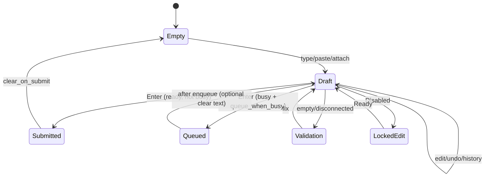

# PromptComposer — flagship agent input surface

| Field | Value |
|-------|-------|
| **Status** | Global-contract flagship pass (`termrock::widgets::PromptComposer`, migration `0211`) |
| **Location** | `crates/termrock/src/widgets/prompt_composer.rs` |
| **Package role** | Kernel widget; `@termrock/agent` may ship opinionated skins later |
| **Supersedes for agents** | Thin `PromptBox` remains for simple embeds only |
| **Related** | `termrock-agent.md`, `overlay-stack.md`, `streaming-performance.md`, `permission-trust.md` |

**Law:** Draft text is **never** cleared when focus moves to permission, question, plan, session picker, or command palette. Only explicit `clear_draft`, successful submit policy, or consumer overwrite clears it.

---

## 1. State model

Five separated buckets (no provider I/O inside any of them):

| Bucket | Owns | Survives overlay takeover? |
|--------|------|----------------------------|
| **Text editing** | `TextAreaState` (grapheme-safe), undo/redo (64 snaps), submit history (100), selection anchor, history browse draft | **Yes** |
| **Tokens & attachments** | `Vec<ComposerChip>` + paste payloads | **Yes** |
| **Completion** | `CompletionQuery` (slash / file / symbol) | Closed on Esc; draft kept |
| **Presentation** | compact / normal / expanded / fullscreen, density, ascii fallback, placeholder | **Yes** |
| **Policy & session** | `SubmitPolicy`, `busy`, `ComposerConnection`, queue, validation | Consumer-set; draft kept |

```text
                    ┌─ Permission / Question / Plan / Session / Palette ─┐
Draft + chips  ──blur──►  still held in PromptComposerState              │
                    ◄── focus returns ───────────────────────────────────┘
```



---

## 2. Component anatomy

```
┌─ chips: [F lib.rs ×] [P paste… ×] ─────────────────────────────┐
│ multiline editor (TextArea — grapheme cursor, mouse, paste)     │
│ MODE · model · ● busy  ^C interrupt  ^U stop · queue:N  [ctx]  │
│ validation error (optional)                                     │
└─────────────────────────────────────────────────────────────────┘
```

| Region | Role |
|--------|------|
| `chips` | Attachments / large pastes; focus strip via BackTab |
| `editor` | Primary caret; mouse click positions cursor |
| `status` | Mode, model, busy/stop hints, queue count, offline, context meter |
| `validation` | Danger-role reason line |

**Compact:** no panel border when short; 2 editor rows.  
**Normal / Expanded:** bordered panel when focused (`PanelEmphasis`).  
**Fullscreen:** host opens `termrock.prompt_fullscreen` overlay; Esc exits fullscreen first.

---

## 3. Public API

```rust
use termrock::widgets::{
    PromptComposer, PromptComposerState, PromptComposerOutcome,
    SubmitPolicy, ComposerPresentation, ComposerConnection,
    ModeIndicator, ModelIndicator, ContextEstimate, ComposerChip,
    CompletionKind, CompletionQuery, LARGE_PASTE_THRESHOLD,
    PROMPT_COMPLETION_OVERLAY_ID, PROMPT_FULLSCREEN_OVERLAY_ID,
};

let mut state = PromptComposerState::new();
state.set_mode(Some(ModeIndicator { label: "PLAN".into(), warning: false }));
state.set_model(Some(ModelIndicator { label: "model-a".into() }));
state.set_context(ContextEstimate { used: 12_000, limit: 128_000 });
state.set_busy(true); // Enter → Queued

// Overlay takeover — do NOT clear_draft
state.set_accepts_input(false);
// … PermissionPrompt / PlanReview / SessionPicker / CommandPalette …
state.set_accepts_input(true);

match state.handle_key(key) {
    PromptComposerOutcome::Submit { text, chip_ids } => { /* run */ }
    PromptComposerOutcome::Queued { entry } => { /* host queue */ }
    PromptComposerOutcome::Completion { query } => { /* open menu */ }
    PromptComposerOutcome::Cancel => { /* hard stop */ }
    PromptComposerOutcome::Interrupt => { /* soft interrupt */ }
    PromptComposerOutcome::ExternalEditor => { /* $EDITOR; then apply_external_editor_text */ }
    PromptComposerOutcome::FullscreenRequested => { /* open overlay */ }
    _ => {}
}

// Narrow terminals
let _ = state.contract_for_width(area.width);
```

**Policy is application-specific** — set via `set_policy(SubmitPolicy { … })`. Defaults: Enter submits, Alt/Ctrl/Shift+Enter newline, queue when busy, clear on submit, large paste → chip.

---

## 4. Typed messages (`PromptComposerOutcome`)

| Outcome | Meaning |
|---------|---------|
| `Ignored` | Not handled |
| `Changed` | Draft / chips / cursor / selection changed |
| `Submit { text, chip_ids }` | Run agent with draft + attachments |
| `Queued { entry }` | Enqueued while busy |
| `QueueRemoved { id }` | User removed queue entry (host may map from chip UI) |
| `Cancel` | Hard stop when busy (`Ctrl+U` / `Ctrl+Backspace`) |
| `Interrupt` | Soft interrupt when busy (`Ctrl+C`); draft kept |
| `DismissRequest` | Esc with nothing local to close |
| `ExternalEditor` | Open `$EDITOR` with draft |
| `Completion { query }` | Open/update slash / @ / # menu |
| `CompletionClosed` | Completion dismissed |
| `CompletionCommitted { kind, id }` | Host inserts candidate (via `apply_completion_insert`) |
| `ModeMenu` / `ModelMenu` | Badge activated |
| `ChipRemoved` / `ChipActivated` | Chip strip |
| `AttachRequest` | Request file attach (`Ctrl+Shift+O`) |
| `ValidationFailed { reason }` | Empty / disconnected / busy without queue |
| `PresentationChanged` | Compact/normal/expanded changed |
| `Blur` | Focus left (optional host signal) |
| `SelectionCopied { text }` | Ctrl+C with selection (not busy) |
| `FullscreenRequested` / `FullscreenDismissed` | Fullscreen lifecycle |

All outcomes are pure — **no I/O**.

---

## 5. Overlay integration

| Overlay id | Kind | When |
|------------|------|------|
| `termrock.prompt_completion` | `OverlayKind::Completion` | `/` `@` `#` active query |
| `termrock.prompt_fullscreen` | `OverlayKind::Dialog` | Fullscreen promote |

Helpers: `open_completion_overlay`, `dismiss_completion_overlay`, `place_completion`, `open_fullscreen_overlay`, `dismiss_fullscreen_overlay`, `commit_completion(id, insertion)`.

**Esc order:** completion close → fullscreen exit → clear selection → `DismissRequest` (host peels permission/plan/palette).

**Draft preservation:** host sets `set_accepts_input(false)` while other overlays own input; never call `clear_draft` on those transitions.

**Mouse:** prefer `handle_mouse_at(mouse, &layout)` so mode/model status hits emit `ModeMenu` / `ModelMenu`.

---

## 6. Focus integration

- `set_accepts_input(false)` unfocuses editor **without** clearing text/chips/queue.
- Scene: register composer focus id on root prompt pane only (not duplicated as Card when OverlayStack owns modals).
- Chip strip: `BackTab` focuses last chip; Left/Right; Delete removes; Esc returns to editor.
- Completion navigation lives in consumer `CompletionMenu` while overlay is top.

---

## 7. Rendering strategy

1. `layout_in(area)` → chips / editor / status / validation rects + chip hit map.
2. Optional `Panel` (skipped in Compact or height &lt; 3).
3. Chips: kind mark (📎/F, 📋/P) + label + `×`; selection style when chip-focused.
4. Editor: `TextArea` with placeholder; grapheme caret; mouse via `handle_mouse`.
5. Status: mode · model · busy/interrupt/stop hints · queue · connection · fullscreen; `TokenMeter` when `context.limit > 0`.
6. Validation: `Role::Danger` one line.
7. **No-color:** Host passes monochrome-quantized `Theme` (`ColorCapability::Monochrome` / `NO_COLOR`) **and/or** `set_colorless(true)` (forces ASCII marks + reverse selection). Status always readable via words (`BUSY`, `offline`, `queue:N`). **ASCII fallback:** emoji → `F`/`P` letters.  
8. **Selection paint:** after `TextArea` paint, apply `Role::Selection` (optional reverse when colorless) over selected span using editor scroll.

---

## 8. Performance strategy

| Concern | Strategy |
|---------|----------|
| Undo | Bounded full-text snapshots (64), not per-grapheme ropes |
| History | Cap 100 submitted strings |
| Large paste | Chip + optional payload; never force multi-MB into editor wrap path |
| Paint | O(visible editor rows + chips + status) |
| Completion detect | O(prefix before cursor) on edit only |
| Selection | Cursor pair; replace via single `replace_between` rebuild |

---

## 9. Tests (lib)

| Test | Proves |
|------|--------|
| `draft_survives_blur_for_overlay_takeover` | Permission/plan/palette safe |
| `empty_submit_validates` / `disconnected_blocks_submit` | Validation |
| `submit_returns_text_and_clears` | Submit policy |
| `busy_enqueues_instead_of_submit` | Queue while active |
| `large_paste_becomes_chip` + `payload` | Paste chips |
| `slash_detects` / `file_mention` / `symbol_mention` | Completion triggers |
| `undo_redo` / `history_up` | Edit history |
| `apply_completion_replaces_trigger_span` | Commit insert |
| `selection_delete` / `select_all_and_copy` | Selection |
| `busy_ctrl_c_interrupts_ctrl_u_cancels` | Interrupt vs Cancel |
| `disabled_ignores_keys` | Disabled |
| `external_editor_applies_text` | External editor round-trip |
| `contract_for_narrow_width` | Narrow + ASCII |
| `fullscreen_request_and_esc_exit` | Fullscreen |
| `queue_fifo_pop_and_remove` | Queue drain |
| `completion_overlay_opens_on_stack` | OverlayStack |

---

## 10. Lookbook stories

| Story id | Shows |
|----------|--------|
| `prompt-composer/basic` | Mode, model, context, file chip, draft |
| `prompt-composer/busy-queue` | Busy chrome + queue path |
| `prompt-composer/compact` | Compact + ASCII |
| `prompt-composer/narrow` | Width contraction |
| `prompt-composer/unicode` | Grapheme-safe draft |
| `prompt-composer/paste-chip` | Large paste chip |
| `prompt-composer/disconnected` | Offline validation chrome |
| `prompt-composer/fullscreen` | Fullscreen presentation |

Interactor: `PromptComposerInteractor` — keys + mouse via `layout_in` hits.

---

## 11. Implementation plan

| Phase | Work | Status |
|-------|------|--------|
| **P0** | State split, submit/queue/busy, chips, paste threshold, completion detect, undo/history, indicators, blur draft, core tests, basic stories | **Done** |
| **P1** | Selection (shift-extend, type-over, select-all, copy outcome); paste payload; interrupt vs cancel; external editor apply; queue FIFO APIs; fullscreen request/dismiss overlays; narrow `contract_for_width` | **Done** |
| **P1b** | Selection paint; `commit_completion`; `handle_mouse_at` mode/model hits; `set_colorless` | **Done** |
| **P2** | Wire real `CompletionMenu` rows in AgentWorkbench host | Next |
| **P3** | Mouse drag-select; richer chip multi-row wrap | Later |
| **P4** | Studio scenarios: permission takeover matrix, mono/NO_COLOR, width ladder | Later |

---

## Capability checklist (requirements)

| Capability | Support |
|------------|---------|
| Grapheme-safe multiline | `TextArea` + `edit_core` boundaries |
| Cursor navigation | Arrows / Home / End via TextArea |
| Selection | Anchor + shift-extend; delete/type-over; Ctrl+A; Ctrl+C copy |
| Undo / redo | Ctrl+Z / Ctrl+Y, 64 snaps |
| History | Up/Down at edges after submit |
| Draft preservation | `set_accepts_input` only; no clear on overlay |
| Slash / file / symbol | `/` `@` `#` → `CompletionQuery` |
| Completion overlays | OverlayStack helpers |
| Attachments | `ComposerChip` + `AttachRequest` |
| Paste chips | Threshold + payload body |
| Model / mode indicators | Status badges |
| Token / context estimate | `ContextEstimate` + `TokenMeter` |
| Queue while active | `queue_when_busy` + FIFO APIs |
| Submit / Cancel / Interrupt | Enter / Ctrl+U / Ctrl+C |
| Newline | Alt|Ctrl|Shift+Enter when submit_on_enter |
| External editor | `ExternalEditor` + `apply_external_editor_text` |
| Disabled / disconnected | Connection enum |
| Validation | Empty / disconnected / busy without queue |
| Compact / normal / expanded / fullscreen | `ComposerPresentation` |
| Mouse positioning | Click editor + chip hits |
| Bracketed paste | `Event::Paste` → `handle_paste` |
| Narrow contraction | `contract_for_width` / `presentation_for_width` |
| ASCII fallback | `set_ascii_fallback` / auto on very narrow |
| No-color | Theme mono quantization + word status |

---

## Separation summary

```
Text editing  ── TextAreaState, undo, history, selection
Tokens        ── chips (+ paste payload)
Completion    ── CompletionQuery + overlay id (candidates consumer-owned)
Presentation  ── ComposerPresentation, density, ascii
Policy        ── SubmitPolicy, busy, connection (application)
```

Consumer owns: model catalogs, slash vocab, file search, tool policy, agent run/cancel effects, clipboard system APIs for `SelectionCopied`.
