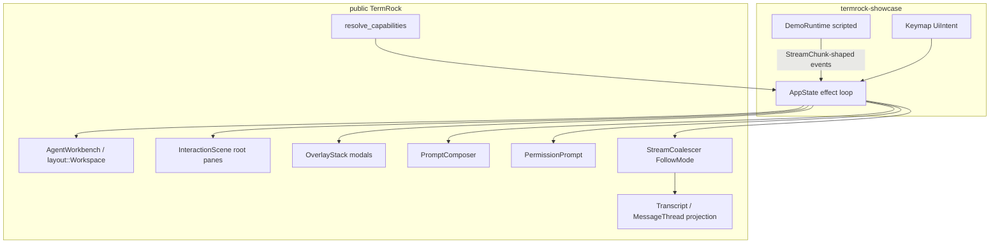
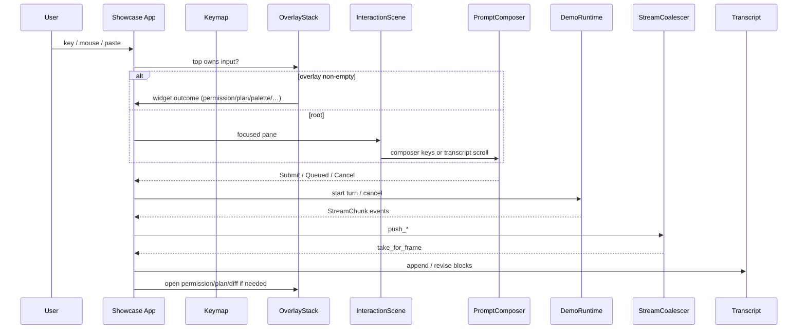
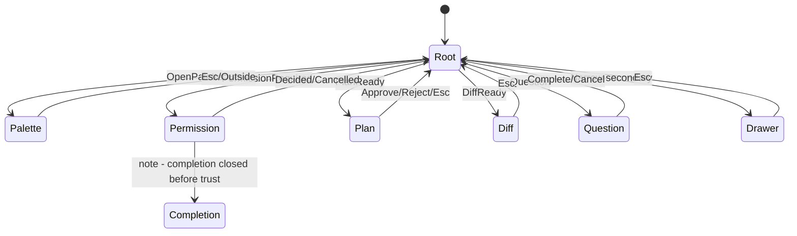
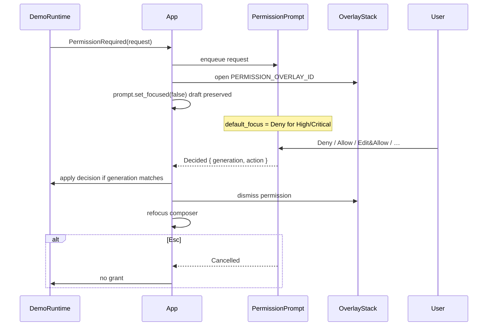
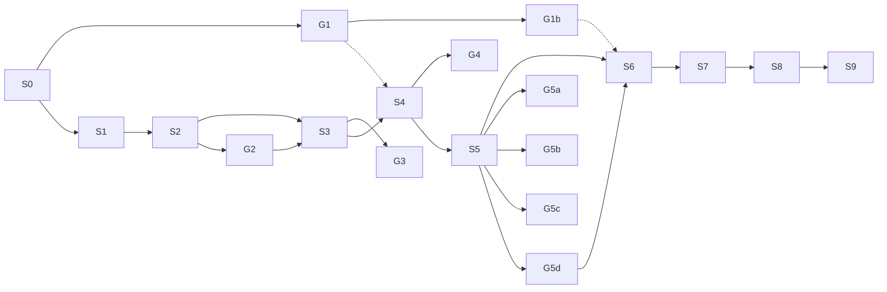

# Flagship TermRock Showcase: AI & Developer Workbench

| Field | Value |
|-------|-------|
| **Title** | Flagship TermRock showcase application (AI + developer workbench) |
| **Author** | TermRock design (elevated from `docs/design/showcase-workbench.md`) |
| **Date** | 2026-08-09 |
| **Status** | Draft — design SoT; implement after S0 review + G1 (or showcase OverlayStack host) |
| **Codename** | `termrock-showcase` (binary / example crate) |
| **Target path (post-review)** | `docs/design/showcase-workbench.md` |
| **Gap log** | `docs/design/showcase-api-gaps.md` |
| **Stacks on** | `termrock-agent.md`, AgentWorkbench pattern, OverlayStack, InteractionScene, PromptComposer, PermissionPrompt, responsive layout, perf coalesce/follow, capability profiles, Studio recordings |

**Law (non-negotiable):**

1. Built **entirely** from **public** TermRock crate APIs first; adopt source-installed registry blocks (`@termrock/agent`, `termrock/agent-workbench`) **when published**. Never private forks of chrome. Until the registry ships, showcase composes public widgets/patterns only (OQ-2 decided lean).
2. Every weakness found while building is a **missing TermRock primitive or public API** — fix the library; never paper over with private app-only chrome.
3. Components are domain-neutral; **demo runtime owns policy**.
4. Esc peels **one** overlay layer.
5. Default-deny permission UX (never auto-allow High/Critical).
6. Phosphor is default theme but fully re-themable; colorless and narrow are first-class.
7. Modern-first API; breaking OK; product-neutral (**mock** agent runtime, no real provider SDK).
8. Library work lands on `main` with DCO + Conventional Commits. This design’s **PR Plan** names ordered delivery units **S0–S9** (and library gap units **G-***) that can ship as sequential main commits.

---

## Overview

TermRock needs a single, runnable proof that the framework can produce a **category-leading** terminal experience — not a widget zoo, but a coherent AI + developer workbench: conversation, streaming Markdown, tool cards, shell runs, permission gates, plan/diff review, tasks/subagents, sessions/checkpoints, command palette, contextual help, and responsive layouts that survive mono/mux/tiny terminals.

This design elevates the existing draft SoT (`docs/design/showcase-workbench.md`, ~639 lines) into a **design SoT** sufficient to implement after S0 review and trust-host cutover (G1 or equivalent). The showcase is simultaneously:

1. **Demo** — humans and agents evaluating TermRock get a &lt;2 minute path to “wow”.
2. **Dogfood** — forces API completeness; every awkwardness becomes a library gap ticket.
3. **Recording corpus** — Studio / headless replay scenarios for quality gates.

**Architecture in one line:** one `termrock::layout::Workspace` geometry + one `InteractionScene` (root panes) + one `OverlayStack` (all modals) + one `PromptComposer` + one `Transcript` (MessageThread projection) + a showcase-only scripted `DemoRuntime` that emits stream-shaped events and never embeds a provider SDK.



---

## Background & Motivation

### Current state (truth from tree, 2026-08-09)

| Surface | Location | Showcase relevance |
|---------|----------|-------------------|
| `AgentWorkbenchState`, `agent_workbench_layout`, `render_agent_workbench`, `sync_workbench_scene` | `crates/termrock/src/patterns/agent_workbench.rs` | Elevated composition: TaskRail, ActivityShelf, PromptComposer, PermissionPrompt, Plan/Diff/Session overlays (**0236**) |
| `PromptComposer` / `PromptComposerState` / outcomes | `widgets/prompt_composer.rs` | Full queue, chips, blur-draft, completion, connection states — **primary composer path** |
| `PermissionPrompt` / queue / provenance / default-deny | `widgets/permission.rs` | Trust SoT; `PERMISSION_OVERLAY_ID`; High/Critical never default Allow |
| `Transcript` / variable-height / follow | `widgets/transcript.rs` | MessageThread substrate (project-to-lines v1) |
| `ToolCard`, `TokenMeter`, `ThinkingBlock`, `Timeline` | `widgets/agent.rs` | Paint primitives; not full ToolCallCard / TerminalRunCard contracts |
| `TaskRail`, `PlanReview`, `QuestionFlow`, `SessionPicker`, `ModeRibbon` | `widgets/agent_blocks.rs` | Seeds present; incomplete streaming/risk focus packaging |
| `DiffReview`, `LogStream` | `widgets/review.rs` | Hunk nav only today (`HunkFocused`/`HunkActivated`/`ToggleMode`); **no** file accept/reject outcomes yet |
| `CommandPalette` + overlay helpers | `widgets/command_palette.rs` | `open_command_palette_overlay` |
| `OverlayStack` / policies | `interaction/overlay_stack.rs` | Sole modal Esc/geometry (agent law KD-19) |
| `InteractionScene` | `interaction/scene.rs` | Root pane focus / hit |
| `StreamCoalescer`, `FollowMode`, `NewContentIndicator` | `perf/` | Streaming law |
| `ResponsiveSurface`, `WIDTH_LADDER`, `termrock::layout::{Workspace, WorkspaceState, …}` | `layout/` | Collapse / drawer / LineMode (Workspace is **not** crate-root re-export) |
| `resolve_capabilities`, doctor | `capability/` | Mono/ascii/mux profiles |
| `examples/showcase.rs` | simple list+tabs on-ramp | **Not** the workbench; keep as on-ramp, do not overload |
| `@termrock/agent` registry collection | design only | MessageThread, StreamingMarkdown, TerminalRunCard, SubagentCard, ActivityShelf, ContextMeter, CheckpointTimeline mostly **GAP** |

### Pain points

1. No single runnable surface proves conversation + trust + multi-agent + narrow/mono together.
2. AgentWorkbench seed still dual-paths (`PromptBox`/`ApprovalCard`) while agent design mandates PromptComposer/PermissionPrompt (KD-2 / KD-25).
3. Several “composition map” names in the draft SoT are design-only (MessageThread, StreamingMarkdown incomplete-fence pack, TerminalRunCard, SubagentCard, ActivityShelf, ContextMeter, CheckpointTimeline) — showcase will hit them immediately.
4. Without a dogfood app, gaps stay theoretical; Studio recording corpus stays empty.

### Why now

Kernel interaction law (scene, overlay stack, intents, workspace, coalescer, capability) is in tree. Agent design SoT (`termrock-agent.md`) freezes the pack contract. Showcase is the **integration pressure test** that converts that contract into a visible product moment.

---

## Goals & Non-Goals

### Goals

1. Ship `termrock-showcase` runnable via `cargo run -p termrock-showcase` (or documented example target) using **public** TermRock only.
2. Achieve MVP success criteria (hello stream, trust, Esc, narrow/mono); full §18 mockups after G* elevations (diff accept post-G4).
3. Prove laws: Esc one layer; default-deny High/Critical; composer draft survives overlays; follow pauses on wheel; narrow 40×16 still submits + reads stream; mono/ascii usable.
4. Maintain append-only gap log; every workaround is forbidden — open a library fix instead.
5. Produce Studio-compatible recordings (§16) for CI later.
6. README demo path &lt; 2 minutes to first streaming “wow”.
7. Align AgentWorkbench elevation with agent design: PromptComposer + PermissionPrompt + OverlayStack (no ApprovalCard on agent path).

### Non-Goals

- Real LLM provider SDK, API keys, network by default.
- Real shell/PTY ownership inside TermRock widgets (demo may fake; optional `TERMROCK_SHOWCASE_REAL_SHELL=1` later only if isolated).
- Product branding, slash vocab from any commercial agent.
- Vim dual-input keymap package (agent KD-27 — separate later).
- Multiplayer/collaboration protocols.
- Replacing or forking kernel Esc/focus into showcase-private code.
- Stable 1.0 API promises (breaking library APIs OK with migrations).

---

## Proposed Design

### Product thesis

Prove TermRock ships a **category-leading** terminal experience: agent + developer workbench intentional as Claude Code / Amp / OpenCode / lazygit hybrids, while remaining **product-neutral** (mock runtime, no provider SDK).

The showcase is demo + dogfood + recording corpus.

### System architecture



### Crate layout

```
crates/termrock-showcase/          # preferred (or examples/showcase_workbench)
  Cargo.toml                       # depends on termrock public only (+ crossterm feature)
  src/
    main.rs                        # capability resolve, Session, event loop
    app.rs                         # AppState, focus, overlays, paint
    demo_runtime.rs                # scripted agent (showcase-only)
    demo_events.rs                 # StreamChunk-shaped enums (showcase local or agent-types)
    keymap.rs                      # Keymap&lt;ShowcaseAction&gt; → UiIntent / app intents
    model/
      session.rs                   # SessionId, message store (in-memory)
      tasks.rs                     # task/subagent view models
      files.rs                     # fake workspace tree
    views/
      thread.rs                    # projects Transcript blocks from model
      rail.rs                      # TaskRail / List rows
      files.rs                     # Tree projection
      status.rs                    # StatusBar slots + TokenMeter/ContextMeter
    scenarios/
      mod.rs
      hello_stream.rs
      permission_high.rs
      plan_build.rs
      multi_subagent.rs
      …
    recordings/                    # .rec.json fixtures (later)
  README.md
```

**Forbidden in showcase:**

- `pub(crate)` TermRock internals, `#[doc(hidden)]` imports.
- Copy-paste of private widgets or reimplementation of Esc/focus/placement.
- Local dual Permission/Approval cards for “simpler” demos.
- Silent auto-Allow of High/Critical.

**Relationship to `examples/showcase.rs`:** keep the simple on-ramp. Flagship is a separate binary/crate so the on-ramp stays tiny.

### Mock agent runtime (showcase-only)

In-process **demo driver** — not a TermRock type:

| Concern | Behavior |
|---------|----------|
| Scenarios | Named scripts emit timed events (text delta, tool start/end, permission required, plan, diff, question, error, done) |
| Tools | Fake: sleep + canned stdout / diff hunks / plan steps |
| Permissions | Always route through `PermissionPrompt` before “running” gated tools |
| Network | None by default |
| Shell | Fake; optional env gate later |
| Policy | Showcase owns allow/deny effects; widgets only emit outcomes |
| Stale gens | Respect `PermissionOutcome::StaleIgnored` / generation |
| Backpressure | Honor `StreamCoalescer::backpressure()` Soft/Hard (pause script ticks) |

Suggested local event shape (align with agent design `StreamChunk` when types land):

```rust
// showcase-local until termrock/agent-types exists
pub enum DemoEvent {
    TextDelta { task_id: String, text: String },
    ToolStart { id: String, name: String, detail: String },
    ToolStdout { id: String, chunk: String },
    ToolEnd { id: String, ok: bool, exit: Option<i32> },
    PermissionRequired { request: PermissionRequest }, // kernel type
    PlanReady { steps: Vec<OwnedPlanStep> },          // owned mirror of PlanStep
    DiffReady { path: String, hunks: Vec<DiffHunk> },  // DiffHunk is kernel-owned
    Question { steps: Vec<OwnedQuestionStep> },        // owned mirror of QuestionStep
    TaskUpdate { id: String, status: TaskStatus, progress: u8 },
    SubagentSpawn { id: String, title: String },
    Error { message: String },
    Done { task_id: String },
}

/// Showcase-owned mirrors: kernel PlanStep/QuestionStep are borrowed for paint.
/// Convert at paint: Owned* → PlanStep<'_, String> / QuestionStep<'_, String>.
pub struct OwnedPlanStep { pub id: String, pub label: String, /* … */ }
pub struct OwnedQuestionStep { pub id: String, pub prompt: String, /* options owned */ }
```

**DemoEvent → `StreamCoalescer` priority map (normative):**

| DemoEvent | `UpdatePriority` | Drop under Hard BP? |
|-----------|------------------|---------------------|
| `TextDelta` | `Normal` | May drop/coalesce |
| `ToolStart` / `ToolStdout` / `ToolEnd` | `High` | **Never drop** |
| `PermissionRequired` | `Critical` | **Never drop** |
| `PlanReady` / `DiffReady` / `Question` | `High` | **Never drop** |
| `TaskUpdate` / `SubagentSpawn` | `High` | **Never drop** |
| `Error` / `Done` | `Critical` | **Never drop** |

On `BackpressureSignal::Soft|Hard`, pause DemoRuntime script ticks until `Open`. Do not push `TextDelta` while Hard if buffer full; still enqueue High/Critical events.

### App state (consumer-owned)

```rust
pub struct AppState {
    pub workspace: WorkspaceState, // termrock::layout::WorkspaceState
    /// FocusId = String end-to-end post-G1 (seed pattern hardcodes &'static str — do not mix).
    pub scene: InteractionScene<String, String, ()>,
    pub overlays: OverlayStack<String>,
    pub tokens: DesignTokens,
    pub caps: EffectiveCapabilities,

    pub transcript: TranscriptState<String>,
    pub blocks: Vec<OwnedBlock>,          // project → TranscriptBlock each frame
    pub prompt: PromptComposerState,
    pub permission: PermissionPromptState,
    pub question: QuestionFlowState<String>,
    pub plan: PlanReviewState<String>,
    pub diff: DiffReviewState,
    pub task_list: ListState<String>,
    pub file_tree: TreeState<String>,
    pub palette: CommandPaletteState<String>, // = PickerState alias for CommandPalette
    /// SessionPicker paints via List; state is ListState, not PickerState.
    pub session_picker: ListState<String>,

    pub follow: FollowMode,
    pub new_content: NewContentIndicator,
    pub coalescer: StreamCoalescer,
    pub run_busy: bool,
    pub connection: ComposerConnection,
    pub app_mode: AppMode,
    pub agent_mode_label: String,         // display-only (PLAN/EDIT/…)
    pub demo: DemoRuntime,
    pub toasts: ToastState,
}
```

### Input routing law (align agent KD-19/20/26) — normative

```
key/mouse/paste (non-Esc):
  → if overlays non-empty: dispatch to top overlay widget by top().id
  → else scene focused pane host
Esc:
  → match overlays.handle_escape():
       Ignored (Trap)     → forward Esc to trust/top widget handle_key(Esc)
                            → Permission: handle_key(Esc) already queue.dismiss_head + Cancelled
                            → apply_trust_gate_cancel(gate, Some(Cancelled))  // queue path is no-op if head gone
                            → then resolve_permission_overlay_geometry (re-open head if queue non-empty,
                              else PermissionPromptState::dismiss_overlay — geometry only)
       Dismissed { id, focus } → apply_dismissed_side_effects(id)
                            → if permission|plan|question: apply_trust_gate_cancel(gate, None)
                              // helper cancels live head if still present (KD-26)
                            → never grant; restore focus from Dismissed.focus
       UnhandledEscape    → scene has no agent modals; quit or ignore per app policy
outside-click:
  → overlays.handle_outside_click(pos)
  → same Dismissed side-effect rules as Esc peel for trust layers
```

**Single helper (required):** `apply_trust_gate_cancel(app, gate, prior_outcome)` — used by (1) Trap-forwarded widget `Cancelled` and (2) Dismissible `Dismissed` (pass `prior_outcome = None`). Kernel `PermissionPromptState::dismiss_overlay` / `OverlayStack::dismiss` are **geometry only** — they do **not** cancel the queue.

Do **not** register approval/question as `InteractionScene` Card layers for agent path (seed workbench still does — elevate away; **GAP-WB-1**).

### Per-frame host sync (normative) — OverlayStack ↔ InteractionScene

Kernel facts: `scene.begin_frame()` clears **elements only** (layers persist). `OverlayStack::sync_scene_layers` **pushes/replaces** open overlay layers by id — it does **not** prune closed overlays. Stale layers poison Tab/focus/hits after peel. Host must prune.

```
// each frame, after DemoEvent/outcome open-dismiss mutations:
1. layout root: termrock::layout::Workspace::layout(area, &workspace) → PaneGeom[]
2. overlays.reflow(terminal_bounds)
3. scene.begin_frame()                    // clear elements; keep focus + layers
4. scene.ensure_root(root_layer)          // InteractionLayer id "root", …
5. prune closed overlays from scene:
     open_ids = { e.id.0 for e in overlays.entries() }
     for layer in scene.layers() (clone ids first):
       if layer.id != root && layer.id not in open_ids:
         scene.remove_layer(&layer.id)
6. overlays.sync_scene_layers(&mut scene) // push/replace open overlay layers (FocusId = String)
7. register root pane controls (task_rail, files?, transcript, prompt, status)
   + overlay control elements on their layer ids (permission, palette, …)
8. scene.reconcile()
9. paint: root panes → OverlayStack bottom→top (use entry.rect)
```

Optional later library hardening: make `sync_scene_layers` prune non-open overlay layers — until then showcase host must prune (step 5). Prefer a single helper `sync_overlays_into_scene(scene, overlays)` implementing steps 5–6.

FocusId consistency: showcase uses `String` everywhere. Until G1 removes `&'static str` hardcode in the pattern, **prefer showcase-owned layout + scene registration** rather than calling seed `sync_workbench_scene` with mixed id types.

---

## 1. Information architecture

### 1.1 Mental model

```
Sessions ──► Conversation (thread of blocks)
                ├── User / Agent / System messages
                ├── ToolCall / TerminalRun / Diff / Plan snippets
                └── Streaming markdown
Tasks / Subagents (rail) ── parallel work, drill into conversation anchors
Composer ── human input + queue + mode/model badges
Overlays ── permission, question, plan, diff, files, sessions, palette, help
Status ── connection, context, keymap hints, capability profile
```

### 1.2 Navigation objects (semantic ids)

| Object | Id prefix | Opened from |
|--------|-----------|-------------|
| Session | `session:` | Session picker, palette |
| Message block | `msg:` | Thread activate |
| Tool call | `tool:` | Thread / activity shelf |
| Task | `task:` | Task rail |
| Subagent | `sub:` | Task rail / SubagentCard |
| Checkpoint | `cp:` | Timeline / palette |
| File | `file:` | File browser / @ mention |
| Command | `cmd:` | Command palette |

Stable ids across streaming revisions; height cache key includes `(id, revision, width, expand, density)` per agent KD-6.

### 1.3 App modes vs agent modes

| App mode | Meaning |
|----------|---------|
| `Workbench` | Default multi-pane |
| `FocusThread` | Thread zoomed (rail drawer) |
| `FocusFiles` | Files pane primary |
| `Review` | Diff or plan fullscreen overlay chain |
| `Help` | Contextual help overlay |

Agent autonomy labels (`Ask` / `Plan` / `Edit` / …) live on **composer mode badge** only — display chrome, not library-enforced auto-allow matrices (KD-8 / KD-10).

---

## 2. Major regions

### 2.1 Default geometry (wide ≥ 120×30)

```
┌─ TermRock Showcase ────────────────────────── profile: modern ──┐
│ Sessions ▾  ·  Workbench  ·  [palette ⌘K]  ·  help ?              │
├────────────┬────────────────────────────────────────────────────┤
│ TASK RAIL  │  CONVERSATION / THREAD                             │
│            │  ┌ user ─────────────────────────────────────────┐ │
│ ● main     │  │ …                                             │ │
│ ● sub-a ⟳  │  └───────────────────────────────────────────────┘ │
│ ○ sub-b    │  ┌ agent · streaming… ───────────────────────────┐ │
│ ○ review   │  │ markdown…                                     │ │
│            │  │ ┌ tool:bash · running ──────────────────────┐ │ │
│ Checkpoints│  │ │ $ cargo test                              │ │ │
│ · cp-3     │  │ └───────────────────────────────────────────┘ │ │
│ · cp-2     │  └───────────────────────────────────────────────┘ │
│            │  Activity: bash · read · search                    │
│ FILES      │  ───────────────────────────────────────────────── │
│ src/       │  PROMPT COMPOSER                                   │
│  lib.rs    │  [chip: main.rs]  mode:EDIT  model:demo  queue:0   │
│  main.rs   │  ▌_                                                │
├────────────┴────────────────────────────────────────────────────┤
│ status: connected · ctx 24k/128k · follow · hints               │
└─────────────────────────────────────────────────────────────────┘
```

### 2.2 Region inventory

| Region id | Component(s) | Collapse priority | Pane / surface |
|-----------|--------------|-------------------|----------------|
| `chrome.top` | session chip / hints (optional ModeRibbon) | last | status band or top strip |
| `rail.tasks` | `TaskRail` + checkpoint compact (`Timeline` → CheckpointTimeline **GAP**) | first → drawer | `WorkbenchPane::TaskRail` (`task_rail`) |
| `rail.files` | `Tree` / `List` | early → drawer | extend Workspace west split **or** drawer overlay |
| `main.thread` | `Transcript` + MessageThread projection | never (primary) | `WorkbenchPane::Transcript` |
| `main.activity` | ActivityShelf **GAP** → interim chip row via `List`/`Tag` | mid | south of thread, north of composer |
| `main.composer` | `PromptComposer` (not PromptBox) | high keep | `WorkbenchPane::Prompt` |
| `chrome.status` | `StatusBar` + `TokenMeter` / ContextMeter **GAP** | mid | `WorkbenchPane::Status` |
| `overlay.*` | `OverlayStack` layers | z-order | exclusive input |

**Today’s pattern geometry** (`agent_workbench_layout`): vertical 92% body / 8% south; body horizontal 22% task rail / transcript; south split prompt (70%) / status (fixed 1). Collapse priorities: task_rail=0, prompt=1, transcript=2, status=3.

### 2.2.1 Interim Workspace (S1–S6) — showcase-owned until GAP-WB-2

Pattern elevation for files/activity is **not** part of G1 trust cutover. Showcase owns a `termrock::layout::Workspace` tree (public API) until G1b/GAP-WB-2:

**S1 wide (≥120) interim — files as drawer only (no west files split):**

```
WorkspaceNode::Split Vertical 92%
  first: Split Horizontal 22%
    first: Leaf task_rail  Min(12)  collapse=0
    second: Leaf transcript Weight(1) collapse=2
  second: Split Vertical 70%
    first: Leaf prompt  Min(3) collapse=1
    second: Leaf status Fixed(1) collapse=3
```

Activity strip: paint 1-row status/chips **inside** transcript south edge (borrowed lines) or status slots — not a new pane until G1b.

**S6+ full target tree (when GAP-WB-2 or showcase elevates):**

```
Split Vertical 92%
  first: Split Horizontal
    first: Split Vertical   # west column
      first: Leaf task_rail
      second: Leaf files     # collapse early → Drawer overlay
    second: Split Vertical  # center column
      first: Leaf transcript
      second: Leaf activity  Fixed(1–2) collapse mid
  second: Split Vertical    # south
    first: Leaf prompt
    second: Leaf status
```

Narrow: files + tasks open via `open_drawer_overlay` (`DRAWER_OVERLAY_ID`); primary remains thread+composer. **No private layout math** — only `Workspace` / `Drawer` / `OverlayStack`.

### 2.3 Focused border law

Every panel uses single-line border geometry. Focus weight is **semantic only**: focused container → `Role::BorderFocused` / `PanelEmphasis::Focused`; inactive → `Role::Border` / `PanelEmphasis::Normal`. No double-line/heavy glyphs for focus (repo Agents.md).

---

## 3. Focus order

### 3.1 Screen Tab cycle (default Workbench)

1. `rail.tasks` (`task_rail`)
2. `rail.files` (when visible)
3. `main.thread` (`transcript`)
4. `main.composer` (`prompt`)
5. Status is non-focusable chrome unless a slot action is registered

Collapsed regions are skipped. Overlay top layer **traps** Tab inside itself.

### 3.2 Within regions

| Region | Internal focus |
|--------|----------------|
| Task rail | `ListState` selection |
| Files | `TreeState` selection |
| Thread | Scroll-only by default; `/` or click enables block selection; `Activated` → expand tool/diff |
| Composer | Editor; chips via BackTab; mode/model badges activatable |

### 3.3 Opener restore

Every overlay records `opener_focus` on `OverlaySpec`. Dismiss → restore composer or previous pane. Pattern already returns focus to `"prompt"` for approval/question seeds — preserve for PermissionPrompt / Plan / Diff.

### 3.4 Seed vs target

| Concern | Current seed | Showcase target |
|---------|--------------|-----------------|
| Composer widget | `PromptBox` | `PromptComposer` |
| Trust widget | `ApprovalCard` on scene layer | `PermissionPrompt` on `OverlayStack` |
| Focus ids | `&'static str` hardcode | `String` (or generic) for dynamic tools |
| Esc | `AgentWorkbenchState::handle_escape` scene-only | OverlayStack first, then scene |

---

## 4. Semantic navigation

| Intent | Default binding | Behavior |
|--------|-----------------|----------|
| `FocusNextPane` | Tab | Scene tab among panes |
| `FocusPrevPane` | Shift+Tab | Reverse |
| `OpenPalette` | Ctrl+K / Ctrl+P | Command palette overlay |
| `OpenSessions` | Ctrl+O | Session picker overlay |
| `OpenFiles` | Ctrl+\\ | Focus files / open drawer |
| `ToggleTaskRail` | Ctrl+B | Collapse / drawer |
| `ToggleFollow` | `f` (thread focused) | `FollowMode` + indicator |
| `JumpLatest` | `G` / End | Thread end + clear new-content |
| `CancelRun` | Ctrl+C when busy | Composer Interrupt / Cancel |
| `Submit` | Enter (composer) | Policy via `SubmitPolicy` |
| `Help` | `?` | Contextual help overlay |
| `Esc` | Esc | **One layer only** |
| `DemoScenario` | palette | Nested scenario picker |

All via TermRock `Keymap` + `UiIntent` / app actions — **no** hardcoded product chords inside widgets. Use `dispatch_keymap_action` bridge where applicable.

---

## 5. Command palette

**Implementation:** `CommandPalette` + `open_command_palette_overlay` / `COMMAND_PALETTE_OVERLAY_ID`. Filter consumer-side; rows as `ListRow` / picker items.

| Id | Label | Effect |
|----|-------|--------|
| `session.new` | New session | Demo runtime new thread |
| `session.switch` | Switch session… | Opens SessionPicker |
| `mode.plan` | Agent mode: Plan | Composer mode badge label |
| `mode.edit` | Agent mode: Edit | |
| `run.cancel` | Cancel active run | `CancelRun` |
| `view.tasks` | Focus task rail | |
| `view.files` | Focus files | |
| `review.plan` | Open last plan | PlanReview overlay |
| `review.diff` | Open last diff | DiffReview overlay |
| `theme.cycle` | Cycle theme recipe | phosphor → slate → … |
| `theme.mono` | Force mono profile | capability override |
| `capability.doctor` | Show capability summary | toast or overlay text via `format_doctor_text` |
| `help.keymap` | Keymap help | Help overlay |
| `demo.scenario` | Run demo scenario… | Nested picker |
| `demo.disconnect` | Simulate disconnect | `ComposerConnection::Disconnected` |
| `demo.reconnect` | Simulate reconnect | Ready + draft preserved |

Outside-click and Esc: **Dismiss** (palette policy). Nested scenario picker is child overlay; Esc peels child first.

---

## 6. Keymap (showcase default)

```
Global
  Ctrl+K / Ctrl+P   OpenPalette
  Ctrl+O            OpenSessions
  Ctrl+\            FocusFiles / toggle files drawer
  Ctrl+B            Toggle task rail drawer
  ?                 Help
  Ctrl+C            CancelRun if busy else SelectionCopied / ignore
  Esc               OverlayStack / scene one layer
  q                 Quit only when no overlay and composer empty (optional)

Composer (focused)
  Enter             Submit / Queue (SubmitPolicy.queue_when_busy)
  Alt+Enter         Newline
  Ctrl+Z / Ctrl+Y   Undo / Redo
  / @ #             Completion kinds → CompletionMenu overlay
  Ctrl+E            ExternalEditor outcome (demo: toast “external editor stub”)

Thread (focused)
  j/k or arrows     Scroll / select block
  f                 ToggleFollow
  Enter             Expand tool / open diff overlay
  y                 Copy block (outcome → toast)
  gg / G            Top / JumpLatest

Task rail
  Enter             Focus thread at task anchor
  c                 Cancel task (demo outcome)

Files
  Enter             Open file preview overlay (read-only fake)
  Space             Toggle expand tree node

Overlays
  inherit PermissionPrompt / PlanReview / DiffReview / CommandPalette maps
  Permission: focus starts Deny; never Allow default on High/Critical
```

Remap table lives only in showcase `keymap.rs` using `termrock::keymap::{Keymap, KeyBinding, KeyChord, Visibility}`. Hints for `Visibility::Shown` feed `HintBar` / status — structural single source.

---

## 7. Mouse behavior

| Target | Action |
|--------|--------|
| Thread body | Wheel scroll → `pause_follow_on_user_scroll`; click expand tool/diff |
| Composer | Caret placement; chip remove/activate |
| Task row | Click select; double-click jump to anchor |
| File row | Click select; Enter/double-click preview |
| Status hints | Optional click → Help |
| Overlay backdrop | Outside policy (palette dismiss; dialog/alert trap) |
| New-content chip | Click → JumpLatest |
| Permission actions | Hit regions from `PermissionActionRegion` |

All hits via public hit regions / scene registration / overlay `pointer_hits_top`. No ad-hoc coordinate math in showcase beyond layout rects returned by TermRock.

---

## 8. Overlay behavior

| Layer id | Kind policy | Esc | Outside | Notes |
|----------|-------------|-----|---------|-------|
| `termrock.command_palette` | CommandPalette | Dismiss | Dismiss | |
| `sessions` | Dialog | Dismiss | Dismiss | SessionPicker |
| `termrock.permission` | AlertDialog if High/Critical; Dialog if Low/Medium | Trap / Dismissible+cancel | Trap | KD-20/26 |
| `question` | Dialog | Cancel flow (drop answers) | Trap | KD-22 |
| `plan` | Dialog | Cancel plan | Trap | |
| `diff` | Fullscreen-capable | Dismiss | Trap | |
| `help` | Popover/Dialog | Dismiss | Dismiss | |
| `termrock.prompt_completion` | Completion | Dismiss | Dismiss | child of composer |
| `termrock.prompt_fullscreen` | Fullscreen | Dismiss | Trap | |
| `files.drawer` | Drawer | Dismiss | Dismiss | narrow |
| `tasks.drawer` | Drawer | Dismiss | Dismiss | narrow |
| `subagent.fs` / tool detail | Fullscreen | Dismiss | Trap | |

**Law:** Esc closes exactly one conceptual layer. Nested: completion under composer context under permission — peel top first.

Stack: single `OverlayStack<String>` + root `InteractionScene` synced each frame (§ Per-frame host sync). **Do not** dual-register trust modals on scene Card layers (seed anti-pattern).

**Trust vs completion (normative):** When `PermissionRequired` / plan / question must open:

1. If `PROMPT_COMPLETION_OVERLAY_ID` (or completion child) is open → host **auto-dismisses** completion first (geometry peel only; no grant; draft preserved).
2. Then open trust overlay (`PERMISSION_OVERLAY_ID` / plan / question).
3. User-driven Esc still peels **one** layer at a time if both somehow remain (should not happen after step 1).

Same rule if palette is open under a trust interrupt: dismiss or leave palette under Trap policy — prefer auto-dismiss non-trust menus before trust AlertDialog so Trap Esc cannot strand a dead completion above permission.



---

## 9. Responsive layouts

**Phase gate:** S1–S5 use §2.2.1 interim Workspace (files = drawer only, no west files leaf). Full dual-rail files geometry is **post-S6 / G1b**. Do not implement a west files split in S1 because §9 “full” row exists.

| Width | S1–S5 interim (§2.2.1) | Post-S6 / G1b target |
|-------|------------------------|----------------------|
| ≥120 | tasks rail + thread + composer + status; **files via drawer/palette** | Full: tasks + **files** rails, thread, activity, composer, status |
| 80–119 | Compact density; rail narrower; files drawer | Compact; files drawer; rail narrower |
| 60–79 | Single primary: thread+composer; tasks drawer; files palette | Same |
| 40–59 | Composer compact; thread only; secondary overlays/drawers | Same |
| ≤24 / height≤5 | LineMode: last agent line + one-line composer; palette for rest | Same |

Use `ResponsiveSurface::AppShell`, `TaskRail`, `PromptComposer`, `PermissionPrompt`, `PlanReview`, `DiffReview`, `StatusBar` policies; `WIDTH_LADDER = [160,120,100,80,60,40,20]`; `termrock::layout::Workspace` collapse_priority; `ComposerPresentation::{Compact,Normal,Expanded,Fullscreen}`.

`essential_survives(surface, width)` gates must remain true for PromptComposer + thread primary at 40 cols.

---

## 10. Streaming behavior

```
demo runtime ──chunks──► channel / queue
UI: StreamCoalescer.push_text / push boundary
    batch = take_for_frame(tick)
    apply to thread model (last block append / new tool card lines)
    apply_follow_after_append(window, follow, indicator, …)
    dirty body → paint
```

| Event class | Priority | UI effect |
|-------------|----------|-----------|
| Token text | Normal | Append StreamingMarkdown / plain lines; bump revision |
| Tool start/end | High | New/update Tool card lines; never drop |
| Permission required | Critical | Open PermissionPrompt; pause tools |
| Errors / Done | Critical / High | System block + toast; clear busy |
| Log flood | Normal → Soft/Hard BP | Coalesce; pause demo ticks |

**Follow:** default `Following` during active run; user wheel → `Paused` + `NewContentIndicator`. JumpLatest clears indicator and resumes follow optionally.

**Height cache:** bump `TranscriptBlock.revision` on content change only; width change invalidates measure.

**Never drop** permission/tool boundary events under backpressure — enforce via DemoEvent priority map (Mock agent runtime): Tool* → High; Permission/Error/Done → Critical. `StreamCoalescer` may drop **Normal** under Hard; that is expected for tokens only.

---

## 11. Task and subagent presentation

**Task rail rows (`ListRow` / `ComposedRow` via TaskRail):**

- leading: status glyph (`●` running, `○` pending, `✓` done, `✗` failed) — ascii fallback `*` / `.` / `+` / `x`
- primary: task title
- secondary: agent/sub label
- badge: progress or spinner via `Spinner` / text `%`

**SubagentCard** (**GAP-SUB-1**): until elevated, project into:

1. Rail row with `sub:` id, and  
2. Thread block lines (`TranscriptKind::Tool` or `Content`) with expand → fullscreen detail overlay.

**Multiple running:** rail lists all Running; activity shelf shows top 3 tools (**GAP-ACT-1** interim: status slot `agents:N · tools:M`); status shows counts.

Selecting a subagent filters thread highlight or jumps to anchor message id (`TranscriptAnchor`).

**Cancel taxonomy** (agent AD-5): `CancelRun` / `CancelTool` / `CancelTask` / `CancelAll` / `Interrupt` — demo runtime maps outcomes; widgets stay pure.

---

## 12. Permission flows



Rules:

1. Demo tool requests gate → `PermissionRequest` with provenance (main → sub → mcp).
2. `PermissionPromptState` queue; open overlay; blur composer **without clearing draft**.
3. User decision → `Decided { generation }` → demo apply; stale generations ignored.
4. Esc / dismiss → Cancelled, **no grant**; composer refocus (KD-26).
5. **Never** default Allow on High/Critical (`PermissionRisk::default_focus` structural).
6. Low/Medium Dismissible peel still runs gate-cancel side effect.

---

## 13. Empty, loading, disconnected, and failure states

| State | UI |
|-------|-----|
| **Empty session** | Thread `EmptyState` “Start with a prompt”; composer focused |
| **Loading session** | `Skeleton` / `LoadingView` in thread; composer optional disabled |
| **Streaming** | Assistant lines growing; tool `ToolStatus::Running` |
| **Disconnected** | `ComposerConnection::Disconnected`; status “offline”; submit → `ValidationFailed` |
| **Tool failure** | Tool card Failed + Retry outcome → demo re-queue |
| **Agent error** | System/error block + `Toast` severity error |
| **Permission denied** | Tool cancelled card; optional agent follow-up message |
| **Queue while busy** | Enter → `Queued`; badge `queue:N`; fail/cancel **do not** auto-drain (KD-29) |
| **Stale permission** | `StaleIgnored` toast; no effect |

Use public `EmptyState`, `ErrorView`, `LoadingView`, `Skeleton`, `Banner`, `Toast`.

---

## 14. Theme and visual hierarchy

- Default **phosphor** recipe (quiet hierarchy: canvas → surface → elevated).
- **One** focused border role for the pane owning keyboard.
- Thread: user muted, agent default, tools nested card lines.
- Risk: PermissionPrompt danger chrome (`Role` danger / warning).
- Status: muted; warnings only for offline / busy queue depth.
- Density: Comfortable default; Compact under ~100 cols.
- Capability: `resolve_capabilities` → quantize theme + `GlyphSet`; doctor command in palette.
- Re-theme: `Theme::slate()` and future recipes via `theme_for_appearance` / `ThemePicker` — showcase cycles presets; no phosphor hardcode in widgets.

Colorless: set composer `colorless` + mono theme; selection via gutters `*` / `>` and labels `[!!]`; never green/red alone.

---

## 15. Narrow and tiny terminal variants

### Narrow (~40×16)

```
┌ showcase · EDIT · offline? ─────┐
│ thread (full width)               │
│ … tool cards collapsed            │
│ [n new ↓]                         │
├───────────────────────────────────┤
│ composer compact                  │
│ › prompt…                         │
├───────────────────────────────────┤
│ q:0 · hints: ⌘K ?                 │
└───────────────────────────────────┘
# Tasks/Files: Ctrl+B / Ctrl+\ drawers
```

### Tiny (~20×5)

```
│ agent: running tests…     │
│ › _                       │
│ * offline                 │
```

Palette + drawers for everything else; LineMode anatomy from responsive policies.

---

## 16. Test recordings (Studio / showcase)

| Id | Script |
|----|--------|
| `rec/conversation-basic` | user submit → stream markdown → done |
| `rec/tool-running` | tool card expand + follow pause |
| `rec/permission-high` | nested provenance; Enter stays Deny; `n` deny |
| `rec/plan-approve` | plan overlay; approve → tools |
| `rec/diff-hunks` | diff n/p hunks; Esc |
| `rec/multi-subagent` | two Running in rail; jump |
| `rec/narrow-drawer` | resize 40; open tasks drawer |
| `rec/no-color` | mono profile; selection still visible |
| `rec/queue-busy` | submit while busy → Queued |
| `rec/esc-layers` | palette over composer; Esc peels one |
| `rec/composer-continuity` | type draft → permission → dismiss → draft intact |
| `rec/stale-permission` | cancel run while prompt open → StaleIgnored |

Format: Studio `.rec.json` (see `termrock-studio` design). CI target later: `termrock-showcase record --check`. Until Studio lands, headless paint scripts with `TestBackend` assert strings/focus (pattern tests already use this).

---

## 17. Demo scenarios

| Scenario | User sees |
|----------|-----------|
| **Hello stream** | Token stream + follow |
| **Read file + permission** | Low-risk read gate → tool card |
| **Destructive shell** | High-risk permission → deny/allow path |
| **Plan then build** | PlanReview → approve → multi tools |
| **Failing tests + diff** | Terminal-like fail → DiffReview overlay |
| **Question mid-run** | QuestionFlow pause/resume |
| **Parallel subagents** | Two cards + rail |
| **Reconnect** | Disconnect banner → reconnect → draft preserved |
| **Session switch** | Picker; empty vs resume |
| **Capability stress** | Toggle ascii/mono; doctor |
| **Queue drain** | Busy queue then success auto-drain recommendation |
| **Esc peel stack** | Completion → palette → root |

Script runner: timed events + wait-for-outcome (permission decided) so demos stay deterministic under load.

---

## 18. Terminal mockups (detail)

### 18.1 Normal conversation

```
┌ TermRock Showcase · session:demo ────────────── modern · phosphor ─┐
│ tasks 22% │ conversation                                           │
│ ● plan    │ You                                                    │
│ ○ build   │   Summarize the workbench layout.                      │
│           │ Agent                                                  │
│ files     │   The workbench splits **tasks**, **thread**, and      │
│  src/     │   **composer**. Focus moves with Tab.                  │
│           │                                                        │
│           │ [follow]                                               │
│           ├────────────────────────────────────────────────────────│
│           │ EDIT · demo-model · ctx 12k/128k                       │
│           │ › Ask a follow-up…                                     │
├───────────┴────────────────────────────────────────────────────────┤
│ connected · Tab panes · Ctrl+K palette · ? help                    │
└────────────────────────────────────────────────────────────────────┘
```

### 18.2 Active tool execution

```
│ Agent                                                              │
│   I'll run the test suite.                                         │
│   ┌ ● bash · running ───────────────────────────────────────────┐  │
│   │ $ cargo test -p termrock --lib                              │ │
│   │ running 417 tests                                           │ │
│   │ ..........                                                  │ │
│   └─────────────────────────────────────────────────────────────┘ │
│ Activity: bash                                                      │
│ EDIT · busy · queue:0                                               │
│ › (queued submits allowed) _                                        │
```

### 18.3 Permission request

```
┌─ !! high risk · bash ─────────────────────────────────────────────┐
│ from agent:main > subagent:worker > mcp:shell                     │
│ shell → workspace                                                 │
│ at local · cwd: ~/proj                                            │
│ DESTRUCTIVE: shell may be hard to undo                            │
│ expect: remove build artifacts                                    │
│ $ rm -rf target/debug                                             │
│ scope: Once · [] · q:1                                            │
│ [ Deny ] [ Details ] [ Edit&Allow ] [ Change ] [ Restrict ] [Allow]│
└───────────────────────────────────────────────────────────────────┘
  focus: Deny     composer blurred, draft preserved under overlay
```

### 18.4 Plan review

```
┌─ Plan review · medium risk ───────────────────────────────────────┐
│ 1. Audit public APIs                                              │
│ 2. Add showcase binary                                            │
│ 3. Record Studio scenarios                                        │
│ [ Reject ] [ Edit ] [ Approve ]                                   │
└───────────────────────────────────────────────────────────────────┘
```

### 18.5 Diff review

**Interim (pre-G4 / GAP-DF-1):** public `DiffReviewOutcome` is only `Ignored | HunkFocused | HunkActivated | ToggleMode`. Demo proves hunk nav + Esc dismiss. **No** accept/reject chrome in showcase until library outcomes exist.

```
┌─ Diff · crates/termrock/src/lib.rs ──────────── hunk 2/5 ─────────┐
│ @@ pub mod capability;                                            │
│ +pub mod showcase;                                                │
│  pub mod perf;                                                    │
│ [n]ext hunk  [p]rev  Esc close                                    │
└───────────────────────────────────────────────────────────────────┘
```

**Target (post-G4):** add file accept/reject once library exposes outcomes (e.g. `FileAccepted` / `FileRejected` / multi-file nav):

```
┌─ Diff · crates/termrock/src/lib.rs ──────────── hunk 2/5 · file 1/3 ─┐
│ @@ pub mod capability;                                              │
│ +pub mod showcase;                                                  │
│  pub mod perf;                                                      │
│ [n]/[p] hunk  [[]/[] file  [a]ccept file  [r]eject  Esc           │
└─────────────────────────────────────────────────────────────────────┘
```

### 18.6 Multiple running subagents

```
│ TASKS           │ conversation (filter: all)                       │
│ ● research  45% │ ┌ subagent:research · streaming ───────────────┐ │
│ ● implement 12% │ │ probing OverlayStack usage…                  │ │
│ ○ review        │ └──────────────────────────────────────────────┘ │
│                 │ ┌ subagent:implement · running tool ───────────┐ │
│                 │ │ tool:search · src/**                         │ │
│                 │ └──────────────────────────────────────────────┘ │
│ status: agents:2 · tools:2                                         │
```

### 18.7 Narrow terminal (~40 cols)

```
┌ showcase · EDIT · agents:1 ──┐
│ Agent: running cargo test…   │
│ ┌ bash · run ● ────────────┐ │
│ │ $ cargo test             │ │
│ └──────────────────────────┘ │
│ [3 new ↓]                    │
├──────────────────────────────┤
│ › _                          │
│ q:1 · Ctrl+K · Ctrl+B tasks  │
└──────────────────────────────┘
```

### 18.8 No-color terminal

```
| TermRock Showcase [mono] [ascii]                    |
| * task research  R                                  |
|   You> Summarize layout                             |
|   Agent> The workbench splits tasks, thread, ...    |
|   tool:bash [R] cargo test                          |
| >_                                                  |
| = connected | ctx 12k/128k | Deny is default on perms|
```

Selection/focus via `*` / `>` gutters and labels; risk via `[!!]` text; no reliance on green/red alone.

---

## Public composition map (grounded inventory)

Legend: **OK** = public in crate today and usable; **SEED** = public but incomplete vs mockups; **GAP** = design-only or missing — fix library, not showcase private.

| Need | Public TermRock surface | Status | Gap id |
|------|-------------------------|--------|--------|
| Geometry / panes | `termrock::layout::{Workspace, WorkspaceState, WorkspaceNode, …}`, `agent_workbench_layout`, `WorkbenchPane` | SEED — no files/activity slots; PromptBox wiring | GAP-WB-1, GAP-WB-2 |
| Root focus / hits | `InteractionScene`, `sync_workbench_scene` | OK (elevate modal registration) | |
| Modal Esc / place | `OverlayStack`, `OverlaySpec`, `place_overlay` | OK | |
| Conversation | `Transcript`, `TranscriptBlock`, `TranscriptState` | OK substrate | |
| MessageThread projection helpers | design pack | **GAP** — implement project-to-lines helpers | GAP-MT-1 P0 |
| Streaming Markdown incomplete fence | `MarkdownView` + plain lines | SEED — incomplete-fence algorithm | GAP-MD-1 P0 |
| Tools | `ToolCard`, `ToolStatus` | SEED — not full ToolCallCard | GAP-TC-1 P0 |
| Terminal run | `LogPane` / `LogStream` compose | **GAP** TerminalRunCard | GAP-TR-1 P0 |
| Composer | `PromptComposer`, `PromptComposerState` | OK | |
| Trust | `PermissionPrompt`, queue, provenance | OK | |
| Questions | `QuestionFlow` | SEED | |
| Plan | `PlanReview` | SEED — chords `a`/`r`/`e` today; Enter does **not** accept; no Deny-default action focus | GAP-PL-1 P1 |
| Diff | `DiffReview`, `DiffView` | SEED — hunk nav only; **no** FileAccepted/FileRejected or multi-file list outcomes | GAP-DF-1 P1 |
| Tasks | `TaskRail` = Panel+List | SEED | |
| Subagent card | — | **GAP** | GAP-SUB-1 P1 |
| Activity shelf | — | **GAP** | GAP-ACT-1 P1 |
| Context meter | `TokenMeter` + `ContextEstimate` on composer | SEED → ContextMeter | GAP-CM-1 P1 |
| Sessions | `SessionPicker` + `ListState` + `session_picker_handle_key` | SEED | |
| Checkpoints | `Timeline` (paint-only Widget; no `handle_key`) | **GAP** interactive CheckpointTimeline | GAP-CP-1 P1 |
| Files | `Tree`, `List` | OK | |
| Palette | `CommandPalette`, open/dismiss helpers | OK | |
| Completion | `CompletionMenu`, prompt completion ids | OK | |
| Help / hints | `HintBar`, `Dialog` | OK | |
| Status | `StatusBar`, `StatusSlot` | OK | |
| Empty/load/error | `EmptyState`, `LoadingView`, `ErrorView`, `Skeleton`, `Banner` | OK | |
| Toasts | `Toast` | OK | |
| Drawers | `Drawer`, `open_drawer_overlay` | OK | |
| Capability | `resolve_capabilities`, doctor | OK | |
| Stream / follow | `StreamCoalescer`, `FollowMode`, `apply_follow_after_append` | OK | |
| Keymap | `Keymap`, `dispatch_keymap_action` | OK | |
| Theme | `Theme`, `DesignTokens`, `Role`, `Density`, `GlyphSet` | OK | |
| Session/lifecycle | `crossterm::Session` | OK | |
| Agent shell alternate | `layout_agent_shell` | OK geometry alt | |
| ApprovalCard / PromptBox | still public | **Banned on agent showcase path** (KD-25) | |

---

## Gap protocol (dogfood → core)

**Rule:** When showcase needs a private workaround, **stop**. Log in `docs/design/showcase-api-gaps.md` and fix TermRock.

| Gap id | Symptom | Missing primitive / API | Severity | Home | Delivery unit |
|--------|---------|-------------------------|----------|------|---------------|
| GAP-WB-1 | Workbench still PromptBox/ApprovalCard | Elevate to PromptComposer + PermissionPrompt + OverlayStack | P0 | `patterns/agent_workbench.rs` | **closed (0236)** |
| GAP-WB-2 | No files pane / activity slot in layout | Workspace slots in pattern **or** showcase-owned Workspace (interim §2.2.1) | P1 | pattern + layout | G1b (not G1) |
| GAP-MT-1 | Nested tool under message awkward | MessageThread project-to-lines helpers | P0 | widgets + agent pack | G2 |
| GAP-MD-1 | Stream fences break wrap | StreamingMarkdown incomplete-fence | P0 | `markdown.rs` | G2 |
| GAP-TC-1 | Tool card not full inspectable run | ToolCallCard elevation | P0 | `agent.rs` | G3 |
| GAP-TR-1 | Shell stdout not first-class | TerminalRunCard (LogPane compose) | P0 | review/log + agent | G3 |
| GAP-PL-1 | Plan accept chords unsafe (`a` accept; Enter not bound to accept) | PlanReview action-focus + default Reject/safe focus | P1 | `agent_blocks.rs` | G4 |
| GAP-DF-1 | No file accept/reject at all; multi-file nav missing | Add `FileAccepted` / `FileRejected` (+ multi-file nav) to `DiffReviewOutcome`; stories | P1 | `review.rs` | G4 |
| GAP-SUB-1 | Custom subagent paint | SubagentCard | P1 | agent pack / blocks | G5a |
| GAP-ACT-1 | Active tools row hand-rolled | ActivityShelf | P1 | agent pack | G5b |
| GAP-CM-1 | Context only TokenMeter | ContextMeter | P1 | agent elevate | G5c |
| GAP-CP-1 | Checkpoints not interactive (`Timeline` paint-only) | CheckpointTimeline | P1 | Timeline elevate | G5d |
| GAP-REC-1 | No Studio rec format wired | recording schema + check CLI | P2 | studio + showcase | S8 |

Severity: **P0** blocks core demo scenario; **P1** degrades vs mockups; **P2** polish.

---

## API / Interface Changes

### Showcase-facing (new crate)

No TermRock public API *required* solely for a minimal hello-stream if we compose widgets manually — but flagship quality **requires** library elevations listed as GAPs.

### Library elevations (summary; details in agent SoT)

| Change | Before | After |
|--------|--------|-------|
| Workbench surfaces | `PromptBox`, `ApprovalCard` on scene | `PromptComposer`, `PermissionPrompt` on OverlayStack |
| Workbench ids | `&'static str` | generic `FocusId` / `BlockId` (examples: `String`) |
| MessageThread | raw `Transcript` only | projection helpers `project_*` + host routing on `Activated` |
| StreamingMarkdown | plain `MarkdownView` | incomplete-fence parse + revision | 
| ToolCallCard / TerminalRunCard | `ToolCard` paint / LogPane | elevated status, expand, cancel outcomes |
| PlanReview focus | chords `a`/`r`/`e`; Enter does not accept | Action-focus model; safe default; no bare Accept-primary hazard |
| DiffReview outcomes | HunkFocused / HunkActivated / ToggleMode only | + FileAccepted / FileRejected / multi-file nav (G4) |

Breaking kernel changes: next sequential `migrations/00xx-*.md` + `MIGRATING.md` in same commit (repo law).

### Critical host loop (normative sketch — real public APIs)

```rust
// showcase app.rs — public APIs only
use termrock::interaction::{
    InteractionLayer, InteractionScene, LayerDismissPolicy, LayerKind,
    OverlayId, OverlayOutcome, OverlayStack,
};
use termrock::widgets::{
    COMMAND_PALETTE_OVERLAY_ID, PERMISSION_OVERLAY_ID, PROMPT_COMPLETION_OVERLAY_ID,
    PermissionOutcome, PermissionPromptState, PromptComposerOutcome,
};

/// How cancel was entered: Trap already ran widget Esc; Dismissible did not.
enum PriorCancel {
    /// Trap path: `permission.handle_key(Esc)` already returned this.
    PermissionCancelled(PermissionOutcome), // must be Cancelled { .. }
    /// Dismissible peel / outside: queue head may still be live.
    None,
}

fn handle_escape(app: &mut AppState) {
    match app.overlays.handle_escape() {
        OverlayOutcome::Ignored => {
            // Trap (High/Critical permission AlertDialog): Esc goes to widget.
            if let Some(top) = app.overlays.top() {
                match top.id.as_str() {
                    PERMISSION_OVERLAY_ID => {
                        let o = app.permission.handle_key(esc_key());
                        // handle_key(Esc) already: queue.dismiss_head + sync_from_head
                        if matches!(o, PermissionOutcome::Cancelled { .. }) {
                            apply_trust_gate_cancel(
                                app,
                                TrustGate::Permission,
                                PriorCancel::PermissionCancelled(o),
                            );
                            resolve_permission_overlay_after_cancel(app);
                        }
                    }
                    "plan" | "question" => {
                        // widget Esc → Cancelled → apply_trust_gate_cancel(..., PriorCancel::None after widget)
                        // then dismiss overlay geometry by id
                    }
                    _ => {}
                }
            }
        }
        OverlayOutcome::Dismissed { id, focus } => {
            // Field is `focus` (opener), not `opener_focus`.
            apply_dismissed_side_effects(app, id.as_str());
            if let Some(f) = focus {
                let _ = app.scene.focus(f);
            }
        }
        OverlayOutcome::UnhandledEscape => {
            // no overlay — optional quit policy
        }
        OverlayOutcome::Opened { .. } => {}
    }
}

fn apply_dismissed_side_effects(app: &mut AppState, id: &str) {
    match id {
        PERMISSION_OVERLAY_ID => {
            // Geometry already removed. Cancel live head if any, then maybe re-open.
            apply_trust_gate_cancel(app, TrustGate::Permission, PriorCancel::None);
            if !app.permission.is_empty() {
                let _ = app.permission.open_overlay(
                    &mut app.overlays,
                    app.overlays.bounds(),
                    Some("prompt".into()),
                );
            } else {
                app.prompt.set_focused(true);
            }
        }
        "plan" | "question" => {
            apply_trust_gate_cancel(app, TrustGate::from_overlay_id(id), PriorCancel::None);
        }
        PROMPT_COMPLETION_OVERLAY_ID | COMMAND_PALETTE_OVERLAY_ID => {
            // peel only; no trust grant
        }
        _ => {}
    }
}

/// Single cancel path for Trap-forwarded Cancelled and Dismissible Dismissed.
/// Idempotent on permission queue: never double-`dismiss_head`.
///
/// **Law:** Prefer routing Dismissible permission cancel through
/// `cancel_permission_dismissible` (widget Esc once) so Trap and Dismissible
/// share one queue-advance implementation. `PriorCancel::None` is the fallback
/// when geometry already peeled and head may still be live.
fn apply_trust_gate_cancel(app: &mut AppState, gate: TrustGate, prior: PriorCancel) {
    match gate {
        TrustGate::Permission => {
            match prior {
                PriorCancel::PermissionCancelled(PermissionOutcome::Cancelled {
                    request_id,
                    generation,
                }) => {
                    // Queue already advanced by handle_key(Esc). Notify demo once.
                    app.demo.on_permission_cancelled(request_id, generation);
                }
                PriorCancel::PermissionCancelled(_) => {
                    // Non-Cancelled prior — ignore (idempotent).
                }
                PriorCancel::None => {
                    // Geometry already gone (Dismissible peel). Advance live head if any.
                    // Public: `permission.queue: PermissionQueue` + `dismiss_head` + `sync_from_head`.
                    if let Some(gen) = app.permission.head_generation() {
                        let head_id = app.permission.head().map(|r| r.id.clone());
                        match app.permission.queue.dismiss_head(gen) {
                            Ok(_) => {
                                app.permission.sync_from_head();
                                app.demo.on_permission_cancelled(head_id, gen);
                            }
                            Err(_stale) => {
                                // Head gen raced away — no-op (idempotent).
                            }
                        }
                    }
                    // head_generation() == None → already cancelled; no-op.
                }
            }
        }
        TrustGate::Plan => {
            app.demo.on_plan_cancelled();
        }
        TrustGate::Question => {
            // KD-22: drop answers
            app.question = QuestionFlowState::new(/* step_count */);
            app.demo.on_question_cancelled();
        }
    }
    // Do not force composer focus if permission queue re-opens immediately.
    if !matches!(gate, TrustGate::Permission) || app.permission.is_empty() {
        app.prompt.set_focused(true); // draft preserved across blur
    }
}

/// After Trap cancel: re-open overlay if more queue heads, else geometry dismiss.
fn resolve_permission_overlay_after_cancel(app: &mut AppState) {
    if app.permission.is_empty() {
        // Prefer typed helper over raw dismiss string.
        let _ = PermissionPromptState::dismiss_overlay(&mut app.overlays);
        // == stack.dismiss(&OverlayId::from_static(PERMISSION_OVERLAY_ID))
        app.prompt.set_focused(true);
    } else {
        // Keep overlay open; resync risk policy (Alert vs Dialog) for new head.
        let _ = PermissionPromptState::dismiss_overlay(&mut app.overlays);
        let _ = app.permission.open_overlay(
            &mut app.overlays,
            app.overlays.bounds(),
            Some("prompt".into()),
        );
        app.permission.sync_from_head();
    }
}

fn handle_key(app: &mut AppState, key: KeyEvent) {
    if key.code == KeyCode::Esc {
        handle_escape(app);
        return;
    }
    if let Some(top) = app.overlays.top() {
        match top.id.as_str() {
            PERMISSION_OVERLAY_ID => {
                let o = app.permission.handle_key(key);
                apply_permission_outcome(app, o); // Decided → demo; never silent grant
            }
            COMMAND_PALETTE_OVERLAY_ID => { /* CommandPalette / Picker handle_key */ }
            PROMPT_COMPLETION_OVERLAY_ID => { /* CompletionMenu */ }
            "plan" => { /* PlanReviewState::handle_key */ }
            "question" => { /* QuestionFlowState::handle_key */ }
            "diff" => { /* DiffReviewState::handle_key — hunk nav only pre-G4 */ }
            _ => {}
        }
        return;
    }
    if let Some(action) = app.keymap.get(key) {
        apply_global_action(app, action);
        return;
    }
    match app.scene.focused().map(|s| s.as_str()) {
        Some("prompt") => {
            // Real API: PromptComposerState::handle_key(&mut self, key: KeyEvent) -> PromptComposerOutcome
            let o = app.prompt.handle_key(key);
            apply_prompt_outcome(app, o);
        }
        Some("transcript") => { /* TranscriptState::handle_key */ }
        Some("task_rail") => { /* List / UiIntent */ }
        Some("files") => { /* Tree */ }
        _ => {}
    }
}

/// Preferred Dismissible permission cancel when overlay still top:
/// run the same Esc key path so dismiss_head happens once inside the widget,
/// then peel geometry if helper left queue empty.
fn cancel_permission_dismissible(app: &mut AppState) {
    if app.permission.head_generation().is_some() {
        let o = app.permission.handle_key(esc_key());
        if matches!(o, PermissionOutcome::Cancelled { .. }) {
            apply_trust_gate_cancel(
                app,
                TrustGate::Permission,
                PriorCancel::PermissionCancelled(o),
            );
        }
    }
    resolve_permission_overlay_after_cancel(app);
}

fn on_frame(app: &mut AppState, tick: FrameTick, area: Rect) {
    while let Some(ev) = app.demo.try_recv() {
        // PermissionRequired: auto-dismiss completion first (§8), then open_overlay
        ingest_demo_event(app, ev);
    }
    let batch = app.coalescer.take_for_frame(tick);
    apply_stream_batch(app, batch);

    let panes = layout_showcase_workspace(area, &app.workspace); // §2.2.1 tree
    app.overlays.reflow(area);

    // --- scene sync (see Per-frame host sync) ---
    app.scene.begin_frame(); // clears elements only; required to avoid DuplicateElement
    app.scene.ensure_root(InteractionLayer {
        id: "root".into(),
        kind: LayerKind::Root,
        owns_input: true,
        esc: LayerDismissPolicy::Ignore,
        outside: LayerDismissPolicy::Ignore,
        focus_return: None,
    });
    // Prune stale overlay layers (sync_scene_layers does not remove closed ids)
    let open: std::collections::HashSet<String> = app
        .overlays
        .entries()
        .iter()
        .map(|e| e.id.0.clone())
        .collect();
    let stale: Vec<String> = app
        .scene
        .layers()
        .iter()
        .filter(|l| l.id != "root" && !open.contains(&l.id))
        .map(|l| l.id.clone())
        .collect();
    for id in stale {
        let _ = app.scene.remove_layer(&id);
    }
    app.overlays.sync_scene_layers(&mut app.scene);
    register_root_panes_only(&mut app.scene, &panes);
    register_overlay_controls(&mut app.scene, &app.overlays);
    app.scene.reconcile();
    // paint root then overlays using overlays.entries()[].rect
}
```

**Permission cancel matrix (normative):**

| Path | Queue cancel | Geometry | Re-open if queue non-empty |
|------|--------------|----------|----------------------------|
| Trap + widget Esc | Inside `handle_key(Esc)` → `dismiss_head` | `PermissionPromptState::dismiss_overlay` if empty; else dismiss+`open_overlay` | Yes |
| Dismissible Esc / outside | Prefer `cancel_permission_dismissible` → same `handle_key(Esc)` once; **or** helper `PriorCancel::None` with live-head `dismiss_head` only if head still present | Already peeled by `handle_escape`/`dismiss`; re-`open_overlay` if head remains | Yes |
| Helper called twice | Second call: `head_generation() == None` → **no-op** on queue; demo notify only once | Idempotent | — |

**Never** call raw `stack.dismiss("…")` with a bare `&str` — use `OverlayId::from_static` or `PermissionPromptState::dismiss_overlay`.

**S4 acceptance tests (host matrix):**

| Test / recording | Assert |
|------------------|--------|
| `rec/esc-layers` | Palette over composer: Esc peels palette only; second Esc does not quit mid-draft unless policy |
| `rec/esc-layers` | Completion open: Esc closes completion only |
| `rec/permission-high` | High risk: Esc → Cancelled, no grant; focus was Deny; Enter does not Allow |
| `rec/permission-high` | Low/Medium: Dismissible Esc → **same** cancel semantics as widget Cancelled (queue advanced) |
| `rec/permission-high` | Two queued High requests: cancel first → second head shows (overlay re-open) |
| `rec/plan-approve` | Plan Esc → cancel plan, no execute |
| `rec/composer-continuity` | Type draft → open permission → Esc → draft text unchanged |
| unit | After dismiss permission, scene has **no** stale `termrock.permission` layer (`remove_layer` prune) |
| unit | Showcase crate **does not** import `ApprovalCard` / `PromptBox` (compile or grep test) |

## Data Model Changes

Showcase-only in-memory model (not TermRock persistence):

| Entity | Fields (minimal) |
|--------|------------------|
| `Session` | id, title, created, block_ids, checkpoint_ids |
| `OwnedBlock` | id, kind, revision, text/lines, fold, tool meta |
| `Task` | id, title, status, progress, subagent_of, anchor_msg |
| `Checkpoint` | id, label, at_block, kind (turn/file) |
| `FakeFile` | path, children, preview text |
| `DemoScript` | name, steps: `Vec<DemoStep>` |

No schema migration — ephemeral process memory. Optional JSON load of scenarios from `scenarios/*.json` later.

---

## Alternatives Considered

### A. Grow `examples/showcase.rs` into the workbench

| Pros | Cons |
|------|------|
| One entrypoint | Bloats on-ramp; confuses “hello list” with flagship; harder CI isolation |

**Rejected:** keep simple showcase; new `termrock-showcase` crate/binary.

### B. Showcase as registry-only block without a binary

| Pros | Cons |
|------|------|
| Aligns source-owned install story | Cannot dogfood event loop, capability session, recordings without a host |

**Rejected as sole delivery:** registry block **and** runnable host; host is the proof.

### C. Embed a real provider (OpenAI/etc.) for “wow”

| Pros | Cons |
|------|------|
| Flashy | Violates product neutrality; secrets; flaky CI; not a TermRock test |

**Rejected:** mock runtime only.

### D. Private showcase widgets for missing cards

| Pros | Cons |
|------|------|
| Ships demos faster | Creates dual chrome; freezes library gaps; violates meta-law |

**Rejected:** gap protocol mandatory.

### E. Keep ApprovalCard path “for simple demos”

| Pros | Cons |
|------|------|
| Less code | Dual-truth safety hazard (`y`→AllowOnce class); agent KD-25 ban |

**Rejected.**

### F. Flagship as lookbook multi-story only (no binary)

| Pros | Cons |
|------|------|
| Stories already in lookbook infrastructure | No session loop, capability resolve, DemoRuntime stream, OverlayStack host dogfood, or recording corpus as a product surface |

**Rejected as sole delivery:** lookbook stories remain required for components, but they do not replace `termrock-showcase` as the end-to-end proof.

---

## Security & Privacy Considerations

| Topic | Stance |
|-------|--------|
| Provider keys | None in showcase |
| Shell | Fake by default; real shell behind explicit env only, never in CI demos |
| Permission | Default-deny structural; provenance visible; stale gens ignored |
| Pastes | Large paste → chip; payload optional strip |
| Files | Fake tree; no arbitrary FS write from demo tools |
| Audit | Optional in-memory `PermissionAuditEntry` list for demo “doctor” |
| Threat: demo confuses users into trusting Allow | Copy: “DEMO RUNTIME — not a real agent”; High risk chrome still scary |
| Threat: showcase imports private APIs | Compile gate: depend on published `termrock` surface only; deny `pub(crate)` paths |

---

## Observability

| Signal | Mechanism |
|--------|-----------|
| Capability doctor | palette → `build_doctor_report` / `format_doctor_text` |
| Overlay depth / top id | status debug slot when `TERMROCK_SHOWCASE_DEBUG=1` |
| Focused pane | debug slot |
| Coalescer backpressure | debug slot Soft/Hard |
| Permission queue head generation | debug |
| Follow mode | status `follow` / `paused` / new-content count |
| Metrics | optional stderr frame timing under debug (not a product telemetry pipe) |
| Recordings | §16 scripts for regression |

No network telemetry.

---

## Rollout Plan

Feature flags not required (pre-1.0). Delivery units **S0–S9** (showcase) interleave **G1–G5** (library gaps). All library commits: Conventional Commits + DCO on `main`; migration files when public API breaks.

**Rollback:** fix-forward preferred; showcase crate can pin revision if needed. Never reintroduce ApprovalCard as agent default.

**Validation commands (per unit):**

```bash
rtk cargo test -p termrock --lib
rtk cargo run -p termrock-showcase -- --scenario hello_stream
# later: rtk cargo test -p termrock-showcase
# later: termrock-showcase record --check
```

---

## Success criteria

### MVP (ship after S4 + host matrix; may predate G4/G5)

1. Runs with public TermRock only; documented run command works.
2. Hello stream + tool card + High permission + plan/question/diff **hunk nav** + Esc cancel + composer continuity.
3. Capability Minimal + no-color usable; narrow 40×16 keeps submit + read stream.
4. Permission default never grants; High Enter ≠ Allow.
5. Esc peels exactly one layer (`rec/esc-layers`); draft survives permission (`rec/composer-continuity`).
6. Showcase does not import `ApprovalCard` / `PromptBox`.
7. Zero private chrome workarounds (gaps ticketed, not forked).
8. README demo path &lt; 2 minutes to first streaming “wow”.

### Full mockup parity (post G2–G5d)

9. All §18 mockups including post-G4 diff accept chrome and G5* task/subagent/checkpoint fidelity.
10. Recordings §16 pass headless replay or TestBackend scripts (Studio when ready).
11. Gap log empty or all P0/P1 closed in core.

---

## Key Decisions

| # | Decision | Rationale |
|---|----------|-----------|
| **SKD-1** | Showcase is a **separate crate/binary**, not growth of `examples/showcase.rs` | Preserve on-ramp; isolate flagship complexity and tests |
| **SKD-2** | **Mock DemoRuntime only** — no provider SDK, no network default | Product-neutral dogfood; deterministic demos/CI |
| **SKD-3** | **Public APIs only** + gap protocol | Meta-law; prevents private chrome fork |
| **SKD-4** | Architecture = **`layout::Workspace` + InteractionScene (root) + OverlayStack (modals) + PromptComposer + Transcript**; per-frame reflow + `sync_scene_layers` | Matches agent KD-19 and kernel law |
| **SKD-5** | **Ban ApprovalCard/PromptBox on showcase agent path** | Closes dual-truth safety class (agent KD-2/25) |
| **SKD-6** | MessageThread v1 = **project-to-lines** over Transcript, not nested StatefulWidgets | Implementable now (agent KD-11/21) |
| **SKD-7** | Streaming via **StreamCoalescer + FollowMode + revisionized blocks** | Structural jank prevention (KD-6) |
| **SKD-8** | Permission High/Critical **AlertDialog Trap**; dismiss = cancel never grant | KD-20/26 |
| **SKD-9** | Queue-while-busy; **no auto-drain on fail/cancel** | Continuity (KD-7/29) |
| **SKD-10** | Phosphor default, full retheme; mono/ascii first-class | Design system law |
| **SKD-11** | Files + activity as **first-class regions** (drawer under pressure) | Matches mockups; forces responsive proof |
| **SKD-12** | Library gaps ship as **G-units interleaved** with showcase S-units | Never private workaround; keep main green |
| **SKD-13** | Recordings are **acceptance tests** for the showcase | Studio-ready quality bar |
| **SKD-14** | Agent mode labels are **display-only** in showcase | Policy outside components (KD-8/10) |
| **SKD-15** | Delivery units named **S0–S9 / G1–G5d**, not long-lived feature branches | Aligns TermRock main-only law; PR Plan = ordered commits/phases |
| **SKD-16** | **OverlayStack sole modal Esc/geometry**; InteractionScene = root panes only; Trap→forward Esc to trust widget; Dismissible Dismissed → `apply_trust_gate_cancel` (same helper as widget Cancelled); never grant on peel | Agent KD-19/20/26; prevents dual peel and silent dismiss |
| **SKD-17** | G1 = trust/composer cutover only; files/activity geometry is **G1b/GAP-WB-2** or showcase Workspace interim | Avoids mega-PR coupling safety and layout |
| **SKD-18** | Diff mockup accept-file is **post-G4**; pre-G4 demos hunk nav + Esc only | Public `DiffReviewOutcome` has no FileAccepted today |

---

## Open Questions

| # | Question | Lean | Blocks? |
|---|----------|------|---------|
| OQ-1 | Crate name/path: `crates/termrock-showcase` vs `examples/showcase_workbench` under termrock package? | Prefer `crates/termrock-showcase` for deps clarity | No — decide at S1 |
| OQ-2 | Should elevated AgentWorkbench live only in registry pack, with showcase composing widgets directly until A7? | **Decided lean:** compose public widgets first (Law #1); adopt registry block when published | No |
| OQ-3 | Real shell under env flag in v1 demos? | Defer post-S5; fake tools only | No |
| OQ-4 | Share `StreamChunk` types from future `termrock/agent-types` vs keep showcase-local enum? | Local until agent-types lands; then switch | No |
| OQ-5 | Session persistence to disk for “resume” demo? | In-memory multi-session sufficient for S6 | No |

No blocking open questions for S0–S2.

---

## Risks

| Risk | Severity | Mitigation |
|------|----------|------------|
| Building showcase on dual ApprovalCard path | Critical | SKD-5; G1 first; tests ban import |
| Streaming jank hides framework quality | High | Coalescer + follow + budgets; rec/tool-running |
| Gap pile-up → private hacks pressure | High | Gap log append-only; review rejects hacks |
| Scope explosion (full agent product) | Medium | Non-goals; mock runtime; phased S-units |
| Pattern module hardcodes `'static str` | Medium | G1 generics or showcase manual layout |
| Studio not ready for recordings | Medium | TestBackend scripts interim (GAP-REC-1 P2) |
| Narrow/mono treated as afterthought | High | S8 + mockups 18.7/18.8 as acceptance |

---

## References

- `docs/design/showcase-workbench.md` (prior draft elevated herein)
- `docs/design/showcase-api-gaps.md`
- `docs/design/termrock-agent.md`
- `docs/design/prompt-composer.md`
- `docs/design/permission-trust.md`
- `docs/design/overlay-stack.md`
- `docs/design/responsive-layout.md`
- `docs/design/streaming-performance.md`
- `docs/design/terminal-capability-architecture.md`
- `docs/design/termrock-studio.md`
- `docs/design/competitive-tui-research.md`
- `docs/design/component-anatomy-spec.md`
- `docs/design/semantic-interaction-architecture.md`
- `docs/design/data-presentation.md`
- Kernel: `crates/termrock/src/patterns/agent_workbench.rs`
- Kernel: `crates/termrock/src/widgets/{prompt_composer,permission,transcript,agent,agent_blocks,review,markdown,command_palette,diff}.rs`
- Kernel: `crates/termrock/src/interaction/{overlay_stack,scene,intent}.rs`
- Kernel: `crates/termrock/src/{layout,perf,capability,keymap}.rs`
- Kernel exports: `crates/termrock/src/lib.rs`, `widgets/mod.rs`, `patterns/mod.rs`
- Simple on-ramp: `crates/termrock/examples/showcase.rs`
- Repo law: `Agents.md`, `MIGRATING.md`

---

## PR Plan

Ordered delivery units for **main** (or stacked review). Each unit independently green. Library units that break public API include `migrations/00xx-*.md` + `MIGRATING.md` in the same commit.

### S0 — Design SoT + gap log

- **Title:** `docs(showcase): elevate flagship workbench design SoT`
- **Files:** `docs/design/showcase-workbench.md` (promote this doc), `docs/design/showcase-api-gaps.md` (seed GAP-* rows), cross-links from `termrock-agent.md`
- **Depends:** none
- **Description:** Land design SoT; no runtime change.

### G1 — AgentWorkbench trust/composer cutover (library)

- **Title:** `feat(agent): workbench PromptComposer + PermissionPrompt + OverlayStack`
- **Files:** `patterns/agent_workbench.rs`, tests, lookbook stories, **migration** if surfaces/outcomes change, `MIGRATING.md`
- **Depends:** S0 (design intent); aligns agent A1b
- **Description:** **GAP-WB-1 only.** Replace PromptBox/ApprovalCard surfaces with PromptComposer + PermissionPrompt; OverlayStack sole modals; scene root panes only; ban scene Card layers for approval/question. Generics / FocusId cleanup as needed for that cutover. **Does not** expand files/activity geometry (that is G1b).

### G1b — Workbench layout slots for files/activity (library, optional)

- **Title:** `feat(agent): workbench files + activity workspace slots`
- **Files:** `patterns/agent_workbench.rs`, layout helpers, tests
- **Depends:** G1 preferred
- **Description:** **GAP-WB-2.** Optional pattern elevation. Until G1b ships, showcase uses showcase-owned `termrock::layout::Workspace` tree (§2.2.1) — still public API, not a private layout fork.

### S1 — Showcase scaffold

- **Title:** `feat(showcase): scaffold termrock-showcase crate + capability session`
- **Files:** `crates/termrock-showcase/**`, workspace `Cargo.toml` members, README stub
- **Depends:** S0; **parallel to G1** (does not require G1)
- **Description:** Event loop, `resolve_capabilities`, phosphor theme, §2.2.1 empty IA layout, quit. Host owns OverlayStack + scene from day one (even if empty). **No** `ApprovalCard`/`PromptBox` imports.
- **S1 checklist:**
  - [ ] Workspace member in root `Cargo.toml`
  - [ ] `termrock = { path = "../termrock", features = ["crossterm"] }`
  - [ ] `cargo run -p termrock-showcase` documented in README
  - [ ] Optional later: add `cargo test -p termrock-showcase` to bootstrap/mise gate when tests exist
  - [ ] Non-goal: crates.io publish of showcase; docs-site page can wait S9
  - [ ] Compile/grep test: no `ApprovalCard` / `PromptBox` in showcase sources

### S2 — Thread + composer + hello stream

- **Title:** `feat(showcase): conversation + PromptComposer + demo hello stream`
- **Files:** `demo_runtime.rs`, `views/thread.rs`, scenarios `hello_stream`, keymap submit
- **Depends:** S1
- **Description:** User submit → coalesced token stream (TextDelta→Normal) → Transcript assistant block; follow on; queue-when-busy wired.

### G2 — MessageThread projection + StreamingMarkdown (library)

- **Title:** `feat(agent): MessageThread project-to-lines + incomplete-fence markdown`
- **Files:** transcript helpers / markdown parser, tests, stories, migration if public
- **Depends:** none strictly; before S3 polish
- **Description:** GAP-MT-1, GAP-MD-1. Showcase adopts helpers when available.

### S3 — Tools + terminal cards + activity

- **Title:** `feat(showcase): tool execution cards + activity presentation`
- **Files:** demo tools, thread projection for tools, status activity chips
- **Depends:** S2; G2/G3 for full fidelity
- **Description:** Running tool mockup §18.2; expand/fold; follow pause on wheel. Tool events → High priority.

### G3 — ToolCallCard + TerminalRunCard (library)

- **Title:** `feat(agent): elevate ToolCallCard and TerminalRunCard`
- **Files:** `widgets/agent.rs`, log compose, tests, migration
- **Depends:** G2 optional
- **Description:** GAP-TC-1, GAP-TR-1.

### S4 — Permission + question + plan + diff overlays

- **Title:** `feat(showcase): trust and review overlay flows`
- **Files:** permission/question/plan/diff wiring, scenarios destructive/plan/diff/question, host Esc matrix tests
- **Depends:** S3; **G1 *or* documented showcase OverlayStack host** (must not use AgentWorkbench ApprovalCard seed). **Does not depend on G4.**
- **Description:** Mockups §18.3–18.4; §18.5 **interim** hunk nav + Esc only; default-deny; `apply_trust_gate_cancel`; draft continuity. Plan uses **seed** PlanReview chords (`a`/`r`/`e`; Enter does not accept) until G4. Diff has no accept-file until G4.
- **S4 gate:** `rec/esc-layers`, `rec/permission-high`, `rec/composer-continuity` green.

### G4 — PlanReview focus + Diff file accept / multi-file (library)

- **Title:** `feat(agent): PlanReview action-focus + DiffReview FileAccepted/Rejected + multi-file`
- **Files:** `agent_blocks.rs`, `review.rs`, migrations, tests
- **Depends:** none strictly; **after S4 is fine** (polish)
- **Description:** GAP-PL-1, GAP-DF-1. Expand `DiffReviewOutcome` with file accept/reject (+ multi-file nav). PlanReview action focus / safe default. Showcase then upgrades §18.5 target mockup.

### S5 — Task rail + multi-subagent

- **Title:** `feat(showcase): task rail and parallel subagent scenario`
- **Files:** `views/rail.rs`, scenario `multi_subagent`, cancel task outcomes
- **Depends:** S4
- **Description:** Mockup §18.6 with List/TaskRail + thread projection interim; adopt G5a SubagentCard when ready.

### G5a — SubagentCard (library)

- **Title:** `feat(agent): SubagentCard`
- **Files:** agent blocks / new widget, stories, tests
- **Depends:** none strictly
- **Description:** GAP-SUB-1 only.

### G5b — ActivityShelf (library)

- **Title:** `feat(agent): ActivityShelf`
- **Files:** agent pack / blocks, stories, tests
- **Depends:** none strictly
- **Description:** GAP-ACT-1 only.

### G5c — ContextMeter (library)

- **Title:** `feat(agent): ContextMeter elevate TokenMeter`
- **Files:** `widgets/agent.rs` or blocks, stories, tests
- **Depends:** none strictly
- **Description:** GAP-CM-1 only.

### G5d — CheckpointTimeline (library)

- **Title:** `feat(agent): CheckpointTimeline interactive`
- **Files:** Timeline elevate, stories, tests, migration if outcomes public
- **Depends:** none strictly
- **Description:** GAP-CP-1 only (`Timeline` is paint-only today).

### S6 — Files + sessions + checkpoints

- **Title:** `feat(showcase): file tree, session picker, checkpoint timeline`
- **Files:** `views/files.rs`, session model, checkpoint demo, Ctrl+O
- **Depends:** S5; **G5d for full checkpoint UX** (interim: paint-only `Timeline` + status chips OK). G1b optional for pattern files slot; else showcase Workspace §2.2.1.
- **Description:** Multi-session in-memory; fake FS preview overlay; SessionPicker + `ListState`.

### S7 — Palette + help + keymap polish

- **Title:** `feat(showcase): command palette, contextual help, hint parity`
- **Files:** `keymap.rs`, palette catalog, help overlay, HintBar status
- **Depends:** S6
- **Description:** Full §5 catalog; doctor command; scenario picker nested.

### S8 — Responsive + mono/ascii + recordings

- **Title:** `feat(showcase): narrow/tiny/mono variants + recording corpus`
- **Files:** responsive layout wiring, capability stress scenario, `recordings/*`, TestBackend scripts
- **Depends:** S7
- **Description:** Mockups §18.7–18.8; rec/* scripts; GAP-REC-1 interim without Studio OK.

### S9 — README polish + gap burn-down

- **Title:** `docs(showcase): demo path polish; close remaining showcase gaps in core`
- **Files:** README, gap log status updates, any leftover G* fixes
- **Depends:** S8
- **Description:** &lt;2 minute wow path; full success criteria; zero untracked workarounds.

### Dependency graph



Notes:

- **S1 ∥ G1:** scaffold may land before pattern cutover.
- **S4 requires OverlayStack host:** either **G1** (pattern cutover) **or** showcase-owned OverlayStack + PermissionPrompt (never ApprovalCard seed). Graph: solid `S3 --> S4`; dotted `G1 -.-> S4` (optional path).
- **S4 → G4:** G4 is polish after S4; S4 ships seed PlanReview + interim diff hunk nav.
- **G5 split:** G5a–d independent; only G5d hard-depends into full S6 checkpoint UX.

---

*End of design document.*
