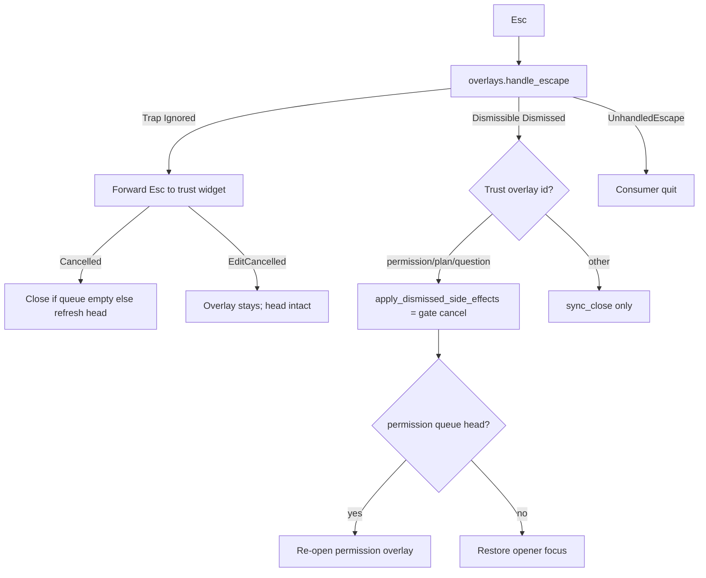
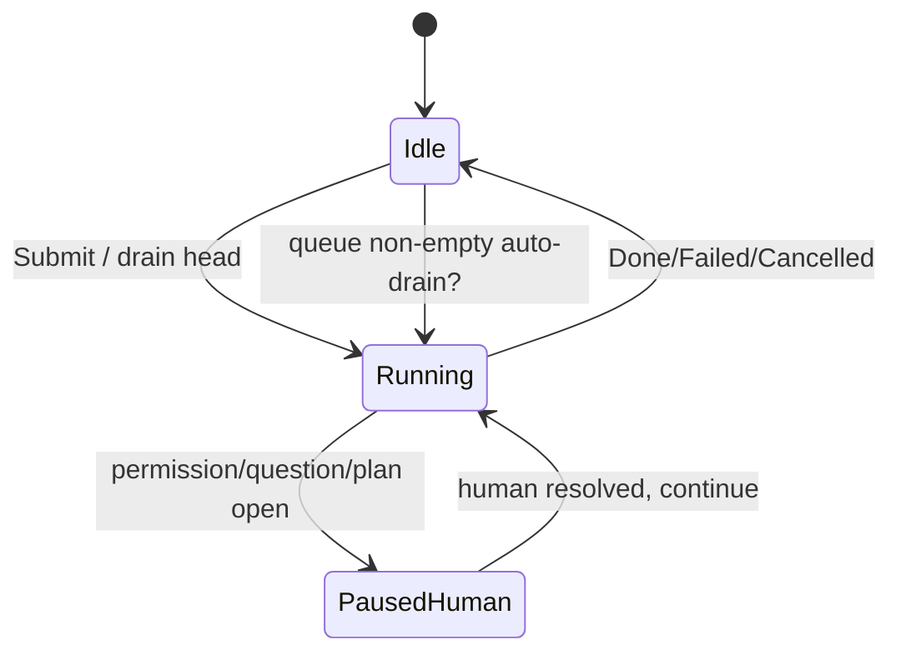
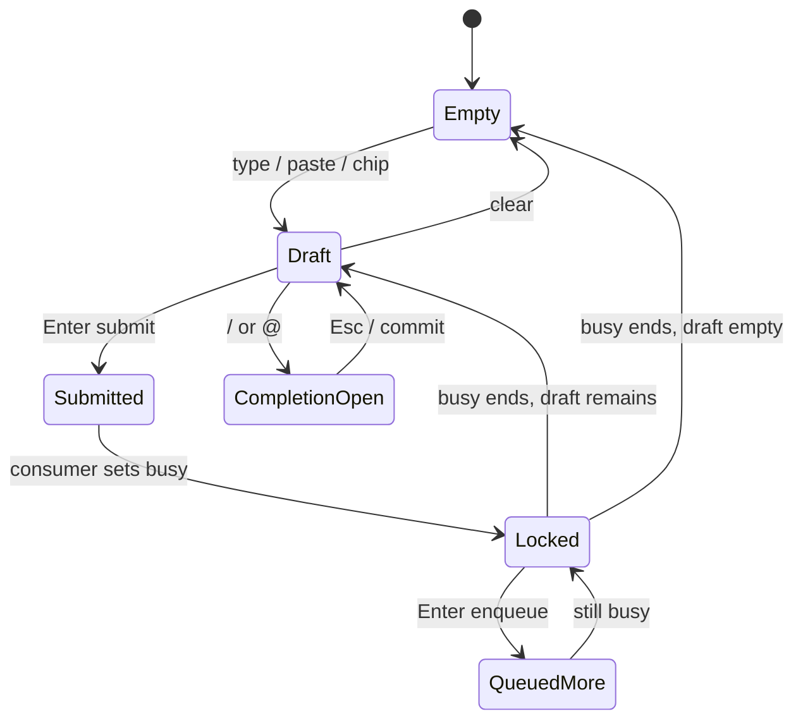
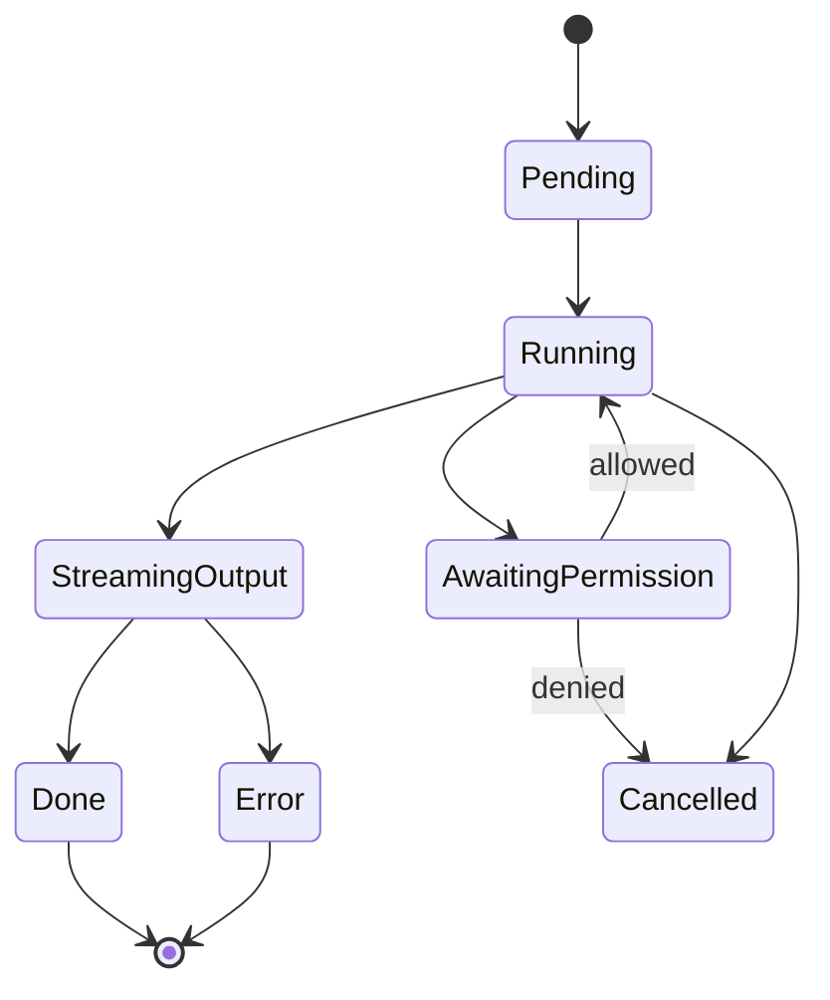
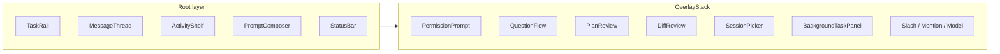
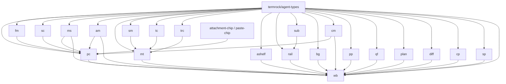

# Design: `@termrock/agent` — source-owned agent UI collection

| Field | Value |
|-------|-------|
| **Title** | `@termrock/agent` — source-owned agent UI collection for TermRock |
| **Author** | TermRock design (elevated from seed + kernel audit) |
| **Date** | 2026-08-09 |
| **Status** | Draft (design SoT) — open questions closed (KD-27…29 user-final) |
| **Repo path** | `docs/design/termrock-agent.md` |
| **Distribution** | Source-owned registry package `@termrock/agent` (`termrock/agent/*` items); interaction kernel stays in `termrock` crate |
| **Related** | `prompt-composer.md`, `permission-trust.md`, `streaming-performance.md`, `overlay-stack.md`, `responsive-layout.md`, `semantic-interaction-architecture.md`, `source-owned-registry.md`, `component-anatomy-spec.md` §11–12, `experience-research-2026.md`, `competitive-tui-research.md`, plan 046, migrations `0040`/`0045`/`0046`/`0049` |

**Rule:** Components are **domain-neutral**. Provider policy (which tools run, sandbox rules, model routing, AGENTS.md loading, secrets, persistence) is **consumer-owned**. TermRock owns chrome, interaction, streaming presentation, contraction, and typed outcomes only.

**Display-only projections:** enums such as `PermissionScopePreview`, `StreamChunk` tool events, and ModelSelector capability **tags** are consumer-supplied display data — not provider integration, not default catalogs, not auto-allow matrices (KD-8).

---

## Overview

Agent-class TUIs (Grok Build–class studios, Amp, OpenCode, Claude Code, Codex CLI, peers) share a durable interaction grammar: composer-first loops, trust/mode dials, permission interrupts, inspectable tool work, session resume, and streaming transcripts. No open design system currently ships that grammar as **product-neutral, contract-tested, source-owned** components on Ratatui.

This design specifies `@termrock/agent`: a registry collection of 22 components plus the flagship `AgentWorkbench` block. It elevates the existing seed and the kernel foundations already present in-tree (`PromptComposer`, `PermissionPrompt`, `Transcript`, `ToolCard`, `PlanReview`, `TaskRail`, `AgentWorkbench` pattern, `OverlayStack`, `InteractionScene`, `perf` stream kits) into a single implementable package contract.

Consumers own execution, policy, and persistence. Components emit pure outcomes. Esc peels one overlay layer. High-risk permission surfaces are default-deny. Streaming is append-only and virtualization-friendly. Colorless and narrow terminals remain first-class.

---

## Background & Motivation

### Current state (truth from tree)

| Surface | Location | Gap vs category-leading agent UI |
|---------|----------|----------------------------------|
| `PromptComposer` | `crates/termrock/src/widgets/prompt_composer.rs` | Strong foundation (queue, chips, blur-draft, `apply_completion_insert` + Completion outcomes); **gap is workbench/overlay UX wiring**, not total absence of commit helpers |
| `PermissionPrompt` | `crates/termrock/src/widgets/permission.rs` | Default-deny + provenance + stale queue; needs workbench overlay wiring as sole path |
| `Transcript` | `crates/termrock/src/widgets/transcript.rs` | Variable-height engine; heterogeneous tool/markdown composition incomplete |
| `ToolCard` / `ApprovalCard` | `widgets/agent.rs` | Paint primitives; not full ToolCallCard / TerminalRunCard contracts |
| `PlanReview`, `QuestionFlow`, `SessionPicker`, `TaskRail`, `ModeRibbon` | `widgets/agent_blocks.rs` | Seed blocks; incomplete risk focus, streaming, registry packaging |
| `DiffReview` | `widgets/review.rs` | Hunk nav; multi-file accept/reject outcomes incomplete |
| `AgentWorkbench` | `patterns/agent_workbench.rs` | Elevated public composition (TaskRail, ActivityShelf, Composer, Permission, Plan/Diff/Session) — **0236** |
| Registry | `registry/fixtures/*` | Demo blocks; **no** `termrock/agent/*` items yet |

### Pain points

1. **Apps re-glue agent chrome** — every consumer reinvents tool cards, permission stacks, and queue semantics.
2. **Dual-truth leftovers** — `PromptBox` vs `PromptComposer`, `ApprovalCard` vs `PermissionPrompt`; agents need one path.
3. **Incomplete streaming law** — token append without coalescing + height cache thrash.
4. **Trust bugs as a class** — historical Allow-default focus; must be structural, not lore.
5. **No source-owned distribution unit** — crate exports exist; `@termrock/agent` collection does not.

### Why now

TermRock's product direction names agent UIs as a primary consumer class. Kernel interaction law (`InteractionScene`, `OverlayStack`, intents, responsive workspace) is in place. Experience research (2026) and competitive research already extract patterns. This document freezes the **package contract** so implementation PRs stay coherent.

---

## Goals & Non-Goals

### Goals

1. Ship an **implementable** catalog of 22 domain-neutral agent components with **L1 pack contracts** (flagship L2); honesty matrix AD-4 — not false claim of anatomy 1–24 for every chip.
2. Ship `AgentWorkbench` as a **block** composed only from public kernel APIs + `@termrock/agent` components.
3. Encode **non-negotiable laws**: composer continuity, default-deny trust, Esc one-layer, append-only streaming, colorless/narrow survival.
4. Define **shared types** used consistently across components (actor, status, risk, stream, review, checkpoint).
5. Define **registry install graph** (`termrock add termrock/agent-workbench` pulls deps).
6. Provide **stories + tests + PR plan** so another engineer implements without reading competitor source.

### Non-Goals

- Embedding any model provider SDK, API keys, or tool executors.
- Owning process/PTY lifecycle, sandbox, or network policy.
- Stable 1.0 API compatibility (breaking OK; no facades).
- Product branding, logos, or slash-command vocabularies from any agent product.
- Replacing kernel primitives (Panel, List, TextArea, OverlayStack stay crate-stable).
- Multiplayer/collaboration protocol design (UI projection only).

---

## Research synthesis (patterns only)

Studied interaction *models* from Grok Build–class studios, Amp, OpenCode, Claude Code, Codex CLI, Crush, and peer agent TUIs (docs/product pages + TermRock research SoTs). **No branding, copy, or source reuse.**

### Recurring interaction patterns

| Pattern | Product signal | TermRock expression |
|---------|----------------|---------------------|
| **Composer-first loop** | Always-visible multi-line prompt; Enter send / chord newline | `PromptComposer` |
| **Composer continuity** | Draft+queue survive overlays & stream | Blur without clear; queue while busy |
| **Mode as safety dial** | Plan / ask / edit / auto / full-auto change *permission chrome* | `AgentModeSelector` + mode badge |
| **Slash + @ surfaces** | `/` commands; `@` attach context without leaving composer | `SlashCommandMenu`, `FileMention` |
| **Attachment chips** | Pastes/files/images as dismissible chips | `AttachmentChip`, `PasteChip` |
| **Streaming transcript** | Variable-height blocks; follow-tail until scroll | `MessageThread` + `StreamingMarkdown` over `Transcript` |
| **Tool cards as first-class rows** | Collapsible invocation + args + status + result | `ToolCallCard` |
| **Shell as inspectable run** | Live stdout, cancel, exit code | `TerminalRunCard` |
| **Permission gates** | Default-deny risk-aware cards | `PermissionPrompt` |
| **Question interruptions** | Multi-step Qs pause agent | `QuestionFlow` |
| **Plan → approve → execute** | Read-only plan before writes | `PlanReview` |
| **Autonomy ladder** | Suggest → auto-edit → full-auto (Codex-class) | Visible mode badge always |
| **Subagent / background work** | Side rail of tasks; cancel per task | `TaskRail`, `SubagentCard`, `BackgroundTaskPanel`, `ActivityShelf` |
| **Context meter** | Token/window usage near composer | `ContextMeter` (not fake “thinking” bar) |
| **Diff + checkpoint review** | Hunk nav; restore points | `DiffReview`, `CheckpointTimeline` |
| **Session resume** | Picker of threads/sessions | `SessionPicker` |
| **Client/server optional** | UI against async event stream | No embedded provider SDK |
| **Command palette** | Global jump (modes, models, sessions) | Kernel `CommandPalette` + workbench routing |

### Product DNA (steal / avoid)

| Source | Steal | Avoid |
|--------|-------|-------|
| **Grok Build–class** | Transcript-as-document; composer never dies; overlay cascade; plan+subagent+diff | Product slash vocab, branding, provider policy |
| **Amp** | Threads as objects; mode dials always visible; MCP/tools as panels; palette jump | Capability preset names as library enums |
| **OpenCode** | Plan vs Build chrome; multi-session; client/server survival | Provider chrome |
| **Claude Code–class** | Dense tool stream; permission interrupt UX | Brand lock-in |
| **Codex-class** | Autonomy ladder as visible dial | Unsafe auto defaults in kit |
| **Crush-class** | Screenshot-worthy token recipes | Pretty over trust |

### Anti-patterns

- Embedding API keys or provider SDKs in components.
- Approval defaulting to Allow (historical TermRock bug class — structural fix via `PermissionRisk::default_focus`).
- Treating streaming as full re-render of transcript history.
- Mixing shell process ownership into widgets.
- Brand glyphs as the only status channel (colorless must work).
- Dual composers / dual permission cards without a single agent path.

### Ownership split

| TermRock (`@termrock/agent` + kernel) | Consumer agent |
|--------------------------------------|----------------|
| Layout, focus, overlays, Esc law | Model/provider choice |
| Prompt editor chrome, chips | What attachments mean |
| Permission / question / plan chrome | Whether a tool is allowed |
| Tool card presentation | Tool schemas & executors |
| Transcript virtualization | Message persistence |
| Task rail geometry | Task orchestration |
| Typed outcomes | Effects (run tool, write file, network) |
| Stream coalescing UI helpers | Worker threads / channels |

### Six non-negotiable agent laws

1. **Composer continuity** — draft/queue survive overlays and streaming.
2. **Trust visibility** — mode, risk, pending permission always readable.
3. **Inspectable work** — tools, diffs, plans, subagents are first-class rows.
4. **Durable session** — resume/multi is UI, not afterthought.
5. **Degrade with dignity** — mono / narrow / mux still usable.
6. **Default-deny trust** — high risk never Enter-approves by accident.

---

## Key Decisions

| # | Decision | Rationale |
|---|----------|-----------|
| **KD-1** | **Hybrid distribution**: kernel crate keeps interaction law + heavy primitives; `@termrock/agent` is source-owned chrome/blocks | Matches `source-owned-registry.md`; Esc/focus/unicode must not fork |
| **KD-2** | **One agent path**: `PromptComposer` + `PermissionPrompt` supersede `PromptBox` + `ApprovalCard` for agent workbench; **A1b cutover** | Dual truths cause safety bugs; ApprovalCard still binds `y`→AllowOnce |
| **KD-3** | **Outcomes are pure enums** — zero I/O inside components | Testability; TEA-friendly hosts |
| **KD-4** | **Esc = one conceptual layer** | Ambiguous Esc is premium-TUI failure mode |
| **KD-5** | **Default-deny is structural** — `PermissionRisk::default_focus` always Deny; Allow never default | Closes Allow-default bug class |
| **KD-6** | **Streaming is structural** — append-only + height cache `(id, revision, width, expand, density)` + `StreamCoalescer` | Prevents O(history) re-wrap |
| **KD-7** | **Queue while busy** — Enter enqueues when busy; never dual-submit | Continuity + race prevention |
| **KD-8** | **Provider policy outside** — no model lists, tool schemas, sandbox, or mode→auto-Allow in library | Product neutrality |
| **KD-9** | **Workbench is composition** — public APIs only; consumer owns effect loop | Installable source |
| **KD-10** | **Mode changes chrome, not model weights** — projection table AD-6; optional non-binding helper only | Separates autonomy UX from routing |
| **KD-11** | **MessageThread = project-to-lines v1** (AD-1); nested widget trees deferred v2 | Matches real `Transcript` API |
| **KD-12** | **Fullscreen promotion** for Diff/Plan/Terminal/Composer/tool detail via OverlayStack | Responsive algebra |
| **KD-13** | **Phosphor default, full retheme** via `Role` | Design system law |
| **KD-14** | **Registry graph is install unit** — flat `termrock/*` names + collection tag `@termrock/agent` | shadcn-class ownership |
| **KD-15** | **Stale permission generations** — FIFO + generation | Async safety |
| **KD-16** | **Modern-first; breaking OK** | Forward-only rule |
| **KD-17** | **Flat item names** `termrock/<item>` + metadata collection `@termrock/agent` — not nested `termrock/agent/*` paths | Matches CLI fixtures / registry examples; freezes OQ-1 |
| **KD-18** | **No dual risk/tool enums** — `PermissionRisk` + elevated `ToolStatus` only | Kills dual-truth class |
| **KD-19** | **OverlayStack sole agent modal Esc/geometry**; InteractionScene = root panes only | Resolves dual peel (Issue 2) |
| **KD-20** | **Permission High/Critical → AlertDialog Trap** (Esc → widget → Cancelled → host close); **Low/Medium → Dialog Dismissible** but host **must** run trust-cancel on `Dismissed` (KD-26); Esc never grants | Trap vs Dismissible is geometry law; cancel semantics must not fork |
| **KD-21** | **Project-to-lines MessageThread v1** | Implementable against kernel now |
| **KD-22** | **QuestionFlow cancel drops answers** (no partial commit by default) | Predictable pause/resume |
| **KD-23** | **Cancel taxonomy** `CancelRun` / `CancelTool` / `CancelTask` / `CancelAll` / `Interrupt` (AD-5) | Cross-pack consistency |
| **KD-24** | **Contract levels L0/L1/L2** — flagship L2; chips L0–L1; never claim 1–24 for all 22 at A0 | Honest implementability |
| **KD-25** | **ApprovalCard agent ban** — agent docs/examples/workbench must use PermissionPrompt from A1b; ApprovalCard non-agent embeds only until A9 remove | Dual-path hazard |
| **KD-26** | **Trust-overlay dismiss = gate cancel** — any close of permission/plan/question (Dismissible Esc peel, outside-click dismiss where allowed, or Trap→widget Esc) runs the **same pure cancel path** as widget Esc; never silent close | Kernel Dismissible peels without delivering Esc to the widget (`OverlayStack::handle_escape`) |

**Resolved product decisions (user-final):**

| # | Decision |
|---|----------|
| **KD-27** | **Vim / dual-input keymap is a separate package (PR-A8 later).** Agent pack and workbench stay free of vim bindings. |
| **KD-28** | **ThinkingBlock is a projection helper only** — not a registry install item; nested in MessageThread line projection. |
| **KD-29** | **No auto-drain of composer queue after Failed or Cancelled run.** Success may auto-drain (default recommendation yes); fail/cancel hold queue for user edit/send. Consumer may override; library must not force drain on fail/cancel. |

## Package shape

```
@termrock/agent  (collection tag; **item names are flat** `termrock/<name>` per KD-17)
├── types/                    # termrock/agent-types
│   └── agent_types.rs        # shared domain-neutral types
├── components/
│   ├── prompt-composer/      # may re-export/wrap kernel PromptComposer skin
│   ├── attachment-chip/
│   ├── paste-chip/
│   ├── file-mention/
│   ├── slash-command-menu/
│   ├── model-selector/
│   ├── agent-mode-selector/
│   ├── message-thread/
│   ├── streaming-markdown/
│   ├── tool-call-card/
│   ├── terminal-run-card/
│   ├── activity-shelf/
│   ├── task-rail/
│   ├── subagent-card/
│   ├── background-task-panel/
│   ├── context-meter/
│   ├── permission-prompt/
│   ├── question-flow/
│   ├── plan-review/
│   ├── diff-review/
│   ├── checkpoint-timeline/
│   └── session-picker/
├── blocks/
│   └── agent-workbench/
└── stories/                  # Studio / lookbook scenarios
```

### Kernel deps (crate, not copied)

`InteractionScene`, `OverlayStack`, `Workspace` / responsive anatomy, `Panel`, `List` / `ComposedRow`, `TextArea`, `MarkdownView`, `DiffView`, `Dialog`, `Picker`, `CompletionMenu`, `CommandPalette`, `ScrollArea` / `LogPane`, tokens (`DesignTokens`, `Role`, `Density`), intents (`UiIntent`), `perf::{StreamCoalescer, FollowMode, ScrollAnchor}`, `Transcript` engine (virtualization substrate).

### What elevates into registry vs stays kernel

| Stay kernel (crate) | Source-owned (registry) |
|---------------------|-------------------------|
| Transcript measure/follow/virtual window | MessageThread chrome projection |
| Permission queue + default-deny math | PermissionPrompt product layout skins |
| PromptComposer state machine | Opinionated workbench layout + wiring |
| DiffView / DiffReview scroll math | Multi-file accept/reject chrome |
| OverlayStack policies | Agent-specific overlay id conventions |

**Rule of thumb:** if a bugfix must reach every consumer without merge conflict → crate. If branding/layout productization is the point → registry.

---

## Shared domain-neutral types

**Law (KD-18):** Package types **must not** parallel kernel SoTs. Use kernel enums for risk and tool lifecycle. Package introduces only pack-level concepts (stream envelope, agent mode dial, checkpoints, activity rows).

### Kernel SoTs (re-export / use directly — never duplicate)

| Kernel type | Path | Package use |
|-------------|------|-------------|
| `PermissionRisk` | `widgets/permission.rs` | Risk everywhere (permission, plan, activity, tool chrome) |
| `PermissionAction` / `PermissionScope` / `PermissionOutcome` / `PermissionRequest` / `PermissionQueue` | same | Trust surface |
| `ToolStatus` | `widgets/agent.rs` | Tool lifecycle (elevated in A3c — see mapping) |
| `PromptComposerOutcome` / `QueuedPrompt` / `ComposerChip` | `prompt_composer.rs` | Composer |
| `TranscriptKind` / `TranscriptBlock` / `TranscriptOutcome` | `transcript.rs` | MessageThread substrate |
| `DiffReviewOutcome` (elevated) | `review.rs` | DiffReview |

### ToolStatus elevation (single enum — A3c migration)

Kernel today:

```rust
// crates/termrock/src/widgets/agent.rs — current
pub enum ToolStatus { Pending, Running, Done, Error, Cancelled }
```

**Target single SoT** (migration file required; no parallel `ToolCallStatus`):

```rust
#[non_exhaustive]
pub enum ToolStatus {
    Pending,
    Running,
    /// Streaming stdout/args still open (was informal Running+detail).
    StreamingOutput,
    /// Blocked on PermissionPrompt head.
    AwaitingPermission,
    /// Was `Done`.
    Done,
    /// Was `Error`.
    Error,
    Cancelled,
}
```

| Old | New | Glyph (colorless) |
|-----|-----|-------------------|
| Pending | Pending | `…` |
| Running | Running / StreamingOutput | `◉` / `»` |
| — | AwaitingPermission | `P` |
| Done | Done | `✓` |
| Error | Error | `✗` |
| Cancelled | Cancelled | `⊘` |

**Forbidden:** package-level `RiskLevel`, `ToolCallStatus`, or second permission risk enum. Activity rails use `Option<PermissionRisk>`.

### Package-only types

All IDs are consumer-owned (`Id: Clone + Eq + Hash`). Text borrowed at paint where practical. Optional `serde` feature for Studio fixtures.

```rust
/// Who produced a message or activity (display projection).
#[non_exhaustive]
pub enum ActorKind { User, Agent, System, Tool, Subagent }

pub struct Actor {
    pub id: String,
    pub kind: ActorKind,
    pub label: String,
    pub provenance: Option<String>,
}

/// Lifecycle of a rail/task unit (not a tool-call status duplicate).
#[non_exhaustive]
pub enum TaskStatus {
    Queued,
    Running,
    WaitingPermission,
    WaitingInput,
    Streaming,
    Succeeded,
    Failed,
    Cancelled,
    TimedOut,
}

/// Optional *display* projection of what a permission UI describes.
/// Consumer builds these strings; library never invents paths/hosts.
/// Not a policy engine. McpTool/Shell/Network are **labels**, not providers.
#[non_exhaustive]
pub enum PermissionScopePreview {
    FileRead { path: String },
    FileWrite { path: String },
    Shell { command_preview: String },
    Network { host_preview: String },
    McpTool { name: String },
    Custom { label: String },
}

pub struct ActivityItem<Id> {
    pub id: Id,
    pub actor: Actor,
    pub title: String,
    pub status: TaskStatus,
    pub risk: Option<PermissionRisk>, // kernel type
    pub progress: Option<ActivityProgress>,
    pub parent: Option<Id>,
}

#[non_exhaustive]
pub enum ActivityProgress {
    Indeterminate,
    Ratio { done: u32, total: u32 },
    Bytes { done: u64, total: Option<u64> },
}

pub struct Checkpoint<Id> {
    pub id: Id,
    pub label: String,
    pub at_label: String,
    pub kind: CheckpointKind,
}

#[non_exhaustive]
pub enum CheckpointKind {
    UserMessage, ToolBoundary, PlanApproved, ExplicitSave, Error,
}

#[non_exhaustive]
pub enum ReviewDecision {
    Accept, AcceptOnce, Reject, RequestChanges, Skip,
}

/// UI-thread stream envelope. **Not** a provider wire format.
/// Consumer maps provider events → these variants. No default model lists.
#[non_exhaustive]
pub enum StreamChunk {
    TextDelta(String),
    ReasoningDelta(String),
    ToolCallStart { id: String, name: String },
    ToolCallArgsDelta { id: String, json_delta: String },
    ToolCallEnd { id: String, status: ToolStatus },
    Status(TaskStatus),
    Error { message: String, retryable: bool },
    Done,
}

pub struct StreamingContentState {
    pub phase: StreamPhase,
    pub text: String,
    pub reasoning: Option<String>,
    pub error: Option<String>,
}

#[non_exhaustive]
pub enum StreamPhase {
    Idle, WaitingFirstToken, Streaming, Finalizing, Complete, Failed,
}

/// Safety / autonomy dial (not model routing). See Mode → chrome table.
#[non_exhaustive]
pub enum AgentMode {
    Ask, Plan, Edit, AutoEdit, FullAuto,
}
```

**Serialization:** optional `serde` feature; Studio fixtures use **fake neutral** model ids (`model-a`, `model-b`) and slash commands (`/demo-clear`, `/demo-plan`) only — **no** product slash vocab, **no** default model catalog, **no** library `AgentMode` → auto-Allow matrix (KD-8, Issue 11).

## Cross-cutting contracts (all components)

| Concern | Rule |
|---------|------|
| **Esc** | **One peel authority for agent overlays:** `OverlayStack` (KD-19). Scene owns root pane focus only. Never approve via Esc. |
| **Outcomes** | Pure enums — no I/O, no threads, no clocks (`FrameTick` only if animation needed) |
| **Streaming** | Append-only patches; paint O(visible); invalidate height by `(id, revision, width)` |
| **Queue** | Composer may enqueue; consumer drains; components never auto-send queue |
| **Cancel** | Pack SoT names: `CancelRun` / `CancelTool` / `CancelTask` / `CancelAll` / `Interrupt` (AD-5/KD-23); local aliases map there. Trust-overlay Esc cancels **gate** not run (KD-26) |
| **Errors** | Inline error tone + retry outcome; never panic on bad chunks |
| **Narrow** | Responsive stages; essential labels survive; drawers/fullscreen promote |
| **Colorless** | Glyph + wording carry status; `Role` still set for themed hosts |
| **Fullscreen** | Diff/Plan/Terminal/Composer promote via overlay |
| **a11y** | Focus order, hit regions, non-color status prefixes, actor labels |
| **Focus-visible** | Single-line borders; `Role::BorderFocused` vs `Role::Border` only |
| **Theme** | Paint via `DesignTokens` / `Theme` roles; phosphor default; retheme-safe |
| **Mouse** | Hit regions published each frame when interactive |
| **Tests** | Deterministic; no wall clock; hot-path budgets where streaming |

### Overlay id conventions (agent pack) — frozen policies

**KD-19 / KD-20:** Agent modal chrome uses **`OverlayStack` as sole geometry + Esc authority**. `InteractionScene` registers **root workbench panes only** (task_rail, transcript, prompt, status, modes). Overlay open → stack owns input; **do not** also push scene Card layers for the same permission/question/plan (kills dual peel). Migration from current scene-only workbench is **A1b**.

| Overlay id | OverlayKind | Esc | Outside | Backdrop | Narrow | Purpose |
|------------|-------------|-----|---------|----------|--------|---------|
| `termrock.prompt_completion` | Completion | Dismissible | Dismiss | None | Clamp | Slash / @ |
| `termrock.prompt_fullscreen` | Fullscreen | Dismissible | Trap | Occlude | Fullscreen | Tiny composer |
| `termrock.permission` (Low/Medium) | Dialog | Dismissible | Trap | Dim | Fullscreen | Trust gate |
| `termrock.permission` (High/Critical) | AlertDialog | **Trap** | Trap | Occlude | Fullscreen | Trust gate; Esc absorbed until explicit Cancel/Deny action |
| `termrock.question` | Dialog | Dismissible | Trap | Dim | Fullscreen | QuestionFlow |
| `termrock.plan` | Dialog (≥80w) / Fullscreen | Dismissible | Trap | Dim | Fullscreen | PlanReview |
| `termrock.diff` | Fullscreen | Dismissible | Trap | Occlude | Fullscreen | DiffReview |
| `termrock.terminal_run` | Fullscreen | Dismissible | Trap | Occlude | Fullscreen | Terminal log |
| `termrock.tool_detail` | Fullscreen / Popover | Dismissible | Dismiss | None/Occlude | Fullscreen | Expanded tool (v1 promote) |
| `termrock.background_tasks` | Drawer | Dismissible | Dismiss | Dim | Fullscreen | BackgroundTaskPanel |
| `termrock.session_picker` | CommandPalette or Dialog | Dismissible | Dismiss | Dim | Fullscreen | SessionPicker |
| `termrock.model_select` | Select | Dismissible | Dismiss | None | Clamp | ModelSelector |
| `termrock.mode_select` | Select / Menu | Dismissible | Dismiss | None | Clamp | AgentModeSelector |
| `termrock.command_palette` | CommandPalette | Dismissible | Dismiss | Dim | Fullscreen | Global jump |

### Trust-overlay Esc law (KD-20 + KD-26) — normative

Kernel fact (`overlay_stack.rs`):

| `LayerDismissPolicy` | `OverlayStack::handle_escape` | Widget sees Esc? |
|----------------------|-------------------------------|------------------|
| **Trap** | `Ignored` (layer stays) | **Host must forward** Esc into widget |
| **Dismissible** | `Dismissed { id, focus }` (layer popped + descendants) | **No** — widget never runs `handle_key(Esc)` |
| **Ignore** | `UnhandledEscape` | N/A for top input owner |

Kernel fact (`permission.rs`): widget Esc → `queue.dismiss_head(generation)` + `PermissionOutcome::Cancelled { request_id, generation }` (no grant; head advanced). Edit-mode Esc → `EditCancelled` only (does not dismiss request).

**Rule:** Closing a **trust gate** overlay must always produce the **gate-cancel outcome**, whether Esc reached the widget (Trap) or only the stack (Dismissible / outside-click dismiss).

#### Trust overlay set (must apply gate-cancel on any dismiss)

| Overlay id | Kind / Esc | Gate-cancel path (pure UI; host emits workbench outcome) |
|------------|------------|----------------------------------------------------------|
| `termrock.permission` (any risk) | High/Critical: AlertDialog **Trap**; Low/Medium: Dialog **Dismissible** | Same as widget Esc: if edit mode → exit edit only on Trap-forwarded Esc; else `permission.cancel_head()` ≡ `dismiss_head(gen)` + emit `PermissionOutcome::Cancelled` + audit non-grant + set related tool `AwaitingPermission` → consumer policy (usually re-queue tool fail/deny) + **if queue still non-empty, keep or re-open head** (see below) |
| `termrock.plan` | Dialog/Fullscreen **Dismissible** | `PlanReviewOutcome::Cancelled` (≠ Approved); clear plan UI state |
| `termrock.question` | Dialog **Dismissible** | `QuestionFlowOutcome::Cancelled`; **drop answers** (KD-22) |

**Not trust gates** (Dismissible peel without gate-cancel): completion, model/mode select, session picker, command palette, tool detail, terminal fullscreen, background drawer, prompt fullscreen — those only `sync_close` + focus restore (their own Cancelled if any is widget-local when Trap-forwarded; session picker etc. may emit `Cancelled` on Dismissed for consistency — recommended).

#### Permission queue after dismiss

```text
// Prefer one helper used by BOTH Trap-forwarded Esc and Dismissed path:
fn permission_gate_cancel(state) -> PermissionOutcome:
  // Mirror PermissionPromptState Esc branch (permission.rs ~930):
  //   dismiss_head(generation); sync_from_head(); Cancelled { id, generation }
  out = state.permission.apply_esc_cancel()   // or handle_key(Esc) if surface still mounted
  return out

fn after_permission_outcome(state, out):
  match out:
    Cancelled | Decided{Deny…} =>
      // head already advanced inside PermissionPromptState
      if state.permission.queue has head:
        // Keep overlay open OR re-open immediately — pick one and test it.
        // **Default (A1b):** re-open permission overlay on next frame if head present
        // so FIFO queue is not stranded.
        state.ensure_permission_overlay_for_head()
      else:
        state.overlays.close(termrock.permission) // already pealed if Dismissible
        state.ui_paused = false if no other gates
    Decided{Allow…} => close overlay; continue run
```

**Dismissible path:** stack already peeled → still call `permission_gate_cancel` on the **state machine** (not only clear a bool). If queue has another head, **re-open** overlay with new head (default). Never leave head grantable with overlay closed and no outcome emitted.

**Trap path:** `handle_escape` → `Ignored` → `permission.handle_key(Esc)` → on `Cancelled` host closes overlay if queue empty, else refresh head UI.

**Outside-click:** Low/Medium outside is **Trap** (Dialog policy) — no accidental outside dismiss. If a future skin sets outside Dismissible, same gate-cancel as Esc Dismissed.

**Edit mode:** Trap-forwarded Esc that yields `EditCancelled` does **not** close overlay and does **not** dismiss head. Dismissible stack peel during edit is rare (Esc hits stack first only if host calls stack before widget — **host order for Trap is stack then widget**; for Dismissible, stack peels first so edit buffer is discarded: treat as full gate-cancel + drop edit — document and test).

#### Plan / Question on Dismissed

```text
Dismissed { id: termrock.plan } =>
  emit PlanReviewOutcome::Cancelled
  clear plan state; ui_paused &= !other_gates
  // never Approved

Dismissed { id: termrock.question } =>
  emit QuestionFlowOutcome::Cancelled
  drop answers map (KD-22); reset step index
  ui_paused &= !other_gates
```

#### AD-5 clarification

| Esc target | Cancels agent **run**? | Cancels **human gate**? |
|------------|------------------------|-------------------------|
| Trust overlay (permission/plan/question) | **No** (unless consumer binds) | **Yes** — always (KD-26) |
| Composer Stop / Ctrl+C | Yes → `CancelRun` / `Interrupt` | N/A |
| Completion / picker peel | No | N/A (menu only) |

### Input routing (workbench) — single peel algorithm

```text
fn handle_escape(state) -> WorkbenchOutcome:
  // 1) OverlayStack first (sole modal peel authority)
  match state.overlays.handle_escape():  // kernel OverlayStack

    // Trap (High/Critical permission AlertDialog): layer stays
    Ignored if top is trust overlay =>
      out = forward_esc_to_top_widget(state)  // PermissionPrompt / …
      match out:
        PermissionOutcome::Cancelled | EditCancelled | Plan Cancelled | Question Cancelled =>
          if should_close_after(out):  // queue empty / gate done
            state.overlays.remove(top_id)
            restore_focus(opener)
          else if PermissionCancelled && queue.has_head:
            refresh permission UI on still-open or re-opened layer
          return map(out)  // never grant
        _ => return map(out)

    // Dismissible: layer ALREADY popped — widget did not see Esc
    Dismissed { id, focus } =>
      out = apply_dismissed_side_effects(state, id)  // KD-26 for trust ids
      restore_focus(focus or "prompt")
      // If permission queue still has head: re-open overlay (default)
      if id is permission && state.permission.has_head():
        open_permission_overlay(state)
      return out  // must include Cancelled for trust ids, not bare LayerDismissed alone

    UnhandledEscape => go to 2

  // 2) No overlays — root only
  UnhandledEscape => consumer quit policy
```

```text
fn apply_dismissed_side_effects(state, id) -> WorkbenchOutcome:
  match id:
    termrock.permission =>
      // MUST run even though widget missed Esc:
      return Permission(permission_gate_cancel(state))  // Cancelled + queue advance
    termrock.plan =>
      return Plan(Cancelled)
    termrock.question =>
      clear_answers(state.question)  // KD-22
      return Question(Cancelled)
    termrock.session_picker =>
      return Session(Cancelled)  // recommended
    termrock.prompt_completion | model_select | mode_select | … =>
      return LayerDismissed / CompletionClosed  // non-trust
    _ =>
      return LayerDismissed
```



**Focus return:** `OverlaySpec.opener_focus` = pane that opened the overlay. After gate-cancel with empty permission queue (or plan/question cancel), `scene.focus(opener)`.

**Forbidden (post-A1b):** scene Card layers for approval/question; **silent** `sync_close` of trust overlays without gate-cancel; treating Dismissed as “UI only” while leaving permission head live.

### Mandatory tests (A1 / A1b)

| Test | Assert |
|------|--------|
| `dismissible_permission_esc_cancels_head` | Low/Medium overlay Dismissible Esc → `PermissionOutcome::Cancelled`, head advanced/dismissed, **no** Allow, audit non-grant |
| `dismissible_permission_esc_no_stranded_queue` | Two queued requests; Esc on first → first Cancelled; second becomes head (overlay re-open or still present) |
| `trap_permission_esc_cancels` | High/Critical Trap → widget Esc → Cancelled; overlay closes if empty queue |
| `trap_permission_edit_esc_stays` | Edit mode Esc → `EditCancelled`; head remains; overlay open |
| `dismissible_plan_esc_not_approved` | Plan Dismissed → `Cancelled` only |
| `dismissible_question_esc_drops_answers` | Question Dismissed → `Cancelled` + answers empty (KD-22) |
| `esc_never_grants` | All risks: Esc path ∉ Allow* |
| `outside_click_low_medium_trapped` | Dialog outside Trap: click outside does not dismiss without explicit policy change |

**Forbidden (post-A1b):** `sync_workbench_scene` pushing `InteractionLayer { id: "approval" | "question", … }` for agent trust UX. ApprovalCard path removed from workbench surfaces.

---

## Kernel composition map

Components must compose these public primitives (absolute paths under repo):

| Primitive | Path | Used by |
|-----------|------|---------|
| `Panel` | `crates/termrock/src/widgets/panel.rs` | Cards, drawers, rail |
| `List` / `ComposedRow` | `widgets/list.rs`, `composed_row.rs` | TaskRail, SessionPicker, menus |
| `TextArea` | `widgets/text_area.rs` | PromptComposer editor |
| `MarkdownView` | `widgets/markdown.rs` | StreamingMarkdown |
| `DiffView` / `DiffReview` | `widgets/diff.rs`, `review.rs` | DiffReview |
| `Dialog` / `ChoiceDialog` | `widgets/dialog.rs` | Permission, Question, Plan shells |
| `CompletionMenu` | `widgets/completion_menu.rs` | Slash, FileMention |
| `Picker` | `widgets/picker.rs` | SessionPicker, ModelSelector |
| `ScrollArea` / `LogPane` | `widgets/scroll_area.rs`, `log_pane.rs` | TerminalRunCard, long results |
| `Transcript` | `widgets/transcript.rs` | MessageThread substrate |
| `TokenMeter` | `widgets/agent.rs` | ContextMeter foundation |
| `ToolCard` | `widgets/agent.rs` | ToolCallCard foundation |
| `PromptComposer` | `widgets/prompt_composer.rs` | PromptComposer |
| `PermissionPrompt` | `widgets/permission.rs` | PermissionPrompt |
| `OverlayStack` | `interaction/overlay_stack.rs` | All overlays |
| `InteractionScene` | `interaction/scene.rs` | Workbench focus/Esc |
| `Workspace` | `layout/workspace.rs` | AgentWorkbench geometry |
| `StreamCoalescer` | `perf/stream.rs` | Streaming host loop |
| `StatusBar` / `HintBar` | `widgets/status_bar.rs`, `hint_bar.rs` | Workbench chrome |

---

## Architecture decisions (blocking forks resolved)

### AD-1 MessageThread: project-to-lines (v1) — not nested widget trees

**Chosen (KD-21):** MessageThread is a **projection host** over kernel `Transcript` / `TranscriptState`. Interactive nested StatefulWidgets **inside** the transcript viewport are **out of scope for v1**.

#### Why

Real kernel `TranscriptBlock` is a **pre-measured line slice** (`lines: &'a [&'a str]`, `revision`, fold) with outcomes limited to scroll/select/activate/fold/follow (`transcript.rs`). There is no nested hit-region tree or per-block focus ownership. Inventing dual virtualization without a substrate rewrite thrashs implementers (review Issue 1).

#### v1 law (implementable now)

| Concern | Rule |
|---------|------|
| Paint | Consumer (or pack helper) builds `lines` each frame from domain model |
| Measure | Height = line count (or folded 1); cache key `(block_id, revision, width, expand_flag, density)` |
| Expand | Consumer toggles expand in model → bump `revision` → more lines; **or** promote body to overlay (`termrock.tool_detail` / fullscreen) |
| Keys in thread | Transcript owns: scroll, select, follow, fold, **Activate(id)** |
| Nested actions | On `Activated(id)`, host routes to **card controller** for that id (expand/cancel/retry/copy) **or** opens overlay with full ToolCallCard/TerminalRunCard widget |
| Hit regions | Thread publishes block-row hits only; action buttons live on **selected** block’s **chrome strip** (1–2 footer lines with `[c]ancel [r]etry`) as plain text lines, not separate widgets |
| Mid-stream expand | `ScrollAnchor::ContentId` + row; after remeasure call reveal; follow uses FromEnd |
| Links | StreamingMarkdown link activation only in **fullscreen reader** overlay in v1; in-thread links are plain text |

#### Helpers (pack or kernel)

```rust
// Conceptual — A3a
fn project_tool_card(view: &ToolCallView, width: u16, expanded: bool) -> (Vec<String>, u64 /*revision bits*/);
fn project_terminal_run(view: &TerminalRunView, width: u16, expanded: bool) -> Vec<String>;
fn project_agent_markdown(state: &StreamingContentState, width: u16) -> Vec<String>;
// MessageThread::handle_key → TranscriptOutcome; host maps Activated → CardAction
```

#### v2 (explicit non-goal until designed)

Nested interactive regions: block region registry, focus id `thread/{block}/{part}`, hit_test union with OverlayStack, height cache includes part expand. **Do not implement half of v2.**

---

### AD-2 Esc / focus: OverlayStack sole modal authority

See cross-cutting overlay table + peel algorithm. **Reject** dual “Esc → overlays then scene Card layers for same modal.” Current `agent_workbench.rs` scene Card layers for approval/question are **migrated off in A1b**.

Legacy `overlay_controller.rs` is private/legacy — **do not** revive for agent pack; use public `OverlayStack` + `InteractionScene` root only.

---

### AD-3 Kernel vs registry ownership matrix (frozen)

| Item | Ownership | Notes |
|------|-----------|-------|
| Shared types (pack) | **registry** `termrock/agent-types` | Re-exports kernel risk/tool/outcome types; adds Actor, TaskStatus, StreamChunk, AgentMode, Checkpoint |
| PromptComposer | **kernel elevate** + optional **registry skin** | State machine stays crate; registry may copy chrome layout |
| AttachmentChip / PasteChip | **kernel** (as composer chip kinds) + thin **registry** stories | Logic in PromptComposer; chip paint may skin |
| FileMention / SlashCommandMenu | **registry** over kernel `CompletionMenu` | Consumer candidate lists |
| ModelSelector / AgentModeSelector | **registry** over Select/ModeRibbon | No model catalog in library |
| MessageThread | **registry** projection helpers + kernel **Transcript** | AD-1 |
| StreamingMarkdown | **kernel elevate** (parse/cache) + registry stories | Incomplete-fence algorithm in crate |
| ToolCallCard | **kernel elevate** `ToolCard`→full outcomes + `ToolStatus` extend | Registry skin optional |
| TerminalRunCard | **kernel elevate** (LogPane compose) | PTY consumer |
| ActivityShelf | **registry-only new** | Composes chips/list |
| TaskRail | **kernel elevate** seed + registry skin | List/ComposedRow |
| SubagentCard | **registry-only new** | Projects TaskStatus |
| BackgroundTaskPanel | **registry-only new** | Drawer + List |
| ContextMeter | **kernel elevate** TokenMeter | |
| PermissionPrompt | **kernel elevate** (already strong) | Workbench must use this (A1b) |
| QuestionFlow | **kernel elevate** seed | |
| PlanReview | **kernel elevate** + action-focus model (A1) | |
| DiffReview | **kernel elevate** multi-file model (A5) | |
| CheckpointTimeline | **kernel elevate** Timeline → interactive select/restore | Non-goal: persistence |
| SessionPicker | **kernel elevate** seed | |
| AgentWorkbench | **registry block** | Public APIs only; pattern in crate may thin-wrap until A7 |

**Install meaning:** `termrock add termrock/prompt-composer` installs a **skin/recipe** that depends on kernel `PromptComposer`, not a second state machine. `termrock add termrock/activity-shelf` installs full source component.

**Types edges:** `termrock/agent-types` is a dependency of every pack item that paints status/risk/stream (all leaves + workbench).

---

### AD-4 Contract completeness levels (Issue 7)

Anatomy SoT axes **1–24** (`component-anatomy-spec.md`) are the quality bar. This design does **not** claim every of 22 items is 1–24 complete today.

| Level | Meaning | Items |
|-------|---------|-------|
| **L0** | Sketch (anatomy + outcomes + key laws) | Chips, ActivityShelf, SubagentCard, CheckpointTimeline, Model/Mode selectors (until elevation PR) |
| **L1** | Pack contract (this doc + tests/stories listed) — enough to implement without competitor source | Most of §§1–22 |
| **L2** | Flagship deep — axes 1–24 + hot_path + snapshots | PromptComposer, PermissionPrompt, MessageThread, ToolCallCard, PlanReview, AgentWorkbench |

**Completeness matrix (target at A7):**

| Component | Level now | Target A7 | Gaps vs axes 1–24 |
|-----------|-----------|-----------|-------------------|
| PromptComposer | L2-ish (kernel) | L2 | External editor, fullscreen polish |
| PermissionPrompt | L2 (kernel) | L2 | Workbench overlay wiring A1b |
| PlanReview | L0→L2 in A1 | L2 | Action focus, risk field (this rev) |
| MessageThread | L1 law AD-1 | L2 | Projection helpers A3a |
| StreamingMarkdown | L1 law | L2 | Parse algorithm A3b |
| ToolCallCard | L1 | L2 | ToolStatus migrate A3c |
| DiffReview | L1 model | L2 | Multi-file A5 |
| AgentWorkbench | L1 | L2 | A1b + A6 |
| AttachmentChip, PasteChip | L0/L1 | L1 | Density/tiny in composer PR |
| FileMention, SlashCommandMenu | L1 | L1 | — |
| ModelSelector, AgentModeSelector | L0 | L1 | Property lists in A2/A4 |
| TerminalRunCard | L1 | L1 | — |
| ActivityShelf, SubagentCard, BackgroundTaskPanel | L0 | L1 | A4 |
| TaskRail | L1 seed | L1 | — |
| ContextMeter | L1 | L1 | — |
| QuestionFlow | L1 seed | L1 | Cancel drops answers KD-22 |
| CheckpointTimeline | L0 | L1 | Interactive only A5; no persistence |
| SessionPicker | L1 seed | L1 | — |

**Rule:** PR descriptions must not say “full 1–24” unless matrix cell is L2 and CI stories/snapshots exist. Prefer “L1 pack contract” / “L2 flagship.”

---

### AD-5 Agent host protocol — busy, queue, cancel, priorities

#### Busy ownership

| Flag | Owner | Meaning |
|------|-------|---------|
| `run_busy` | Consumer | Agent run in flight (stream open or tools running) |
| `prompt.busy` | Consumer → `PromptComposerState::set_busy` | Mirrors `run_busy` for queue-when-busy |
| `ui_paused` | Consumer | Permission / Question / Plan overlay requires human; run may be paused server-side |

Composer **queue still allowed** when `run_busy || ui_paused` if `SubmitPolicy.queue_when_busy` (default true). Consumer sets both flags.

#### Queue drain state machine



| Policy | Default recommendation (consumer may override) |
|--------|-----------------------------------------------|
| Auto-drain queue when run ends Successfully | **Yes** (default recommendation): head → next Submit effect |
| Auto-drain after Cancel run | **No** (KD-29) — hold queue; user edits/sends |
| Auto-drain after Failed | **No** (KD-29) — hold queue; consumer may offer retry UI, not silent drain |
| Session switch | **Drop or snapshot queue** — consumer; workbench emits no persistence; document choice in app |
| Permission open | Queue **accepts** new prompts; does not submit under overlay |

#### Cancel taxonomy (normalized names)

| Outcome / host intent | Scope | Typical binding |
|----------------------|-------|-----------------|
| `CancelRun` | Current agent run (all tools) | Composer Stop / Ctrl+C → map `PromptComposerOutcome::Cancel` or `Interrupt` |
| `Interrupt` | Soft stop; draft kept | Ctrl+C while busy (`Interrupt`) |
| `CancelTool { id }` | One tool invocation | Tool card `c` when selected/activated |
| `CancelTask { id }` | Task rail / subagent / background row | Rail / Background panel |
| `CancelAll` | Run + clear in-flight tools (not necessarily queue) | Workbench chord / palette |
| Overlay Esc (trust gate) | **Not** cancel run (unless consumer binds); **does** cancel human gate (KD-26) | Trap→widget Esc or Dismissible→`apply_dismissed_side_effects` |
| Overlay Esc (menus/pickers) | Not cancel run | Peel only / widget Cancelled |

**Alias map (pack consistency):** prefer `CancelRun` / `CancelTool` / `CancelTask` / `CancelAll` / `Interrupt` in workbench union. Component-local names may map:

| Local | Maps to |
|-------|---------|
| `PromptComposerOutcome::Cancel` | `CancelRun` |
| `PromptComposerOutcome::Interrupt` | `Interrupt` |
| ToolCallCard `CancelRequested` | `CancelTool` |
| TerminalRunCard `CancelRequested` | `CancelTool` (same run id) |
| TaskRail `CancelTask` | `CancelTask` |
| Background `Cancel { id }` | `CancelTask` |
| Workbench `CancelAll` | `CancelAll` |

#### StreamChunk → UpdatePriority

| Event | Priority | Drop under Hard backpressure? |
|-------|----------|-------------------------------|
| Permission / tool boundary / ToolCallStart/End | Critical | **Never** |
| Plan/Question interrupt | Critical | Never |
| TextDelta / ReasoningDelta | Normal | Coalesce; may drop intermediate deltas if Soft+ |
| Terminal line spam | Normal/Low | Coalesce lines |
| Status heartbeat | Low | Droppable |
| Error | High | Never drop final error |

Align with `termrock::perf::{UpdatePriority, StreamCoalescer, BackpressureSignal}`.

---

### AD-6 AgentMode → chrome projection table (KD-10)

TermRock **paints** mode chrome only. **Consumer owns** whether tools auto-run. Optional pure helper may document defaults but **must not** auto-emit Allow.

| Mode | Badge / density | PlanReview before writes | PermissionPrompt typical | Warning banners | Composer hint |
|------|-----------------|--------------------------|--------------------------|-----------------|---------------|
| **Ask** | muted | N/A (discourage writes) | Always for write/shell/network | Low noise | “ask — no writes preferred” |
| **Plan** | info | **Required** before execute | Read may auto in consumer; writes gated | Plan chrome primary | “plan” |
| **Edit** | default | Optional | Every write/shell; reads maybe session | Standard | “edit” |
| **AutoEdit** | warning tint on badge | Optional | Shell/network/mcp always; file writes may session-grant **by consumer** | Elevated on shell | “auto-edit” |
| **FullAuto** | **Warning role always** | Consumer | Still show Critical/egress; consumer may skip Low reads | Max destructive/egress copy | “FULL” + warning |

**Non-binding pure helper (optional, documented non-enforcing):**

```rust
/// Recommendation only — consumer policy wins. Never grants.
pub fn permission_prompt_recommended(mode: AgentMode, kind: PermissionActionKind, risk: PermissionRisk) -> bool {
    if risk >= PermissionRisk::High { return true; }
    match mode {
        AgentMode::Ask | AgentMode::Plan => true,
        AgentMode::Edit => !matches!(kind, PermissionActionKind::FileRead),
        AgentMode::AutoEdit => matches!(kind,
            PermissionActionKind::Shell | PermissionActionKind::Network
            | PermissionActionKind::McpTool | PermissionActionKind::Secrets
            | PermissionActionKind::FileDelete),
        AgentMode::FullAuto => risk >= PermissionRisk::Critical
            || matches!(kind, PermissionActionKind::Secrets | PermissionActionKind::Network),
    }
}
```

**Forbidden:** library code that auto-resolves `PermissionOutcome::Decided { action: Allow, … }` from mode alone.

---

## Proposed Design — Component catalog

For every component: anatomy · state machine · typed outcomes · keyboard · mouse · streaming · queue · cancel · error · compact/expanded · fullscreen · responsive · a11y/colorless · stories · tests.

**Completeness SoT is AD-4 (L0/L1/L2)** — sections below are L1 pack contracts unless marked L2; not a claim of anatomy axes 1–24 for every item.

Implementation may start from kernel seeds; contracts below are the **target** API quality bar.

---

### 1. PromptComposer

**Purpose:** Primary human → agent input surface. Kernel foundation: `termrock::widgets::PromptComposer` / `PromptComposerState` / `PromptComposerOutcome` (`prompt_composer.rs`). Flagship for agents; `PromptBox` remains for minimal embeds only.

**Anatomy:**

```
┌ chip_row: [AttachmentChip…] [PasteChip…] ──────────────────┐
│ editor (TextArea, grapheme-safe)                            │
│ mode_badge · model_chip · ContextMeter · queue_badge · STOP │
│ validation_error (optional)                                 │
│ footer_hints (density-dependent)                            │
└─────────────────────────────────────────────────────────────┘
```

**State machine:**



**State buckets:**

| Bucket | Owns | Survives overlay? |
|--------|------|-------------------|
| Text editing | `TextAreaState`, undo/redo, history | **Yes** |
| Chips | `Vec<ComposerChip>` | Yes |
| Completion | `CompletionQuery` | Closed on Esc; draft kept |
| Presentation | compact/normal/expanded/fullscreen | Yes |
| Policy | `SubmitPolicy`, busy, connection, queue | Consumer-set |

**Outcomes** (align kernel): `Changed` · `Submit { text, chip_ids }` · `Queued { entry }` · `QueueRemoved { id }` · `Cancel` · `Interrupt` · `DismissRequest` · `ExternalEditor` · `Completion { query }` · `CompletionClosed` · `CompletionCommitted { kind, id }` · `ModeMenu` · `ModelMenu` · `ChipRemoved` · `ChipActivated` · `AttachRequest` · `ValidationFailed` · `PresentationChanged` · `Blur` · `Ignored`

**Keyboard:** Enter submit (when `SubmitPolicy` allows); Mod+Enter newline; Esc closes completion first then `DismissRequest`; Up on empty → history browse; Ctrl+C → `Interrupt`/`Cancel` when busy; chip strip focus via Tab/BackTab.

**Mouse:** Click chips activate/remove; send/stop hit targets; drag-drop → `AttachRequest`.

**Streaming:** While busy, editor stays editable; send becomes **queue**; stop visible.

**Queue:** Count badge; optional queue list popover (consumer or follow-on).

**Cancel:** Stop → `Cancel` / `Interrupt`.

**Error:** Validation under editor; empty submit → `ValidationFailed` or ignored per policy; disconnected → block submit.

**Compact / expanded:** Compact 2–3 rows; expanded grows with content to max; fullscreen overlay on tiny.

**Fullscreen:** `termrock.prompt_fullscreen` OverlaySpec.

**Responsive:** Hide mode/model text → icons; chips scroll horizontally; footer hints collapse to keymap-only.

**A11y / colorless:** SEND/STOP labels; queue as `[n]`; connection text not color-only.

**Stories:** `prompt-composer/empty`, `draft`, `busy-queue`, `chips`, `narrow`, `slash-open`, `blur-draft-preserved`.

**Tests:** submit empty ignored; busy submit enqueues; Esc closes menu not app; blur keeps draft; paste over threshold → chip; undo bounds; completion apply inserts token.

---

### 2. AttachmentChip

**Purpose:** Dismissible chip representing a file/image/context attachment attached to the composer (not transcript until send).

**Anatomy:** `icon` · `label` · `meta` · `remove`

**State:** idle · hover · focus · removing

**Outcomes:** `Activated { id }` · `Removed { id }` · `FocusMoved`

**Keyboard:** Left/Right among chips; Backspace/Delete remove focused; Enter activate.

**Mouse:** click activate; × remove.

**Streaming / queue:** N/A (composer-owned list).

**Cancel:** N/A.

**Error:** broken path → `Role::Warning` + still removable.

**Compact / expanded:** icon + truncated name vs path meta.

**Fullscreen:** N/A.

**Responsive:** drop meta first; overflow menu when chip_row exceeds width.

**A11y / colorless:** type letter `F`/`I`/`C` (file/image/context).

**Stories:** `attachment-chip/file`, `broken-path`, `remove-focus-restore`.

**Tests:** remove restores focus to composer; truncated label display_cols safe.

---

### 3. PasteChip

**Purpose:** Large paste summarized as chip (avoids multi-MB insert into editor/transcript until send). Align with kernel paste threshold in `PromptComposer`.

**Anatomy:** `kind_badge` · `preview` · `bytes` · `remove`

**State:** idle · expanded_preview

**Outcomes:** `Expanded` · `Collapsed` · `Removed` · `InsertedIntoPrompt` (consumer inserts text)

**Keyboard:** Enter expand; Esc collapse; Delete remove.

**Mouse:** click expand popover (`OverlayKind::Popover`).

**Streaming / queue:** N/A.

**Cancel:** Esc collapses preview only.

**Error:** binary paste → `binary` label; no insert as text without confirm outcome.

**Compact / expanded:** one line vs popover first N lines.

**Fullscreen:** large paste preview may promote popover → dialog.

**Responsive:** bytes hidden first.

**A11y / colorless:** `PASTE` badge text.

**Stories:** `paste-chip/large`, `binary`, `expand-esc`.

**Tests:** threshold boundary; binary never auto-inserts.

---

### 4. FileMention

**Purpose:** `@` completion for paths/symbols. Consumer supplies candidates; component owns list chrome + placement.

**Anatomy:** popup list via `CompletionMenu` + `OverlayStack` Completion policy; optional type filter tabs.

**State:** closed · open · loading · empty · error

**Outcomes:** `Opened` · `Closed` · `QueryChanged { text }` · `Selected { id }` · `Committed { id }` · `LoadFailed`

**Keyboard:** standard completion (j/k, Enter commit, Esc dismiss one layer); type filters list.

**Mouse:** click commit; wheel scrolls menu when `wheel_captures`.

**Streaming:** N/A (async load is consumer; UI shows loading skeleton).

**Queue:** N/A.

**Cancel:** Esc → `Closed`.

**Error:** load fail → empty state message + retry outcome optional.

**Compact / expanded:** list only vs description column when wide.

**Fullscreen:** N/A (completion clamps).

**Responsive:** `place_completion_menu` flip/clamp; narrow hides description.

**A11y / colorless:** selected `*`; kind prefixes.

**Stories:** `file-mention/open-near-edge`, `empty`, `commit-inserts-token`, `loading`.

**Tests:** Esc peels completion only; commit closes overlay; placement within bounds.

---

### 5. SlashCommandMenu

**Purpose:** `/` commands (plan, model, clear, …). **Labels and ids are consumer-defined.**

**Anatomy:** `query` · filtered `list` · optional `description` pane (wide)

**State:** closed · open · filtering

**Outcomes:** `Opened` · `Closed` · `QueryChanged` · `Selected { id }` · `Committed { id }`

**Keyboard:** type filters; Enter commit; Esc close; arrows.

**Mouse:** click commit.

**Streaming / queue:** N/A.

**Cancel:** Esc → Closed.

**Error:** empty filter → empty state, not error.

**Compact / expanded:** list only vs description column.

**Fullscreen:** N/A.

**Responsive:** hide description &lt; ~60 cols.

**A11y / colorless:** command name always text.

**Stories:** `slash/filter`, `commit-replaces-token`, `narrow`.

**Tests:** commit replaces `/token` in draft via consumer applying outcome; Esc closes one layer.

---

### 6. ModelSelector

**Purpose:** Pick model id from consumer-supplied list. **No provider API.**

**Anatomy:** trigger chip · popover/`Select` list · optional capability tags (context window, vision) as consumer strings

**State:** closed · open · (controlled selected id)

**Outcomes:** `Opened` · `Closed` · `Selected { id }` · `Confirmed { id }`

**Keyboard:** open from composer chord / ModeMenu sibling; j/k; Enter confirm; Esc close.

**Mouse:** click trigger; click item confirm.

**Streaming:** N/A.

**Queue:** N/A.

**Cancel:** Esc closes without change.

**Error:** empty list → empty state.

**Compact / expanded:** id only vs tags.

**Fullscreen:** N/A.

**Responsive:** drop tags first.

**A11y / colorless:** selected `*`.

**Stories:** `model-selector/switch`, `empty`, `tags`.

**Tests:** confirm emits once; Esc reverts selection focus without Confirm if not entered.

---

### 7. AgentModeSelector

**Purpose:** Autonomy / safety mode dial (`AgentMode`). Changes **permission chrome expectations**, not model weights.

**Anatomy:** ribbon (`ModeRibbon` seed) or select; active mode badge on composer/status

**State:** controlled selected mode; menu open/closed

**Outcomes:** `ModeChanged { mode }` · `MenuOpen` · `MenuClosed`

**Keyboard:** cycle chord (consumer keymap); open menu; j/k; Enter confirm FullAuto may require consumer confirm dialog.

**Mouse:** click badge / ribbon segment.

**Streaming:** N/A (mode may freeze tool auto-approve — consumer).

**Queue:** N/A.

**Cancel:** Esc closes menu without change if not confirmed.

**Error:** N/A.

**Compact / expanded:** badge only vs full ribbon labels.

**Fullscreen:** N/A.

**Responsive:** collapse to short labels `ASK`/`PLAN`/`EDIT`/`AUTO`/`FULL`.

**A11y / colorless:** text labels always; FullAuto uses `Role::Warning` never success-only green.

**Stories:** `mode/each-badge`, `fullauto-warning`, `ribbon-narrow`.

**Tests:** FullAuto visual role warning; ModeChanged pure.

---

### 8. MessageThread

**Purpose:** Scrollable conversation of heterogeneous blocks. **Substrate:** kernel `Transcript` / `TranscriptState` / `TranscriptOutcome` (**project-to-lines v1**, AD-1 / KD-21).

**Level:** L1 → L2 (A3a).

**Anatomy:** `viewport` · projected `block[]` lines · `sticky_anchor` · `follow_chip` / `jump_latest` · optional `new_content` indicator · optional **selected-block action strip** (text lines, not nested widgets)

**Projection kinds → line builders:**

| Kind | Helper | Nested StatefulWidget in viewport? |
|------|--------|--------------------------------------|
| User / Assistant | `project_agent_markdown` | **No** (v1) |
| Thinking | fold lines / ThinkingBlock paint-to-lines | No |
| Tool | `project_tool_card` | No — Activate → overlay or expand lines |
| Terminal | `project_terminal_run` | No — Fullscreen for full log |
| Diff summary | summary lines | Activate → DiffReview overlay |
| System | plain lines | No |

**State:** `TranscriptState` + consumer model map `Id → BlockModel { kind, revision, expanded, tool_status, … }` + `FollowMode` / anchors

**Hit / focus model (v1, implementable):**

1. Transcript surface is one scene focus id: `transcript`.
2. `selected: Option<Id>` from TranscriptState; keyboard moves selection among blocks.
3. Hit-test: row → block id (kernel or thin wrapper). No per-button hit ids inside card body in v1.
4. `Activated(id)` / Enter → host `CardController::on_activate(id)`:
   - if tool/terminal collapsed → set `expanded=true`, bump revision, reproject lines; **or** open `termrock.tool_detail` overlay with full interactive card widget.
5. When selected tool is expanded **in-thread**, action chords (`c` cancel, `r` retry) handled by **host** while transcript focused and selection matches — documented keymap; not separate focus targets.
6. Esc with transcript focused → `TranscriptOutcome::Cancelled` / follow off — **does not** cancel run.

**Outcomes:** map `TranscriptOutcome` + host-level `CardAction { Expand, Collapse, CancelTool, Retry, OpenDiff, OpenLog, Copy }` derived from activate/chords. Workbench union uses AD-5 names.

**Keyboard:** page/arrows; follow toggle via intents; Enter activate; fold toggle; g/G ends (consumer keymap).

**Mouse:** wheel breaks follow; click selects/activates block.

**Streaming:** append/patch last block only; revision bump; `apply_follow_after_append`; height cache invalidate one id.

**Queue / cancel:** N/A at thread; see AD-5.

**Error:** failed block footer lines + Retry chord when selected.

**Compact / expanded:** collapsed tool = 1–2 summary lines; expanded = args/result lines capped (e.g. 12) then `… open fullscreen`.

**Fullscreen:** tool/terminal/markdown promote overlay.

**Responsive:** drop timestamps; ≤40 cols single column.

**A11y / colorless:** actor prefixes; status letters from `ToolStatus::glyph`.

**Stories:** stream-append, unfollow-on-wheel, sticky-user, activate-expand, activate-overlay, mixed-tools, retry-failed, colorless.

**Tests:** virtualization O(visible); follow; height cache; expand preserves ContentId anchor; no nested widget assumption in unit tests.

**Perf budgets:** `transcript_10k_blocks` (50 paints / 300 ms); append path should not remeasure unrelated blocks; stream coalesce `stream_coalesce_batch`.

### 9. StreamingMarkdown

**Purpose:** Markdown tolerant of incomplete fences during stream. Projects to plain lines (for MessageThread) and/or `MarkdownView` blocks.

**Level:** L1 → L2 (A3b).

**Anatomy:** stable prefix blocks · provisional tail · optional caret/phase · raw fallback · optional reasoning fold

#### Incomplete-fence algorithm (normative)

```text
state:
  committed: String          // stable prefix, only grows (append)
  tail: String               // open fragment (may reparse)
  blocks_committed: Vec<ProjectedBlock>  // immutable until width change
  tail_blocks: Vec<ProjectedBlock>
  fence_open: Option<FenceState { lang, start_offset }>
  revision: u64

on TextDelta(delta):
  tail.push_str(delta)
  // Try to close fences / paragraphs from tail only
  while let Some(split) = find_stable_boundary(tail):
    // stable boundary = completed code fence close, or blank-line paragraph end
    //   when not inside fence
    committed.push_str(split)
    blocks_committed.extend(parse_complete(split))
    tail = rest
    fence_open = update_fence(committed+tail)
  tail_blocks = parse_provisional(tail, fence_open)
  // If fence_open: provisional single Code block with incomplete body
  revision += 1  // MessageThread height cache key includes this

on width_change:
  // Full reparse of committed+tail allowed O(doc) — rare
  rebuild all blocks; revision += 1

on Done:
  flush tail into committed; fence_open forced closed as provisional code or raw
```

| Rule | Detail |
|------|--------|
| Stable prefix | **Never shrinks** except consumer edit/regenerate (new block id) |
| Reparse window | **Tail only** per token (target ≤ 4–16 KiB tail); not full doc each delta |
| Height cache | Thread uses `(block_id, revision, width, …)`; only streaming block revises |
| Reasoning | Separate channel `ReasoningDelta` → collapsed by default; not mixed into body revision unless expanded |
| Links | In-thread: no activation v1; fullscreen reader may emit `LinkActivated` |
| Parent scroll | Thread owns scroll; markdown has no inner focus v1 |
| Failure | parse panic forbidden; on error paint raw tail with `StreamPhase::Failed` |

**Outcomes:** none in-thread; `LinkActivated` only fullscreen.

**Stories:** mid-fence stream, complete, error chunk, reasoning-collapsed, width-resize reparse.

**Tests:** never panic partial input; stable prefix length monotonic on deltas; mid-fence paints code; revision bumps once per batch preferred.

**Perf:** align `stream_coalesce_batch`; no full-doc reparse on Hot path (assert in A3b tests).

### 10. ToolCallCard

**Purpose:** One tool invocation in the thread. Elevates kernel `ToolCard` + `ToolStatus`.

**Anatomy:** `header` (name, status glyph) · `args` · `result` · `timing` · `actions` (cancel/retry/diff/log)

**State machine:**



Uses kernel **`ToolStatus`** (elevated; KD-18). Glyphs from `ToolStatus::glyph`.

**Outcomes:** `Expanded` · `Collapsed` · `CancelTool` (alias CancelRequested) · `RetryRequested` · `OpenDiff` · `OpenLog` · `PermissionFocus` · `CopyArgs` · `CopyResult`

**v1 thread integration:** paint via `project_tool_card` lines; full interactive widget only in overlay/fullscreen (AD-1).

**Keyboard:** Enter toggle expand; `c` cancel when running (if consumer allows); intents for copy.

**Mouse:** click header toggle; action buttons.

**Streaming:** args/result append; status → `StreamingOutput`; only invalidate this card height.

**Queue:** N/A.

**Cancel:** `CancelRequested` outcome.

**Error:** Failed status + message; retry affordance.

**Compact / expanded:** one line name+status vs args+result viewport.

**Fullscreen:** result log overlay (`termrock.terminal_run` or tool log id).

**Responsive:** collapse args JSON pretty → single line.

**A11y / colorless:** `ToolStatus` glyphs (`…`/`◉`/`»`/`P`/`✓`/`✗`/`⊘`).

**Stories:** `tool-call/pending-run-ok`, `failed-retry`, `long-output`, `awaiting-permission`, `narrow`.

**Tests:** toggle preserves scroll anchor in parent thread; streaming revision bumps; cancel only when running.

---

### 11. TerminalRunCard

**Purpose:** Shell/process presentation. **PTY ownership is consumer.**

**Anatomy:** `command` · `status` · `stdout_viewport` (LogPane/ScrollArea) · `exit_code` · `actions`

**State:** idle · running · exited · cancelled

**Outcomes:** `CancelRequested` · `RerunRequested` · `CopyCommand` · `Fullscreen` · `Scrolled` · `FollowChanged`

**Keyboard:** viewport scroll; Ctrl+C → cancel outcome (not process signal); `f` follow.

**Mouse:** wheel; click fullscreen.

**Streaming:** line append via coalescer; follow-tail until user scrolls.

**Queue:** N/A.

**Cancel:** `CancelRequested`.

**Error:** non-zero exit → `Role::Warning`/`Danger`; stderr merge policy consumer.

**Compact / expanded:** command+status vs last N lines.

**Fullscreen:** full log overlay.

**Responsive:** wrap command; drop timing.

**A11y / colorless:** `EXIT n` text; running `RUN`.

**Stories:** `terminal-run/running-scroll`, `exit-codes`, `cancel`, `fullscreen`.

**Tests:** follow pause on wheel; append does not reallocate whole buffer (hot path where applicable).

---

### 12. ActivityShelf

**Purpose:** Horizontal (or vertical thin) strip of live activities (tools, searches) for glanceable status without leaving thread.

**Anatomy:** `item_chip[]` · `overflow` · optional spinner frame (FrameTick)

**State:** items · selected · overflow_open

**Outcomes:** `Selected { id }` · `Activated { id }` · `Dismissed { id }` · `OverflowOpen`

**Keyboard:** left/right; Enter activate.

**Mouse:** click chip; overflow menu.

**Streaming:** status glyph updates in place.

**Queue:** shows queued count as chip.

**Cancel:** per-item dismiss is UI-only unless consumer maps to cancel.

**Error:** failed chip uses danger role.

**Compact / expanded:** icons only vs title.

**Fullscreen:** N/A.

**Responsive:** overflow menu when width insufficient.

**A11y / colorless:** status prefixes on chips.

**Stories:** `activity-shelf/many-overflow`, `statuses`, `activate-jumps-thread`.

**Tests:** overflow math; selection wrap policy documented.

---

### 13. TaskRail

**Purpose:** Vertical list of tasks / subagents / todos. Seed: `TaskRail` in `agent_blocks.rs` + `List`/`ComposedRow`.

**Anatomy:** `header` · `list` · `footer_counts` · optional filter

**State:** `ListState` · filter query · expanded parents

**Outcomes:** `Selected { id }` · `Activated { id }` · `CancelTask { id }` · `FocusTranscript` · `FilterChanged`

**Keyboard:** collection intents (j/k, Enter); cancel chord consumer-bound.

**Mouse:** click select; double-activate; cancel hit target.

**Streaming:** status badge live; progress ratio.

**Queue:** queued tasks show Queued status.

**Cancel:** `CancelTask`.

**Error:** failed task danger role + optional retry outcome.

**Compact / expanded:** status+title vs progress detail.

**Fullscreen:** N/A (rail → drawer).

**Responsive:** drawer under AppShell when width &lt; 80; `collapse_priority` with Workspace.

**A11y / colorless:** status prefixes; nested indent glyphs.

**Stories:** `task-rail/nested`, `cancel`, `drawer-narrow`, `counts`.

**Tests:** collapse_priority with Workspace; nested parent/child selection.

---

### 14. SubagentCard

**Purpose:** Nested agent run summary (lane card). Domain-neutral labels only.

**Anatomy:** `title` · `mode` · `status` · `progress` · `preview` (last line) · `actions`

**State:** collapsed · expanded · (status from TaskStatus)

**Outcomes:** `Open` · `Cancel` · `AttachToTranscript` · `PromoteFullscreen` · `Activated`

**Keyboard:** Enter expand/open; cancel chord.

**Mouse:** click header; action buttons.

**Streaming:** preview last line updates; progress indeterminate or ratio.

**Queue:** N/A.

**Cancel:** `Cancel`.

**Error:** failed status + message preview.

**Compact / expanded / fullscreen:** as ToolCallCard patterns.

**Responsive:** collapse preview first.

**A11y / colorless:** `SUB` prefix; status letters.

**Stories:** `subagent/running`, `failed`, `nested-provenance`.

**Tests:** cancel pure; expand height measured.

---

### 15. BackgroundTaskPanel

**Purpose:** Overlay/drawer of long-running jobs (builds, indexes, multi-agent).

**Anatomy:** panel · task list · clear completed · empty state

**State:** open · closed · list state

**Outcomes:** `Closed` · `TaskActivated { id }` · `Cancel { id }` · `ClearCompleted`

**Keyboard:** Esc closes panel; j/k; Enter activate.

**Mouse:** outside click dismisses if policy Dismissible; click tasks.

**Streaming:** status updates while open.

**Queue:** shows queued jobs section.

**Cancel:** per task.

**Error:** failed rows danger; panel stays open.

**Compact / expanded:** drawer end vs center dialog.

**Fullscreen:** narrow → Fullscreen fallback.

**Responsive:** `OverlaySpec::drawer`.

**A11y / colorless:** section headers text.

**Stories:** `background-tasks/mixed-statuses`, `clear-completed`, `esc-close`.

**Tests:** Esc peels panel only; ClearCompleted only completed ids outcome.

---

### 16. ContextMeter

**Purpose:** Context window / token usage visualization. Elevates `TokenMeter`.

**Anatomy:** `label` · `meter` (bar/hatch) · `detail` (used/limit/%) · optional breakdown (input/output/cached)

**State:** ratios; indeterminate when limit unknown

**Outcomes:** `Activated` (open detail) · `Ignored`

**Keyboard:** Enter activate detail if focusable.

**Mouse:** click activate.

**Streaming:** consumer updates used/limit each batch; meter does not animate-fake progress for “thinking”.

**Queue:** N/A.

**Cancel:** N/A.

**Error:** unknown totals → indeterminate hatch + `—` text; **never claim 100% without totals**.

**Compact / expanded:** bar only vs numbers + breakdown.

**Fullscreen:** N/A.

**Responsive:** percent only under narrow.

**A11y / colorless:** hatch density + percent text always; pressure roles (muted/warning/danger) at 75%/90%.

**Stories:** `context-meter/low-mid-high`, `indeterminate`, `mono`.

**Tests:** never 100% without totals; clamp fraction; zero limit safe.

---

### 17. PermissionPrompt

**Purpose:** Risk-aware permission gate (**default-deny**). Kernel SoT: `permission.rs` + `permission-trust.md`. Prefer over `ApprovalCard` for agent trust UX.

**Anatomy:** `title` · `risk_badge` · `provenance` · `scope/target` · `detail` · `warning_banners` (destructive / egress) · `actions[]` · `scope_cycle` · optional edit fields

**State:** `PermissionPromptState` + `PermissionQueue` (generation, head); focus index on **safe** action first; details expanded; edit mode

**Outcomes:** align kernel `PermissionOutcome`: `Decided { request_id, generation, action, scope, edited }` · `Cancelled` · `StaleIgnored` · `DetailsToggled` · `EditStarted` · `EditChanged` · `EditCancelled` · `SelectionChanged` · `Ignored`

**Keyboard:**

| Key | Action |
|-----|--------|
| ←/→ · Tab | Move among actions |
| `[` / `]` | Cycle scope Once→Session→Project→Always |
| Enter | Confirm selected (Inspect toggles details) |
| Esc | Cancel head (**no grant**), advance queue — **same** whether widget handles Esc (Trap) or host runs `permission_gate_cancel` after Dismissible peel (KD-26) |
| n | Deny + confirm |
| d | Toggle details |
| e / p | Edit command / pattern |
| **y** | **Not bound** (no accidental allow) |

**Mouse:** hover selects; click confirms; hit regions each frame.

**Streaming:** freezes related tool card in `AwaitingPermission`; queue FIFO.

**Queue:** only head confirmable; stale generation → `StaleIgnored`.

**Cancel:** Esc → Cancelled/Deny path; never Allow. Host **must** invoke this path on OverlayStack `Dismissed` for `termrock.permission` (Dismissible Low/Medium), not only on Trap-forwarded Esc — see trust-overlay Esc law / KD-26. Prefer single helper equivalent to kernel `PermissionPromptState` Esc branch (`dismiss_head` + `Cancelled`).

**Error:** missing scope text → still deny-capable; surface stale after external dismiss.

**Compact / expanded:** title+actions vs full provenance/detail.

**Fullscreen:** narrow promote card.

**Responsive:** stack actions vertically &lt; 40 cols; details collapsed by default.

**A11y / colorless:** risk glyphs `i`/`!`/`!!`/`X` + labels; `RISK:HIGH` text.

**Stories:** `permission/high-default-deny`, `critical-egress`, `nested-provenance`, `stale-resolve`, `narrow`, `command-edit`.

**Tests (mandatory CI):**

- Default focus **never** Allow (all risk levels).
- Esc does not approve (widget path).
- **Dismissible overlay peel** (Low/Medium) still Cancelled + head advanced — no stranded queue (A1b host tests).
- Trap High/Critical Esc → Cancelled; edit Esc → EditCancelled only.
- `y` does not grant.
- FIFO + stale generation.
- Nested provenance display path.
- Audit initiator = leaf label when MCP.

**Threat note:** see Security section.

---

### 18. QuestionFlow

**Purpose:** Multi-step agent questions mid-run. Seed: `QuestionFlow` / `QuestionFlowState` in `agent_blocks.rs`.

**Anatomy:** `progress` (step i/n) · `prompt` · `options` / `free_text` · `nav` (back/skip) · prior answers summary (expanded)

**State:** step index · answers map · free_text buffer · validation error

**Outcomes:** `Answered { step, value }` · `Back` · `Skip` · `Completed { answers }` · `Cancelled` · `Changed`

**Keyboard:** number keys select options; Enter confirm step; Esc cancel flow layer; free text editing when focused.

**Mouse:** click options; nav buttons.

**Streaming:** agent paused until Completed/Cancelled (consumer policy).

**Queue:** composer may still queue prompts (consumer policy); agent work paused.

**Cancel:** Esc → `Cancelled` (layer peel). On Dismissible `Dismissed` without widget Esc, host still emits `Cancelled` and **drops answers** (KD-22/26).

**Error:** invalid free text → inline validation; no complete.

**Compact / expanded:** one question vs list prior answers.

**Fullscreen:** narrow dialog fullscreen.

**Responsive:** options stack vertically.

**A11y / colorless:** step `2/5` text; option numbers.

**Stories:** `question-flow/3-step`, `free-text`, `cancel`, `skip`.

**Tests:** Completed only when all required answered; Esc cancels without partial commit unless consumer wants partial (document: default cancel drops answers).

---

### 19. PlanReview

**Purpose:** Present plan steps for approval before execution. **Elevate** seed in `agent_blocks.rs` which today accepts bare **`a` → Accepted` with no action focus / risk** — **unsafe for agent default**.

**Level:** L2 target in A1.

#### Action-focus model (mirrors PermissionPrompt)

```rust
#[non_exhaustive]
pub enum PlanAction {
    Reject,
    Edit,
    Approve, // grant-class — never default when risk >= High
}

impl PlanAction {
    pub const fn grants(self) -> bool { matches!(self, Self::Approve) }
}

pub struct PlanReviewState<Id> {
    selected_step: Option<Id>,
    focused_action: PlanAction,
    risk: PermissionRisk,       // required on open
    details_expanded: bool,
    focused: bool,
}

impl PlanReviewState {
    pub fn open(risk: PermissionRisk, steps: &[PlanStep<'_, Id>]) -> Self {
        Self {
            selected_step: steps.first().map(|s| s.id.clone()),
            focused_action: Self::default_focus(risk),
            risk,
            details_expanded: false,
            focused: true,
        }
    }
    pub const fn default_focus(risk: PermissionRisk) -> PlanAction {
        // Parity with PermissionRisk::default_focus spirit: never Approve by default.
        match risk {
            PermissionRisk::Low | PermissionRisk::Medium => PlanAction::Edit, // or Reject — never Approve
            PermissionRisk::High | PermissionRisk::Critical => PlanAction::Reject,
        }
    }
}
```

| Rule | Detail |
|------|--------|
| Default focus | `default_focus(risk)` — **Approve never initial** |
| Enter | Activates **focused_action** only |
| `a` / `r` chords | **Removed** as bare grants; optional: `a` moves focus to Approve (does not confirm); `r` moves focus to Reject; Enter confirms. **Or** drop letter shortcuts entirely in A1 — prefer focus+Enter only |
| `y` | **Unbound** (parity PermissionPrompt) |
| Esc | `Cancelled` — **no approve**; host closes overlay |
| Risk source | Consumer sets `PermissionRisk` on plan (aggregate of steps); required field |
| Empty plan | Cannot Approve; Approve disabled |

**Anatomy:** `title` · `summary` · `step_list` · `risk_badge` · `actions[Reject|Edit|Approve]` · detail

**Outcomes:** `StepSelected` · `ActionFocused` · `Approved` · `Rejected` · `EditRequested { step }` · `Cancelled` · `Changed`

**Keyboard:** j/k steps; Tab/←/→ actions; Enter confirm focused; Esc cancel (focus+Enter only in A1 — **no** bare `a`/`r` grant chords; optional later focus-move only).

**Dismissible overlay:** `termrock.plan` Esc peels stack without widget key — host **must** emit `Cancelled` (KD-26); never treat peel as Approve.

**Mouse:** click step; click action confirms.

**Streaming:** steps append by id; selection stable; risk may upgrade (if upgraded to High while Approve focused → snap focus to Reject).

**Stories:** stream-steps, high-risk-default-reject, medium-default-edit, approve-requires-focus, esc-no-approve, empty-plan, narrow.

**Tests (mandatory A1):** Approve not default for High/Critical; Esc ≠ Approved; `y` ignored; bare previous `a` path gone; risk upgrade snaps focus off Approve.

### 20. DiffReview

**Purpose:** Review file patches. Elevates kernel `DiffView` (line paint/math) + `DiffReview` (today: flat lines, hunk focus only).

**Level:** L1 model → L2 in A5.

#### Multi-file data model (normative)

```rust
pub struct DiffReviewModel<FileId, HunkId> {
    pub files: Vec<DiffReviewFile<FileId, HunkId>>,
    pub active_file: FileId,
    pub staged: StagedSet<FileId, HunkId>, // accept intent ids only — consumer applies VCS
}

pub struct DiffReviewFile<FileId, HunkId> {
    pub id: FileId,
    pub path: String,              // display
    pub binary: bool,              // if true: no hunks; placeholder body
    pub hunks: Vec<DiffReviewHunk<HunkId>>,
    /// Projected paint lines for active view (unified); kernel DiffView may own wrap.
    pub lines: Vec<DiffLineOwned>, // or borrowed projection each frame
}

pub struct DiffReviewHunk<HunkId> {
    pub id: HunkId,
    pub header: String,
    pub line_start: usize,  // index into file.lines
    pub line_len: usize,
}

pub struct StagedSet<FileId, HunkId> {
    pub files_accepted: BTreeSet<FileId>,
    pub files_rejected: BTreeSet<FileId>,
    pub hunks_accepted: BTreeSet<HunkId>,
    pub hunks_rejected: BTreeSet<HunkId>,
}

/// Width below which split mode is forced off (cols).
pub const DIFF_SPLIT_MIN_COLS: u16 = 70;
```

**Ownership split:** kernel keeps scroll/hunk nav math + `+/−` mono paint; review chrome owns multi-file tabs, staged set, accept/reject outcomes.

**Outcomes (payloads with ids):**

```rust
pub enum DiffReviewOutcome<FileId, HunkId> {
    Ignored,
    FileChanged(FileId),
    HunkFocused { file: FileId, hunk: HunkId, index: usize },
    HunkActivated { file: FileId, hunk: HunkId },
    AcceptHunk { file: FileId, hunk: HunkId },
    RejectHunk { file: FileId, hunk: HunkId },
    AcceptFile(FileId),
    RejectFile(FileId),
    AcceptAll,
    RejectAll,
    ToggleMode, // ignored/forced off if width < DIFF_SPLIT_MIN_COLS
    Scrolled,
    Fullscreen,
    Cancelled, // Esc — does not AcceptAll
}
```

**Streaming patch identity:** hunk `id` stable across appends; if stream renumbers, consumer remaps; focus preserve by `HunkId` not index when possible.

**Binary:** `binary: true` → single placeholder line `binary file — cannot preview`; AcceptFile/RejectFile still valid.

**Mono:** every added/removed line retains `+`/`−` prefix regardless of color (`Role::Success`/`Danger` optional).

**Keyboard:** n/p hunk; `[` `]` file; a/r hunk accept/reject **as outcomes** (staging, not disk); A/R file; Esc cancel.

**Stories:** multi-file tabs, multi-hunk, narrow unified, streaming patch focus preserve, binary, mono +/−, esc-no-accept-all.

**Tests:** hunk bounds; split disabled &lt; 70 cols; staged set pure; mono prefixes present.

### 21. CheckpointTimeline

**Purpose:** Interactive select/restore **outcomes** on kernel `Timeline` paint substrate. **Non-goals (A5):** persistence format, automatic snapshots, multiplayer, diff-at-checkpoint implementation (CompareRequested is pure; consumer opens DiffReview).

**Level:** L0 → L1 in A5.

**Anatomy:** vertical timeline · markers · labels · selected emphasis

**State:** selected checkpoint id · scroll · focused

**Outcomes:** `Selected { id }` · `RestoreRequested { id }` · `CompareRequested { id }` · `Cancelled`

**Keyboard:** up/down; Enter → RestoreRequested (host confirms via Dialog); c → CompareRequested.

**Mouse:** click marker.

**Streaming:** append checkpoints; optional follow last.

**Error:** consumer supplies `last_error` label string if restore failed.

**Compact / expanded:** dots vs labels+kind letters `U`/`T`/`P`/`S`/`E`.

**Stories:** mixed-kinds, restore-confirm-consumer, compact.

**Tests:** selection clamp; RestoreRequested pure; no I/O.

---

### 22. SessionPicker

**Purpose:** Switch/resume sessions (local or remote is consumer). Seed: `SessionPicker` in `agent_blocks.rs`.

**Anatomy:** search · list · meta (time, title, dirty) · empty/loading/error

**State:** picker/list state · query · loading

**Outcomes:** `QueryChanged` · `Selected { id }` · `Opened { id }` · `Deleted { id }` · `Cancelled` · `RetryLoad`

**Keyboard:** type filters; j/k; Enter open; Esc close; delete chord → Deleted outcome (consumer confirms).

**Mouse:** click open; × delete if shown.

**Streaming:** N/A (async load consumer).

**Queue:** N/A.

**Cancel:** Esc → Cancelled.

**Error:** load failure empty+retry.

**Compact / expanded:** title only vs meta columns.

**Fullscreen:** narrow dialog fullscreen.

**Responsive:** drop meta columns.

**A11y / colorless:** dirty `*` marker text.

**Stories:** `session-picker/filter`, `open`, `empty`, `error-retry`, `dirty`.

**Tests:** filter case-insensitive; Esc closes overlay; Opened once per Enter.

---

## AgentWorkbench block

**ID:** `termrock/agent-workbench`  
**Composition:** public TermRock primitives + `@termrock/agent` components only. **No private APIs. No provider SDK.**

### Geometry (Workspace)

```
┌─ TaskRail (west) ──┬─ MessageThread (center) ──────────────┐
│ tasks/subagents    │  user / agent / tool cards            │
│                    │  StreamingMarkdown · ToolCallCard     │
│                    │  TerminalRunCard · SubagentCard       │
│                    ├───────────────────────────────────────┤
│                    │ ActivityShelf (optional thin)         │
│                    ├───────────────────────────────────────┤
│                    │ PromptComposer                        │
│                    │ ContextMeter · Mode · Model           │
├────────────────────┴───────────────────────────────────────┤
│ StatusBar: session · mode · context · hints                │
└────────────────────────────────────────────────────────────┘
Overlays (OverlayStack): Permission · Question · Plan · Diff ·
  BackgroundTasks · SessionPicker · Slash · Mentions · Model ·
  Mode · CommandPalette · Terminal fullscreen · Prompt fullscreen
```



**Elevate current pattern** (`patterns/agent_workbench.rs`): replace `PromptBox`/`ApprovalCard` wiring with `PromptComposer`/`PermissionPrompt`; add OverlayStack alongside InteractionScene; expose ActivityShelf slot; generic `Id` parameters (drop `'static str` hardcode in public block API).

### Responsive matrix

| Width | Behavior |
|-------|----------|
| ≥120 | Full multi-pane |
| 80–119 | Compact density; rail narrow |
| 60–79 | Single pane: Thread+Composer; rail → drawer |
| 40–59 | Drawer overlays; chips iconized |
| ≤24 | LineMode: last message + one-line composer |

### State (`AgentWorkbenchState`)

Consumer-owned across frames. Types match public kernel APIs:

```rust
// FocusId defaults: examples use String; tests may use &'static str.
pub struct AgentWorkbenchState<FocusId = String, BlockId = String, Action = ()> {
    pub workspace: WorkspaceState,
    /// Root panes only (KD-19).
    pub scene: InteractionScene<FocusId, FocusId, Action>,
    /// Sole modal geometry + Esc (KD-19).
    pub overlays: OverlayStack<FocusId>,
    pub task_list: ListState<BlockId>,
    pub transcript: TranscriptState<BlockId>,
    pub prompt: PromptComposerState,
    pub mode: AgentMode,
    pub model_id: Option<String>,
    pub permission: PermissionPromptState,
    pub question: QuestionFlowState<BlockId>,
    pub plan: PlanReviewState<BlockId>,
    pub diff: DiffReviewState, // elevated multi-file state in A5
    pub session_picker: /* SessionPickerState or */ PickerState<BlockId>,
    pub follow: FollowMode,
    pub run_busy: bool,
    pub ui_paused: bool,
    // queue lives in prompt.state.queue / workbench mirror — single source preferred: PromptComposerState
}
```

**Doctor / debug fields (host should expose):** `overlays.depth()`, top overlay id, `scene.focused()`, `permission.queue` head generation, `prompt.queue_len()`, `run_busy`, `ui_paused`, `transcript.follow()`, selected block id.

### Input routing

See peel algorithm under cross-cutting contracts. Summary:

```
key/mouse/paste → if overlays non-empty: top overlay widget
                → else scene focused pane host
Esc → overlays.handle_escape first
    → Trap Ignored → forward Esc to trust widget (Cancelled / EditCancelled)
    → Dismissible Dismissed → apply_dismissed_side_effects (KD-26 gate cancel for permission/plan/question)
    → UnhandledEscape → consumer quit (scene has no agent modals post-A1b)
```

### Public-API compile gate (KD-9 / Issue 15)

| Rule | Detail |
|------|--------|
| Allowed imports | `termrock::{interaction, layout, style, widgets, perf, input, …}` **public** only |
| Forbidden | `termrock::…` private modules, `#[doc(hidden)]`, relative `super::` into kernel crates from registry sources |
| Package layout | `registry/items/agent-workbench/<ver>/src/lib.rs` (or fixtures path) + `entry.json` deps |
| Compile test | `termrock-cli/tests/install_blocks_compile.rs` (extend) **or** `registry/fixtures/agent-workbench/` offline plan+add+`cargo check` |
| Generics | Example workbench uses `FocusId = String`, `BlockId = String`; lookbook may use `&'static str` |
| Dual path | Surfaces **must not** accept `ApprovalCard` / `PromptBox` after A1b |

### Input routing (legacy scene Card layers)

**Removed** after A1b. Do not register `approval`/`question` on `InteractionScene` for agent trust.

### Workbench outcomes (union)

```rust
pub enum AgentWorkbenchOutcome<Id> {
    Prompt(PromptComposerOutcome),
    Thread(MessageThreadOutcome),
    Task(TaskRailOutcome),
    Permission(PermissionOutcome),
    Question(QuestionFlowOutcome<Id>),
    Plan(PlanReviewOutcome<Id>),
    Diff(DiffReviewOutcome),
    Session(SessionPickerOutcome<Id>),
    Mode(AgentMode),
    Model(String),
    Background(BackgroundTaskOutcome),
    CancelAll,
    UnhandledEscape,
    // …
}
```

No effects inside the block.

### Streaming integration (consumer loop)

```text
worker → channel(StreamChunk)
ui thread:
  while try_recv { coalescer.push_* }
  batch = coalescer.take_for_frame(tick)
  apply batch → patch transcript / tool cards / meters
  if Permission needed → open PermissionPrompt overlay
  if Question → open QuestionFlow
  if Plan ready → open PlanReview
  reflow workbench; scene.begin_frame; register; paint
```

**Never drop** permission/tool boundary events under backpressure (`UpdatePriority::High/Critical`).

### Cancellation

See **AD-5** + **KD-26**. Stop → `CancelRun`; rail → `CancelTask`; tool → `CancelTool`. Overlay Esc on trust gates **cancels the gate** (not the run); menu peels do neither.

### Error handling

- Stream error chunk → agent message block + optional toast (consumer).
- Tool fail → card Failed + retry outcome.
- Overlay errors stay on card.

### Stories (Studio / lookbook)

| Story id | Proves |
|----------|--------|
| `agent-workbench/full-session` | rail+thread+prompt |
| `agent-workbench/streaming-tools` | tool cards stream |
| `agent-workbench/permission-high-risk` | default-deny focus |
| `agent-workbench/plan-then-diff` | layered overlays Esc law |
| `agent-workbench/queue-while-busy` | queue badge |
| `agent-workbench/narrow-drawer` | rail drawer |
| `agent-workbench/tiny-line` | essential only |
| `agent-workbench/colorless` | mono status |
| `agent-workbench/question-flow` | pause/resume |
| `agent-workbench/session-picker` | overlay session |
| `agent-workbench/terminal-fullscreen` | promote + Esc |
| `agent-workbench/stale-permission` | generation ignore |

### Tests

- Esc closes exactly one overlay.
- Permission High never focuses Allow.
- **Dismissible Low/Medium permission Esc → Cancelled + queue advance** (not silent close).
- **Plan/question Dismissible Esc → Cancelled** (question drops answers).
- Trap Critical Esc → Cancelled without stack peel-before-widget bug.
- Busy submit enqueues not dual-send.
- Follow broken by wheel.
- Workspace collapse under width matrix.
- Public-API-only compile of block package (`install_blocks_compile` style).
- Stream coalescer batch apply single paint dirty.

---

## Registry install graph

**Frozen item names (KD-17)** — 1 types + 22 components + 1 block = **24 items**:

| Item id | Type | Ownership (AD-3) |
|---------|------|------------------|
| `termrock/agent-types` | types | registry |
| `termrock/prompt-composer` | component | kernel+skin |
| `termrock/attachment-chip` | component | kernel chip + skin |
| `termrock/paste-chip` | component | kernel chip + skin |
| `termrock/file-mention` | component | registry |
| `termrock/slash-command-menu` | component | registry |
| `termrock/model-selector` | component | registry |
| `termrock/agent-mode-selector` | component | registry |
| `termrock/message-thread` | component | registry over Transcript |
| `termrock/streaming-markdown` | component | kernel+stories |
| `termrock/tool-call-card` | component | kernel elevate |
| `termrock/terminal-run-card` | component | kernel elevate |
| `termrock/activity-shelf` | component | registry-only |
| `termrock/task-rail` | component | kernel+skin |
| `termrock/subagent-card` | component | registry-only |
| `termrock/background-task-panel` | component | registry-only |
| `termrock/context-meter` | component | kernel elevate |
| `termrock/permission-prompt` | component | kernel (skin optional) |
| `termrock/question-flow` | component | kernel+skin |
| `termrock/plan-review` | component | kernel elevate |
| `termrock/diff-review` | component | kernel elevate |
| `termrock/checkpoint-timeline` | component | kernel elevate |
| `termrock/session-picker` | component | kernel+skin |
| `termrock/agent-workbench` | **block** | registry |



```bash
termrock add termrock/agent-workbench
# pulls full graph including termrock/agent-types
```

**Fixtures:** demos use fake models/commands only (Issue 11). Kernel remains Cargo dep; registry imports **public** APIs only.

---

## API / Interface Changes

### Target public surfaces

1. **Kernel elevations (crate):** complete contracts for seeds that must stay shared (Permission default-deny tests, Transcript streaming kits, PromptComposer completion commit, DiffReview multi-file outcomes).
2. **Registry package:** opinionated compositions + AgentWorkbench source.
3. **Deprecations (forward-only, no facades):** agent workbench examples and docs stop recommending `PromptBox`/`ApprovalCard` for agent trust/input; leave types until a numbered migration removes them if desired.

### Before / after (workbench)

**Before (seed):** `PromptBox` + `ApprovalCard` + scene layers only.

**After:** `PromptComposer` + `PermissionPrompt` + `OverlayStack` + full component slots + union outcomes.

### Migration documentation

When breaking public kernel APIs: next sequential file under `migrations/` + `MIGRATING.md` link (repo law). Registry items version independently via item semver.

---

## Data Model Changes

No database. UI-side models:

| Model | Owner | Persistence |
|-------|-------|-------------|
| Transcript blocks | Consumer | Consumer |
| Permission queue | Component state | Ephemeral; audit entries consumer may log |
| Composer draft/queue | Component state | Consumer may snapshot |
| Session list | Consumer | Consumer |
| Checkpoints | Consumer | Consumer |

Streaming: `StreamChunk` → consumer reducer → borrowed projections for paint.

---

## Alternatives Considered

### A1. Pure crate module `termrock::agent` only (no registry)

| Pros | Cons |
|------|------|
| Single version; easy import | No source ownership; brand skinning requires fork of crate |
| | Couples app release to agent chrome churn |

**Reject as sole path.** Hybrid is the design.

### A2. Pure copy-paste without kernel interaction law

| Pros | Cons |
|------|------|
| Full ownership | Forks Esc/focus/permission bugs |
| | Loses hot-path fixes |

**Reject.** Kernel keeps law.

### A3. Provider-integrated “agent framework” (runtime + UI)

| Pros | Cons |
|------|------|
| Batteries included | Violates product neutrality; secrets in library |
| | Competes with every agent runtime |

**Reject.** UI collection only.

### A4. Keep dual PromptBox/ApprovalCard as agent defaults

| Pros | Cons |
|------|------|
| Less churn | Safety and continuity dual truths |

**Reject.** KD-2 one agent path.

### A5. TEA-only host requirement

| Pros | Cons |
|------|------|
| Pure updates | TermRock already outcome-pure without mandating TEA |

**Reject mandate.** Document TEA-friendly outcomes; any loop OK.

### A6. MessageThread nested widgets vs project-to-lines

| Path | Pros | Cons |
|------|------|------|
| Nested StatefulWidgets in transcript | Rich in-place buttons | Requires new virtualization substrate; dual scroll; not in kernel today |
| **Project-to-lines v1 (chosen)** | Matches `Transcript` API; ship now | Expand/actions less rich until overlay promote |
| App-only compose without MessageThread | Max flexibility | Every app reinvents follow/anchor |

**Choose project-to-lines v1** (AD-1). Defer nested regions to explicit v2 design.

### A7. Esc authority: Scene-only vs OverlayStack vs dual

| Path | Pros | Cons |
|------|------|------|
| Scene Card layers only (current workbench) | One struct today | Weak placement/backdrop; no OverlayKind policies |
| **OverlayStack sole modals (chosen)** | Placement, trap, narrow, parent/child | Migration from scene-only |
| Dual stacks both peel | — | Dual peel bugs (Issue 2) |

**Choose OverlayStack for agent modals; scene for root panes** (KD-19).

### A8. Elevate all agent widgets in crate vs registry skins

| Path | Pros | Cons |
|------|------|------|
| Everything crate | One version | No source ownership; chrome churn couples apps |
| Everything registry | Full copy | Forks safety/virtualization bugs |
| **Hybrid matrix AD-3 (chosen)** | Safety in crate; chrome ownable | Need clear matrix |

### A9. Single MessageThread pack component vs app-only Transcript+cards

| Path | Pros | Cons |
|------|------|------|
| **MessageThread pack (chosen)** | Shared projection helpers + follow law | Must stay thin over Transcript |
| App-only | Zero pack code | Quality regression; inconsistent agents |

---

## Security & Privacy Considerations

### Threat model (permission default-deny)

| Threat | Mitigation |
|--------|------------|
| Accidental Allow via Enter | Default focus Deny for all risks; tests CI-fail |
| Silent Dismissible peel leaves head grantable | Host `apply_dismissed_side_effects` mandatory; stranded-queue test |
| Accidental Allow via `y` | `y` unbound |
| Esc misinterpreted as approve | Esc → Cancel only; Trap **and** Dismissible paths (KD-26) |
| Stale async approve wrong tool | Generation + FIFO; `StaleIgnored` |
| Click-through on wrong overlay | Focus trap + outside Trap for alert-class |
| Data egress unnoticed | Critical banner + DATA EGRESS copy required in request projection |
| Nested subagent confused deputy | Provenance path always visible |
| Secret leakage in UI | Consumer redacts; components display only provided strings |
| Registry supply chain | Digests + no script execution (`source-owned-registry.md`) |

### AuthN/AuthZ

Out of scope for components. Consumer enforces tool policy after `PermissionOutcome::Decided`.

### Data handling

- Components hold only UI state and borrowed display strings.
- No network.
- Optional audit log entries are local structs for consumer persistence.

### Secure defaults

- FullAuto mode is visual warning only; **does not** auto-emit Allow.
- Plan approve is explicit outcome with action focus (never default Approve at High+).
- Diff AcceptAll never on Esc.
- **Agent workbench must not wire ApprovalCard** (binds `y`→AllowOnce). Use PermissionPrompt only (KD-25). ApprovalCard remains for non-agent embeds until A9 removal.
- Dual-path window closed at **A1b**, not A6/A9.

---

## Observability

| Signal | How |
|--------|-----|
| Permission decisions | `PermissionAuditEntry` for consumer logs |
| Stream backpressure | `BackpressureSignal` from coalescer |
| Frame budget | `ComponentBudget` / hot_path tests — see `streaming-performance.md` §5 (`transcript_10k_blocks`, `workbench_composite_frame`, `stream_coalesce_batch`) |
| Overlay depth | `OverlayStack` depth |
| Follow pauses | transcript follow flag |
| Errors | `StreamChunk::Error`, tool `ToolStatus::Error` |

**Logging:** components do not log. Consumers may log outcomes.

**Host doctor mode (recommended dump fields):**

1. `overlay_depth` + top `OverlayId` + kind  
2. `focused_pane` / `scene.focused()`  
3. `permission_generation` + queue len + head request id  
4. `run_busy` / `ui_paused` / `prompt.queue_len()`  
5. `follow` + selected transcript block id  

**Alerting:** N/A in library; host apps alert on repeated Critical denies or error streams.

**Studio evidence:** SVG/stories for permission default-deny and narrow matrices.

**A6 rollback:** if workbench stories fail, keep prior pattern module behind docs “legacy” only until fixed; **do not** reintroduce ApprovalCard as agent default. Prefer fix-forward on main.

---

## Rollout Plan (phases map to re-sliced PRs)

Feature flags not required (pre-1.0). Any public kernel outcome/API change **must** add next `migrations/00xx-*.md` + `MIGRATING.md` link in the **same** commit (repo law).

| Phase | Deliverable | Rollback |
|-------|-------------|----------|
| A0 | Design SoT (this doc) + types sketch | Doc-only |
| A1 | Permission + PlanReview action-focus + migrations | Revert; tests gate |
| **A1b** | Workbench → PromptComposer + PermissionPrompt + OverlayStack (stubs OK) | Fix-forward; **no** ApprovalCard re-default |
| A2 | Composer chips + slash/mention overlay UX | PromptBox remains non-agent |
| A3a | MessageThread project-to-lines + follow tests | Transcript alone |
| A3b | StreamingMarkdown incomplete-fence | — |
| A3c | ToolCallCard + ToolStatus elevation + migration | — |
| A4 | Task rail family | — |
| A5 | Diff multi-file + Checkpoint interactive + Session + ContextMeter | — |
| A6 | Workbench composition polish + full story matrix | Doctor fields; fix-forward |
| A7 | Registry collection publish + install compile gate | Offline fixtures |

**Success criteria:** A1b removes agent dual-path; A1 default-deny+Plan tests green; A6 stories green; A7 `termrock add termrock/agent-workbench` public-API compile.

---

## Risks

| Risk | Severity | Mitigation |
|------|----------|------------|
| Dual API confusion during migration | High | **A1b** workbench cutover; migration files; kill dual path in agent examples |
| Streaming jank on long sessions | High | Coalescer + height cache + virtualization budgets |
| Incomplete registry CLI | Medium | Offline fixtures first; publish when digests stable |
| Over-scoped block (too opinionated) | Medium | Block is composition; skins copy-own |
| Permission UX incomplete → unsafe consumer forks | Critical | Ship A1+A1b first; structural tests; ban ApprovalCard in agent docs |
| Generic Id explosion | Low | Type aliases; examples with `String` / `&str` |
| Scope creep into runtime | High | Explicit non-goals; PR review checklist |

---

## Open Questions

**All previously open items resolved:**

| # | Resolution |
|---|------------|
| 1. Registry namespace | **KD-17** — flat `termrock/<item>` + collection `@termrock/agent` |
| 2. Permission Esc Trap | **KD-20** — High/Critical Trap; Low/Medium Dismissible + **KD-26** gate-cancel on peel |
| 3. QuestionFlow cancel | **KD-22** — cancel drops answers |
| 4. ToolCallCard home | **AD-3 / KD-18** — kernel elevate in A3c; optional registry skin |
| 5. Vim mode pack | **KD-27 (user-final)** — separate keymap package later (**PR-A8**); agent pack free of vim |
| 6. ThinkingBlock packaging | **KD-28 (user-final)** — projection helper only; **not** a registry install item |
| 7. Auto-drain after Failed/Cancelled | **KD-29 (user-final)** — **no** auto-drain; consumer decides overrides; default hold queue |

No blocking open questions remain for A1+ implementation.

---

## References

- `docs/design/termrock-agent.md` (this SoT)
- `docs/design/prompt-composer.md`
- `docs/design/permission-trust.md`
- `docs/design/streaming-performance.md`
- `docs/design/overlay-stack.md`
- `docs/design/responsive-layout.md`
- `docs/design/semantic-interaction-architecture.md`
- `docs/design/source-owned-registry.md`
- `docs/design/component-anatomy-spec.md` §11–12
- `docs/design/terminal-design-system.md`
- `docs/design/experience-research-2026.md`
- `docs/design/competitive-tui-research.md`
- Kernel: `crates/termrock/src/widgets/{prompt_composer,permission,transcript,agent,agent_blocks,review,markdown,diff}.rs`
- Kernel: `crates/termrock/src/patterns/agent_workbench.rs`
- Kernel: `crates/termrock/src/interaction/{overlay_stack,scene}.rs`
- Kernel: `crates/termrock/src/perf/`
- Repo: `AGENTS.md`, `MIGRATING.md`

---

## PR Plan

Ordered main commits (TermRock works on `main`). Each must pass bootstrap gate alone. **Migration file** required whenever public kernel outcomes/types change.

### PR-A0 — Design SoT

- **Title:** `docs(agent): elevate @termrock/agent design SoT`
- **Files:** `docs/design/termrock-agent.md` (+ cross-links)
- **Depends:** none
- **Description:** This document. No runtime change.

### PR-A1 — Permission + PlanReview safety

- **Title:** `feat(agent): PlanReview action-focus + PermissionPrompt overlay contracts`
- **Files:** `widgets/permission.rs` (if needed), `widgets/agent_blocks.rs` (PlanReview state/actions), tests, stories, **`migrations/00xx-plan-review-action-focus.md`** if public outcomes change, `MIGRATING.md`
- **Depends:** A0
- **Description:** PlanAction focus model; risk field; remove bare `a` accept; `y` unbound; Esc cancel; mandatory tests parity with PermissionPrompt. Document overlay policies KD-20/26 (including Dismissible peel = gate cancel tests once host exists; pure Plan/Permission unit tests in A1).

### PR-A1b — Kill agent dual-path early (workbench trust cutover)

- **Title:** `feat(agent): AgentWorkbench uses PromptComposer + PermissionPrompt + OverlayStack`
- **Files:** `patterns/agent_workbench.rs`, showcase/lookbook agent stories, deprecation comments on ApprovalCard for agent use, docs, tests Esc peel + default-deny in workbench frame, migration if pattern public API breaks
- **Depends:** A1
- **Description:** Remove PromptBox/ApprovalCard from workbench surfaces **now**. Stub MessageThread/rail OK. OverlayStack sole modals; scene root panes only. Implement `apply_dismissed_side_effects` / `permission_gate_cancel` (KD-26): Low/Medium Dismissible Esc must Cancelled+queue advance; plan/question Cancelled; re-open permission if head remains. **ApprovalCard `y` hazard leaves agent flagship.** Agent examples must not use ApprovalCard (KD-25).

### PR-A2 — Composer completion UX

- **Title:** `feat(agent): PromptComposer slash/mention overlay wiring and chips`
- **Files:** `prompt_composer.rs`, completion overlay helpers, stories/tests; migration if outcomes change
- **Depends:** A0; uses OverlayStack (exists); benefits from A1b
- **Description:** Workbench/overlay UX for slash/@ (helpers already partial); paste chips; queue badge stories under permission takeover.

### PR-A3a — MessageThread project-to-lines

- **Title:** `feat(agent): MessageThread projection law on Transcript`
- **Files:** projection helpers, transcript follow tests, stories; optional thin `message_thread` module
- **Depends:** A0
- **Description:** AD-1 only — no incomplete-fence parser, no ToolStatus migrate. Follow/anchor/expand-via-lines tests.

### PR-A3b — StreamingMarkdown incomplete fence

- **Title:** `feat(agent): StreamingMarkdown stable-prefix incomplete-fence parser`
- **Files:** markdown streaming module, tests mid-fence, perf assert no full reparse on hot path
- **Depends:** A3a (or parallel if API isolated)
- **Description:** Algorithm in §9; revision rules; budgets.

### PR-A3c — ToolCallCard + ToolStatus elevation

- **Title:** `feat(agent): elevate ToolCard outcomes and ToolStatus variants`
- **Files:** `agent.rs` ToolStatus + ToolCard, migration `00xx-tool-status-streaming.md`, tests, stories
- **Depends:** A3a for thread projection integration
- **Description:** Add StreamingOutput/AwaitingPermission; CancelTool outcomes; project_tool_card lines; optional overlay detail.

### PR-A4 — Task rail family

- **Title:** `feat(agent): TaskRail, SubagentCard, ActivityShelf, BackgroundTaskPanel`
- **Files:** agent_blocks + new registry-oriented modules as needed, drawer stories, cancel taxonomy mapping
- **Depends:** A0; soft A3a for jump-to-block
- **Description:** Nested tasks; shelf overflow; background drawer Esc; AD-5 CancelTask.

### PR-A5 — Review & session surfaces

- **Title:** `feat(agent): multi-file DiffReview, CheckpointTimeline select/restore, SessionPicker, ContextMeter`
- **Files:** `review.rs`, `diff.rs`, Timeline interactive, TokenMeter→ContextMeter, session picker, **migrations** for DiffReviewOutcome expansion, stories/tests
- **Depends:** A0
- **Description:** DiffReviewModel + staged set; mono +/−; checkpoint **interactive outcomes only** (no persistence); session filter/open; context indeterminate rules.

### PR-A6 — Workbench composition polish + story matrix

- **Title:** `feat(agent): AgentWorkbench full composition and Studio matrix`
- **Files:** workbench pattern/block, all stories listed, doctor fields, width matrix tests, `workbench_composite_frame` budget
- **Depends:** A1b + A2 + A3a–c + A4 + A5
- **Description:** Not first cutover (done A1b). Wire real thread/rail/diff/plan overlays; union outcomes; colorless/narrow/stale-permission stories; public-API compile fixture.

### PR-A7 — Registry `@termrock/agent` collection

- **Title:** `feat(registry): agent collection items, digests, install_blocks_compile`
- **Files:** `registry/` 24 items, CLI tests, collection metadata
- **Depends:** A6 (staged item publish allowed after each PR; graph frozen A7)
- **Description:** `termrock add termrock/agent-workbench` pulls graph; fake neutral fixtures only.

### Optional

- **PR-A8** — **Separate** agent keymap package (simple + optional vim dual-input). **Not** part of `@termrock/agent` component sources (KD-27); installable keymap collection only.
- **PR-A9** — Remove ApprovalCard/PromptBox from public agent-facing exports if unused; migration
- **PR-A10** — Command palette agent actions helper

---

## Decision summary (quick)

1. Extract patterns, never brand or providers.
2. Safety dial + PermissionPrompt; ApprovalCard banned for agent (A1b).
3. Streaming structural; MessageThread project-to-lines v1.
4. Queue while busy; cancel taxonomy AD-5.
5. Workbench: OverlayStack modals + scene root panes only.
6. Consumer owns execution, policy, persistence, provider choice.
7. Hybrid crate + flat registry names + `@termrock/agent` collection.
8. Default-deny + PlanReview action-focus are tested structure.
9. No dual RiskLevel/ToolCallStatus — PermissionRisk + ToolStatus only.
10. Contract levels L0/L1/L2 honesty over false “full 1–24.”
11. Trust-overlay dismiss (Trap **or** Dismissible) always gate-cancels (KD-26); Esc ≠ run cancel.
12. Vim is separate keymap package later (KD-27); agent pack stays keymap-neutral.
13. ThinkingBlock is projection helper only — not a registry item (KD-28).
14. Queue does not auto-drain after fail/cancel (KD-29); success may auto-drain by default recommendation.

## Mapping research → components

| Research pattern | Component |
|------------------|-----------|
| Composer + queue | PromptComposer |
| Paste/file context | PasteChip, AttachmentChip, FileMention |
| `/` commands | SlashCommandMenu |
| Model pick | ModelSelector |
| Plan/auto/suggest ladder | AgentModeSelector |
| Chat + tools inline | MessageThread, ToolCallCard, StreamingMarkdown |
| Shell runs | TerminalRunCard |
| Live activity | ActivityShelf |
| Todos/subagents | TaskRail, SubagentCard, BackgroundTaskPanel |
| Context window | ContextMeter |
| Approvals | PermissionPrompt |
| Clarifying Qs | QuestionFlow |
| Plan approve | PlanReview |
| Patch review | DiffReview |
| Restore points | CheckpointTimeline |
| Thread resume | SessionPicker |
| Full product | AgentWorkbench |
