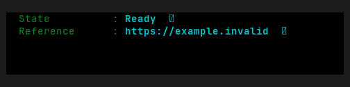
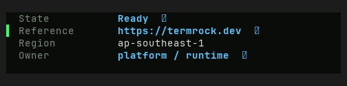
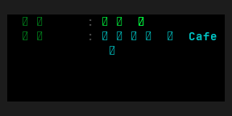
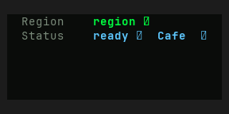

# DetailTable — Old rev vs HEAD comparison

Part of `roadmap/jackin-termrock-parity`. Produced by plan 008. The verdict
below is recorded and applied via plan 009 — never filled by an executor.

- **Family**: DetailTable
- **Old rev**: `5ff94ee117fd4a1b72fdd0d1b1847815055a93ac`
- **HEAD at comparison**: `5bcaac4b`
- **States covered**: 2 compared, 2 uncomparable, 0 HEAD-only
- **Produced by**: dedicated subagent run

## Compared states

### detail-table/basic

| Old rev | HEAD |
|---------|------|
|  |  |

Differences — every visible difference named, each classed:

| # | Difference | Class |
|---|------------|-------|
| 1 | Inner canvas changes from black to a dark green-black, while the surrounding canvas also changes tone. | palette-level |
| 2 | Labels change from bright green to muted gray. | palette-level |
| 3 | Value and capability-glyph colors shift within the cyan/blue accent palette, and the new emphasized owner value uses stronger cyan. | palette-level |
| 4 | The colon separator between each label and value is removed, shifting values one cell left. | widget-level |
| 5 | HEAD adds a bright green selection gutter on the Reference row; Old rev has no selection marker. | widget-level |
| 6 | Reference value changes from `https://example.invalid` to `https://termrock.dev`. | widget-level |
| 7 | HEAD adds visible Region and Owner rows with values `ap-southeast-1` and `platform / runtime`; Old rev shows only State and Reference. | widget-level |
| 8 | HEAD adds a copy capability glyph after Owner. | widget-level |

### detail-table/unicode

| Old rev | HEAD |
|---------|------|
|  |  |

Differences — every visible difference named, each classed:

| # | Difference | Class |
|---|------------|-------|
| 1 | Inner canvas changes from black to a dark green-black, while the surrounding canvas also changes tone. | palette-level |
| 2 | Label styling changes from bright green to muted gray. | palette-level |
| 3 | Emphasized first-row value changes from cyan to bright green; second-row value and copy glyph remain accent-colored but use the newer cyan/blue palette. | palette-level |
| 4 | Labels change from Japanese `地域` and `状態` to English `Region` and `Status`. | widget-level |
| 5 | Values change from `東京 🇯🇵` and `準備完了 ✅ Café` to `region 🇯🇵` and `ready ✅ Café`. | widget-level |
| 6 | The colon separator between each label and value is removed, shifting values one cell left. | widget-level |
| 7 | Old rev's longer Status value wraps onto a continuation line; HEAD's shorter replacement fits on one line. | widget-level |

## Uncomparable states

States with a HEAD story but no Old-rev construction path, from the
old-rev harness uncomparable list (reasons verbatim):

| Story id | Reason |
|----------|--------|
| detail-table/in-app | - `detail-table/in-app` (DetailTable): component exists at 5ff94ee1 but this state has no Old-rev story counterpart and no equivalent public-constructor setup was defined at the pin |
| detail-table/narrow | - `detail-table/narrow` (DetailTable): component exists at 5ff94ee1 but this state has no Old-rev story counterpart and no equivalent public-constructor setup was defined at the pin |

## HEAD-only states

HEAD states with no Old-rev render and no uncomparable entry (added after
the harness ran) — visible here, not compared:

None.

## Verdict

**Verdict**: _pending_
<!-- Allowed values: merge | restore | accept (merge = expected default: jackin-era base, current improvements kept on top; restore = Old-rev look; accept = record the divergence). The user rules (D1): replace `_pending_` with exactly one value — nothing else on the line. Plan 009 appends an `**Applied**: <date>` line below after application. -->
