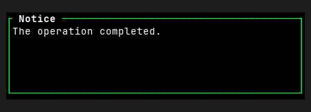
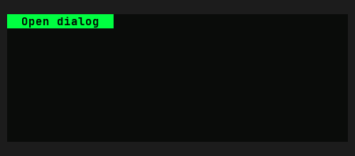
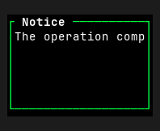
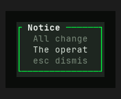

# Dialog — Old rev vs HEAD comparison

Part of `roadmap/jackin-termrock-parity`. Produced by plan 008. The verdict
below is recorded and applied via plan 009 — never filled by an executor.

- **Family**: Dialog
- **Old rev**: `5ff94ee117fd4a1b72fdd0d1b1847815055a93ac`
- **HEAD at comparison**: `5bcaac4b`
- **States covered**: 2 compared, 4 uncomparable, 0 HEAD-only
- **Produced by**: dedicated subagent run

## Compared states

### dialog/message

| Old rev | HEAD |
|---------|------|
|  |  |

Differences — every visible difference named, each classed:

| # | Difference | Class |
|---|------------|-------|
| 1 | Preview height grows from 162 px (9 cells) to 198 px (11 cells), adding two rows of empty surface. | widget-level |
| 2 | The Old rev shows an open, single-line bordered dialog; HEAD shows a borderless inset surface with the dialog closed. | widget-level |
| 3 | The bordered `Notice` title is replaced by a solid green `Open dialog` trigger at the upper left. | widget-level |
| 4 | The body text `The operation completed.` is removed, leaving the HEAD inset surface empty below the trigger. | widget-level |
| 5 | Green emphasis changes from the dialog border line to a filled trigger background with dark trigger text. | widget-level |

### dialog/narrow

| Old rev | HEAD |
|---------|------|
|  |  |

Differences — every visible difference named, each classed:

| # | Difference | Class |
|---|------------|-------|
| 1 | The dialog contracts from an almost full-width, six-row box to a centered, narrower five-row box. | widget-level |
| 2 | HEAD adds a larger black backdrop around the contracted dialog instead of placing the dialog directly against the preview canvas. | widget-level |
| 3 | The dialog interior changes from black to a lighter green-gray surface. | palette-level |
| 4 | The border changes from bright phosphor green to a darker green. | palette-level |
| 5 | The title gains a green leading dash and additional left inset before `Notice`; its border-line continuation also starts later. | widget-level |
| 6 | Body content gains horizontal inset and changes from one left-aligned, clipped line (`The operation comp`) to three stacked lines. | widget-level |
| 7 | HEAD adds dim secondary lines (`All change` and `esc dismis`) around the bright primary `The operat` line; Old rev has only uniformly bright body text. | widget-level |

## Uncomparable states

States with a HEAD story but no Old-rev construction path, from the
old-rev harness uncomparable list (reasons verbatim):

| Story id | Reason |
|----------|--------|
| dialog/compact | - `dialog/compact` (Dialog): component exists at 5ff94ee1 but this state has no Old-rev story counterpart and no equivalent public-constructor setup was defined at the pin |
| dialog/destructive | - `dialog/destructive` (Dialog): component exists at 5ff94ee1 but this state has no Old-rev story counterpart and no equivalent public-constructor setup was defined at the pin |
| dialog/in-app | - `dialog/in-app` (Dialog): component exists at 5ff94ee1 but this state has no Old-rev story counterpart and no equivalent public-constructor setup was defined at the pin |
| dialog/unicode | - `dialog/unicode` (Dialog): component exists at 5ff94ee1 but this state has no Old-rev story counterpart and no equivalent public-constructor setup was defined at the pin |

## HEAD-only states

HEAD states with no Old-rev render and no uncomparable entry (added after
the harness ran) — visible here, not compared:

None.

## Verdict

**Verdict**: _pending_
<!-- Allowed values: merge | restore | accept (merge = expected default: jackin-era base, current improvements kept on top; restore = Old-rev look; accept = record the divergence). The user rules (D1): replace `_pending_` with exactly one value — nothing else on the line. Plan 009 appends an `**Applied**: <date>` line below after application. -->
