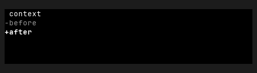
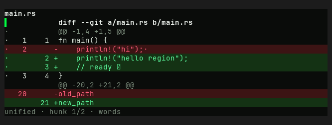

# DiffView — Old rev vs HEAD comparison

Part of `roadmap/jackin-termrock-parity`. Produced by plan 008. The verdict
below is recorded and applied via plan 009 — never filled by an executor.

- **Family**: DiffView
- **Old rev**: `5ff94ee117fd4a1b72fdd0d1b1847815055a93ac`
- **HEAD at comparison**: `5bcaac4b`
- **States covered**: 1 compared, 6 uncomparable, 0 HEAD-only
- **Produced by**: dedicated subagent run

## Compared states

### diff/basic

| Old rev | HEAD |
|---------|------|
|  |  |

Differences — every visible difference named, each classed:

| # | Difference | Class |
|---|------------|-------|
| 1 | The widget canvas grew substantially in both width and height to present a complete multi-hunk diff instead of a three-row minimal sample. | widget-level |
| 2 | The top label changed from `context` to the filename `main.rs`. | widget-level |
| 3 | HEAD added a bright vertical focus/accent marker at the left edge below the filename. | widget-level |
| 4 | HEAD added the file header `diff --git a/main.rs b/main.rs`; Old rev has no file header. | widget-level |
| 5 | HEAD added two hunk-header rows (`@@ -1,4 +1,5 @@` and `@@ -20,2 +21,2 @@`); Old rev has no hunk headers. | widget-level |
| 6 | HEAD added separate old/new line-number gutter columns; Old rev shows only raw `-` and `+` prefixes with no line numbers. | widget-level |
| 7 | The compared content changed from Old rev's single `before` removal and `after` addition to a Rust function with context lines, a removed `println!(\"hi\");`, two added lines (including `ready ✓`), and a second old/new path hunk. | widget-level |
| 8 | HEAD uses dot context markers and aligned `-`/`+` gutter markers, replacing Old rev's directly attached `-before` and `+after` markers. | widget-level |
| 9 | HEAD added full-row removal and addition fills; Old rev leaves both changed rows on the plain body background. | widget-level |
| 10 | HEAD added the footer `unified · hunk 1/2 · words`; Old rev has no footer or view-status chrome. | widget-level |
| 11 | The body background changed from pure black to a green-tinted near-black, while the surrounding canvas changed from medium charcoal to a darker neutral. | palette-level |
| 12 | Diff accents expanded from Old rev's neutral gray removal and bright-white addition to phosphor-green additions and focus marker, dark-red removals, muted-green context, and dim green-gray metadata. | palette-level |

## Uncomparable states

States with a HEAD story but no Old-rev construction path, from the
old-rev harness uncomparable list (reasons verbatim):

| Story id | Reason |
|----------|--------|
| diff-view/in-app | - `diff-view/in-app` (DiffView): component exists at 5ff94ee1 but this state has no Old-rev story counterpart and no equivalent public-constructor setup was defined at the pin |
| diff/narrow | - `diff/narrow` (DiffView): component exists at 5ff94ee1 but this state has no Old-rev story counterpart and no equivalent public-constructor setup was defined at the pin |
| diff/search | - `diff/search` (DiffView): component exists at 5ff94ee1 but this state has no Old-rev story counterpart and no equivalent public-constructor setup was defined at the pin |
| diff/split | - `diff/split` (DiffView): component exists at 5ff94ee1 but this state has no Old-rev story counterpart and no equivalent public-constructor setup was defined at the pin |
| diff/unicode | - `diff/unicode` (DiffView): component exists at 5ff94ee1 but this state has no Old-rev story counterpart and no equivalent public-constructor setup was defined at the pin |
| diff/word | - `diff/word` (DiffView): component exists at 5ff94ee1 but this state has no Old-rev story counterpart and no equivalent public-constructor setup was defined at the pin |

## HEAD-only states

HEAD states with no Old-rev render and no uncomparable entry (added after
the harness ran) — visible here, not compared:

None.

## Verdict

**Verdict**: _pending_
<!-- Allowed values: merge | restore | accept (merge = expected default: jackin-era base, current improvements kept on top; restore = Old-rev look; accept = record the divergence). The user rules (D1): replace `_pending_` with exactly one value — nothing else on the line. Plan 009 appends an `**Applied**: <date>` line below after application. -->
