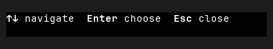
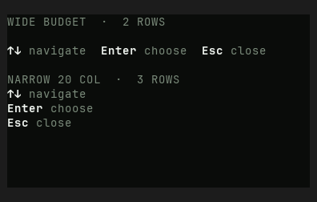

# HintBar — Old rev vs HEAD comparison

Part of `roadmap/jackin-termrock-parity`. Produced by plan 008. The verdict
below is recorded and applied via plan 009 — never filled by an executor.

- **Family**: HintBar
- **Old rev**: `5ff94ee117fd4a1b72fdd0d1b1847815055a93ac`
- **HEAD at comparison**: `5bcaac4b`
- **States covered**: 1 compared, 2 uncomparable, 0 HEAD-only
- **Produced by**: dedicated subagent run

## Compared states

### hint-bar/wrapped

| Old rev | HEAD |
|---------|------|
|  |  |

Differences — every visible difference named, each classed:

| # | Difference | Class |
|---|------------|-------|
| 1 | Preview height increased from 72 px (four terminal rows including surround padding) to 252 px (14 rows), expanding the story canvas from a single demonstration to a measured wrapping showcase. | widget-level |
| 2 | HEAD adds the `WIDE BUDGET · 2 ROWS` and `NARROW 20 COL · 3 ROWS` measurement captions; Old rev has no captions. | widget-level |
| 3 | HEAD adds an intentional blank leading spacer row before the wide hint row; Old rev places its only hint row at the top of the content area. | widget-level |
| 4 | HEAD adds a second, 20-column narrow rendering beneath the wide rendering; Old rev shows only the full-width rendering. | widget-level |
| 5 | In the added narrow rendering, the three key-label pairs wrap onto separate rows (`↑↓ navigate`, `Enter choose`, `Esc close`) instead of remaining on one horizontal row as in Old rev. | widget-level |
| 6 | Hint labels change from neutral light gray in Old rev to muted phosphor green in HEAD, while key chords remain bright white. | palette-level |
| 7 | HEAD measurement captions use muted phosphor green text, introducing a themed secondary-text tier absent from the Old-rev story. | palette-level |

## Uncomparable states

States with a HEAD story but no Old-rev construction path, from the
old-rev harness uncomparable list (reasons verbatim):

| Story id | Reason |
|----------|--------|
| hint-bar/narrow | - `hint-bar/narrow` (HintBar): component exists at 5ff94ee1 but this state has no Old-rev story counterpart and no equivalent public-constructor setup was defined at the pin |
| hint-bar/unicode | - `hint-bar/unicode` (HintBar): component exists at 5ff94ee1 but this state has no Old-rev story counterpart and no equivalent public-constructor setup was defined at the pin |

## HEAD-only states

HEAD states with no Old-rev render and no uncomparable entry (added after
the harness ran) — visible here, not compared:

None.

## Verdict

**Verdict**: _pending_
<!-- Allowed values: merge | restore | accept (merge = expected default: jackin-era base, current improvements kept on top; restore = Old-rev look; accept = record the divergence). The user rules (D1): replace `_pending_` with exactly one value — nothing else on the line. Plan 009 appends an `**Applied**: <date>` line below after application. -->
