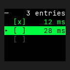
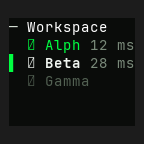
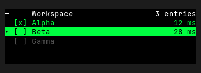
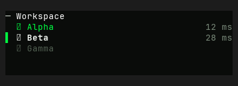
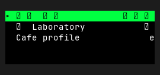
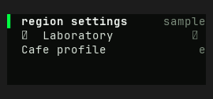

# List — Old rev vs HEAD comparison

Part of `roadmap/jackin-termrock-parity`. Produced by plan 008. The verdict
below is recorded and applied via plan 009 — never filled by an executor.

- **Family**: List
- **Old rev**: `5ff94ee117fd4a1b72fdd0d1b1847815055a93ac`
- **HEAD at comparison**: `5bcaac4b`
- **States covered**: 3 compared, 12 uncomparable, 0 HEAD-only
- **Produced by**: dedicated subagent run

## Compared states

### list/narrow

| Old rev | HEAD |
|---------|------|
|  |  |

Differences — every visible difference named, each classed:

| # | Difference | Class |
|---|------------|-------|
| 1 | List canvas changed from black to a green-tinted near-black. | palette-level |
| 2 | Neutral and muted text changed from bright white and gray to softer off-white and olive-gray. | palette-level |
| 3 | Narrow separator header changed from a lone left rule plus right-aligned `3 entries` to a left-aligned `─ Workspace`; the count is elided instead of the label. | widget-level |
| 4 | Narrow row contraction changed: Old rev elides all item labels while retaining selection boxes and both available timings; HEAD retains `Alpha`, `Beta`, and `Gamma`, retains the first two timings, and elides Gamma's absent trailing value. | widget-level |
| 5 | Multi-selection markers changed from bracketed `[x]` / `[ ]` glyphs to compact checked / unchecked box glyphs. | widget-level |
| 6 | Active-row chrome changed from a leading arrow and full-width bright-green fill to a bright-green left gutter, unfilled row, and emphasized `Beta` label. | widget-level |
| 7 | Selection and membership color treatment separated: Old rev uses the same green emphasis across the filled active row, while HEAD uses white for active `Beta`, green for checked `Alpha`, and muted colors for trailing values. | widget-level |

### list/selection

| Old rev | HEAD |
|---------|------|
|  |  |

Differences — every visible difference named, each classed:

| # | Difference | Class |
|---|------------|-------|
| 1 | List canvas changed from black to a green-tinted near-black. | palette-level |
| 2 | Neutral and muted text changed from bright white and gray to softer off-white and olive-gray. | palette-level |
| 3 | Separator header changed from centered `Workspace` with right-aligned `3 entries` to left-aligned `─ Workspace`; the entry count was removed. | widget-level |
| 4 | Multi-selection markers changed from bracketed `[x]` / `[ ]` glyphs to compact checked / unchecked box glyphs. | widget-level |
| 5 | Active-row chrome changed from a leading arrow and full-width bright-green fill to a bright-green left gutter, unfilled row, and emphasized `Beta` label. | widget-level |
| 6 | Selection and membership color treatment separated: Old rev colors the entire active row green/black, while HEAD gives active `Beta` white emphasis, checked `Alpha` green emphasis, and both timing values muted styling. | widget-level |

### list/unicode

| Old rev | HEAD |
|---------|------|
|  |  |

Differences — every visible difference named, each classed:

| # | Difference | Class |
|---|------------|-------|
| 1 | List canvas changed from black to a green-tinted near-black. | palette-level |
| 2 | Neutral and trailing text changed from bright white to softer off-white and olive-gray. | palette-level |
| 3 | First-row content changed from CJK label and trailing text rendered as replacement glyphs to the readable ASCII label `region settings` and trailing value `sample`. | widget-level |
| 4 | Active-row chrome changed from a leading arrow and full-width bright-green fill to a bright-green left gutter, unfilled row, and emphasized primary label. | widget-level |
| 5 | Active-row trailing treatment changed from black text on the green selection fill to muted right-aligned text on the canvas. | widget-level |

## Uncomparable states

States with a HEAD story but no Old-rev construction path, from the
old-rev harness uncomparable list (reasons verbatim):

| Story id | Reason |
|----------|--------|
| capability/ascii-glyphs | - `capability/ascii-glyphs` (List): component exists at 5ff94ee1 but this state has no Old-rev story counterpart and no equivalent public-constructor setup was defined at the pin |
| list/ascii | - `list/ascii` (List): component exists at 5ff94ee1 but this state has no Old-rev story counterpart and no equivalent public-constructor setup was defined at the pin |
| list/comfortable | - `list/comfortable` (List): component exists at 5ff94ee1 but this state has no Old-rev story counterpart and no equivalent public-constructor setup was defined at the pin |
| list/composed-row | - `list/composed-row` (List): component exists at 5ff94ee1 but this state has no Old-rev story counterpart and no equivalent public-constructor setup was defined at the pin |
| list/disabled | - `list/disabled` (List): component exists at 5ff94ee1 but this state has no Old-rev story counterpart and no equivalent public-constructor setup was defined at the pin |
| list/empty | - `list/empty` (List): component exists at 5ff94ee1 but this state has no Old-rev story counterpart and no equivalent public-constructor setup was defined at the pin |
| list/groups | - `list/groups` (List): component exists at 5ff94ee1 but this state has no Old-rev story counterpart and no equivalent public-constructor setup was defined at the pin |
| list/in-app | - `list/in-app` (List): component exists at 5ff94ee1 but this state has no Old-rev story counterpart and no equivalent public-constructor setup was defined at the pin |
| list/loading | - `list/loading` (List): component exists at 5ff94ee1 but this state has no Old-rev story counterpart and no equivalent public-constructor setup was defined at the pin |
| list/multi | - `list/multi` (List): component exists at 5ff94ee1 but this state has no Old-rev story counterpart and no equivalent public-constructor setup was defined at the pin |
| list/search | - `list/search` (List): component exists at 5ff94ee1 but this state has no Old-rev story counterpart and no equivalent public-constructor setup was defined at the pin |
| list/tiny | - `list/tiny` (List): component exists at 5ff94ee1 but this state has no Old-rev story counterpart and no equivalent public-constructor setup was defined at the pin |

## HEAD-only states

HEAD states with no Old-rev render and no uncomparable entry (added after
the harness ran) — visible here, not compared:

None.

## Verdict

**Verdict**: _pending_
<!-- Allowed values: merge | restore | accept (merge = expected default: jackin-era base, current improvements kept on top; restore = Old-rev look; accept = record the divergence). The user rules (D1): replace `_pending_` with exactly one value — nothing else on the line. Plan 009 appends an `**Applied**: <date>` line below after application. -->
