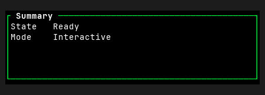
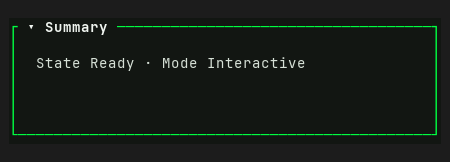

# Panel — Old rev vs HEAD comparison

Part of `roadmap/jackin-termrock-parity`. Produced by plan 008. The verdict
below is recorded and applied via plan 009 — never filled by an executor.

- **Family**: Panel
- **Old rev**: `5ff94ee117fd4a1b72fdd0d1b1847815055a93ac`
- **HEAD at comparison**: `5bcaac4b`
- **States covered**: 1 compared, 10 uncomparable, 0 HEAD-only
- **Produced by**: dedicated subagent run

## Compared states

### panel/focused

| Old rev | HEAD |
|---------|------|
|  |  |

Differences — every visible difference named, each classed:

| # | Difference | Class |
|---|------------|-------|
| 1 | Panel interior changed from black to a dark green-tinted canvas fill. | palette-level |
| 2 | A downward disclosure glyph was added before the `Summary` title, shifting the title right. | widget-level |
| 3 | Body changed from two vertically stacked `State` and `Mode` rows to one inline row separated by a middle-dot glyph. | widget-level |
| 4 | Body content moved right from one-cell inset to a three-cell inset. | widget-level |
| 5 | Body content moved down one row, leaving a blank row below the title border. | widget-level |

## Uncomparable states

States with a HEAD story but no Old-rev construction path, from the
old-rev harness uncomparable list (reasons verbatim):

| Story id | Reason |
|----------|--------|
| `panel-stack/omission` | - `panel-stack/omission` (Panel): component exists at 5ff94ee1 but this state has no Old-rev story counterpart and no equivalent public-constructor setup was defined at the pin |
| `panel/actions` | - `panel/actions` (Panel): component exists at 5ff94ee1 but this state has no Old-rev story counterpart and no equivalent public-constructor setup was defined at the pin |
| `panel/collapsible` | - `panel/collapsible` (Panel): component exists at 5ff94ee1 but this state has no Old-rev story counterpart and no equivalent public-constructor setup was defined at the pin |
| `panel/empty` | - `panel/empty` (Panel): component exists at 5ff94ee1 but this state has no Old-rev story counterpart and no equivalent public-constructor setup was defined at the pin |
| `panel/error` | - `panel/error` (Panel): component exists at 5ff94ee1 but this state has no Old-rev story counterpart and no equivalent public-constructor setup was defined at the pin |
| `panel/in-app` | - `panel/in-app` (Panel): component exists at 5ff94ee1 but this state has no Old-rev story counterpart and no equivalent public-constructor setup was defined at the pin |
| `panel/loading` | - `panel/loading` (Panel): component exists at 5ff94ee1 but this state has no Old-rev story counterpart and no equivalent public-constructor setup was defined at the pin |
| `panel/narrow` | - `panel/narrow` (Panel): component exists at 5ff94ee1 but this state has no Old-rev story counterpart and no equivalent public-constructor setup was defined at the pin |
| `panel/unicode` | - `panel/unicode` (Panel): component exists at 5ff94ee1 but this state has no Old-rev story counterpart and no equivalent public-constructor setup was defined at the pin |
| `panel/variants` | - `panel/variants` (Panel): component exists at 5ff94ee1 but this state has no Old-rev story counterpart and no equivalent public-constructor setup was defined at the pin |

## HEAD-only states

HEAD states with no Old-rev render and no uncomparable entry (added after
the harness ran) — visible here, not compared:

None.

## Verdict

**Verdict**: _pending_
<!-- Allowed values: merge | restore | accept (merge = expected default: jackin-era base, current improvements kept on top; restore = Old-rev look; accept = record the divergence). The user rules (D1): replace `_pending_` with exactly one value — nothing else on the line. Plan 009 appends an `**Applied**: <date>` line below after application. -->
