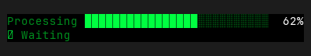
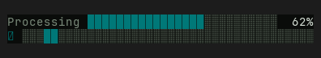
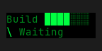
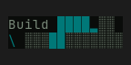
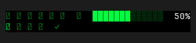
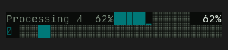

# Progress — Old rev vs HEAD comparison

Part of `roadmap/jackin-termrock-parity`. Produced by plan 008. The verdict
below is recorded and applied via plan 009 — never filled by an executor.

- **Family**: Progress
- **Old rev**: `5ff94ee117fd4a1b72fdd0d1b1847815055a93ac`
- **HEAD at comparison**: `5bcaac4b`
- **States covered**: 3 compared, 4 uncomparable, 0 HEAD-only
- **Produced by**: dedicated subagent run

## Compared states

### progress/determinate

| Old rev | HEAD |
|---------|------|
|  |  |

Differences — every visible difference named, each classed:

| # | Difference | Class |
|---|------------|-------|
| 1 | Widget canvas changes from black to a dark green-black. | palette-level |
| 2 | `Processing` changes from bright green to muted gray. | palette-level |
| 3 | Determinate fill changes from bright green to cyan/teal, and its empty track changes from dark green stipple to muted gray stipple. | palette-level |
| 4 | Second row changes from a spinner followed by the `Waiting` label to a spinner followed by a full-width stippled track with a cyan/teal moving segment; the label is removed. | widget-level |

### progress/narrow

| Old rev | HEAD |
|---------|------|
|  |  |

Differences — every visible difference named, each classed:

| # | Difference | Class |
|---|------------|-------|
| 1 | Widget canvas changes from black to a dark green-black. | palette-level |
| 2 | `Build` changes from bright green to muted gray. | palette-level |
| 3 | Determinate fill changes from bright green to cyan/teal, and its empty track changes from dark green stipple to muted gray stipple. | palette-level |
| 4 | Second row changes from the `\` spinner followed by the `Waiting` label to the same spinner followed by a stippled track with a cyan/teal moving segment; the label is removed. | widget-level |

### progress/unicode

| Old rev | HEAD |
|---------|------|
|  |  |

Differences — every visible difference named, each classed:

| # | Difference | Class |
|---|------------|-------|
| 1 | Widget canvas changes from black to a dark green-black. | palette-level |
| 2 | Text changes from bright green to muted gray, while progress fill changes from bright green to cyan/teal and the empty track changes from dark green stipple to muted gray stipple. | palette-level |
| 3 | First-row label changes from `東京を処理中 🪨` to `Processing ⏳ 62%`, replacing the Japanese text and rock emoji. | widget-level |
| 4 | Determinate value changes from 50% to 62%. | widget-level |
| 5 | HEAD's injected `Processing ⏳ 62%` text overwrites the left portion of the determinate bar, leaving only its right-hand bar suffix visible and showing a second retained `62%` at the far right; Old rev shows one intact label, one intact bar, and one `50%`. | widget-level |
| 6 | Second row changes from a spinner followed by the `検証中 ✓` label to a spinner followed by a full-width stippled track with a cyan/teal moving segment; the Japanese label and check mark are removed. | widget-level |

## Uncomparable states

States with a HEAD story but no Old-rev construction path, from the
old-rev harness uncomparable list (reasons verbatim):

| Story id | Reason |
|----------|--------|
| progress/detailed | - `progress/detailed` (Progress): component exists at 5ff94ee1 but this state has no Old-rev story counterpart and no equivalent public-constructor setup was defined at the pin |
| progress/failed | - `progress/failed` (Progress): component exists at 5ff94ee1 but this state has no Old-rev story counterpart and no equivalent public-constructor setup was defined at the pin |
| progress/in-app | - `progress/in-app` (Progress): component exists at 5ff94ee1 but this state has no Old-rev story counterpart and no equivalent public-constructor setup was defined at the pin |
| progress/multi-line | - `progress/multi-line` (Progress): component exists at 5ff94ee1 but this state has no Old-rev story counterpart and no equivalent public-constructor setup was defined at the pin |

## HEAD-only states

HEAD states with no Old-rev render and no uncomparable entry (added after
the harness ran) — visible here, not compared:

None.

## Verdict

**Verdict**: _pending_
<!-- Allowed values: merge | restore | accept (merge = expected default: jackin-era base, current improvements kept on top; restore = Old-rev look; accept = record the divergence). The user rules (D1): replace `_pending_` with exactly one value — nothing else on the line. Plan 009 appends an `**Applied**: <date>` line below after application. -->
