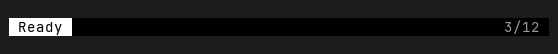
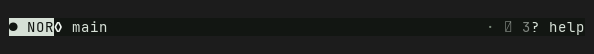
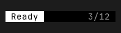
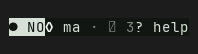

# StatusBar — Old rev vs HEAD comparison

Part of `roadmap/jackin-termrock-parity`. Produced by plan 008. The verdict
below is recorded and applied via plan 009 — never filled by an executor.

- **Family**: StatusBar
- **Old rev**: `5ff94ee117fd4a1b72fdd0d1b1847815055a93ac`
- **HEAD at comparison**: `5bcaac4b`
- **States covered**: 2 compared, 6 uncomparable, 0 HEAD-only
- **Produced by**: dedicated subagent run

## Compared states

### status-bar/basic

| Old rev | HEAD |
|---------|------|
|  |  |

Differences — every visible difference named, each classed:

| # | Difference | Class |
|---|------------|-------|
| 1 | Status-band background changes from black to a subtly green-tinted near-black. | palette-level |
| 2 | The reversed leading-slot fill changes from white to a muted pale green, and its dark text takes on the newer green-black tone. | palette-level |
| 3 | Unreversed status text changes from neutral white/gray to the newer muted gray-green and bright-green role colors. | palette-level |
| 4 | Leading content changes from the plain `Ready` state label to a mode segment with a dot glyph and `NOR` label. | widget-level |
| 5 | HEAD adds a center focus-zone segment, rendered with a diamond glyph and `main`; Old rev leaves that middle span empty. | widget-level |
| 6 | HEAD adds muted dot separators between status segments; Old rev has no separators. | widget-level |
| 7 | The trailing plain `3/12` counter becomes a glyph-marked selection segment and gains a separate `? help` shortcut segment. | widget-level |
| 8 | Story width increases from 60 to 64 cells, making the HEAD status band four cells wider. | widget-level |

### status-bar/narrow

| Old rev | HEAD |
|---------|------|
|  |  |

Differences — every visible difference named, each classed:

| # | Difference | Class |
|---|------------|-------|
| 1 | Status-band background changes from black to a subtly green-tinted near-black. | palette-level |
| 2 | The reversed leading-slot fill changes from white to a muted pale green, and its dark text takes on the newer green-black tone. | palette-level |
| 3 | Unreversed status text changes from neutral white/gray to the newer muted gray-green and bright-green role colors. | palette-level |
| 4 | Leading content changes from the complete plain `Ready` label to a dot-marked mode segment whose `NOR` label contracts to `NO` at this width. | widget-level |
| 5 | HEAD adds a diamond-marked focus-zone segment; `main` contracts to `ma`, while Old rev has no center segment. | widget-level |
| 6 | HEAD adds muted dot separators and fills the former empty middle span with prioritized segments. | widget-level |
| 7 | The trailing plain `3/12` counter is replaced by a glyph-marked, contracted selection segment plus a visible `? help` shortcut segment. | widget-level |

## Uncomparable states

States with a HEAD story but no Old-rev construction path, from the
old-rev harness uncomparable list (reasons verbatim):

| Story id | Reason |
|----------|--------|
| status-bar/hover | - `status-bar/hover` (StatusBar): component exists at 5ff94ee1 but this state has no Old-rev story counterpart and no equivalent public-constructor setup was defined at the pin |
| status-bar/in-app | - `status-bar/in-app` (StatusBar): component exists at 5ff94ee1 but this state has no Old-rev story counterpart and no equivalent public-constructor setup was defined at the pin |
| status-bar/minimal | - `status-bar/minimal` (StatusBar): component exists at 5ff94ee1 but this state has no Old-rev story counterpart and no equivalent public-constructor setup was defined at the pin |
| status-bar/rich | - `status-bar/rich` (StatusBar): component exists at 5ff94ee1 but this state has no Old-rev story counterpart and no equivalent public-constructor setup was defined at the pin |
| status-bar/transient | - `status-bar/transient` (StatusBar): component exists at 5ff94ee1 but this state has no Old-rev story counterpart and no equivalent public-constructor setup was defined at the pin |
| status-bar/unicode | - `status-bar/unicode` (StatusBar): component exists at 5ff94ee1 but this state has no Old-rev story counterpart and no equivalent public-constructor setup was defined at the pin |

## HEAD-only states

HEAD states with no Old-rev render and no uncomparable entry (added after
the harness ran) — visible here, not compared:

None.

## Verdict

**Verdict**: _pending_
<!-- Allowed values: merge | restore | accept (merge = expected default: jackin-era base, current improvements kept on top; restore = Old-rev look; accept = record the divergence). The user rules (D1): replace `_pending_` with exactly one value — nothing else on the line. Plan 009 appends an `**Applied**: <date>` line below after application. -->
