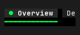
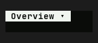
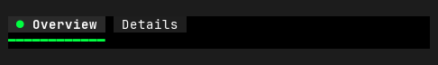
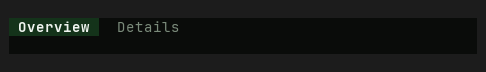

# Tabs — Old rev vs HEAD comparison

Part of `roadmap/jackin-termrock-parity`. Produced by plan 008. The verdict
below is recorded and applied via plan 009 — never filled by an executor.

- **Family**: Tabs
- **Old rev**: `5ff94ee117fd4a1b72fdd0d1b1847815055a93ac`
- **HEAD at comparison**: `5bcaac4b`
- **States covered**: 2 compared, 9 uncomparable, 0 HEAD-only
- **Produced by**: dedicated subagent run

## Compared states

### tabs/narrow

| Old rev | HEAD |
|---------|------|
|  |  |

Differences — every visible difference named, each classed:

| # | Difference | Class |
|---|------------|-------|
| 1 | Tab-strip background changes from black to a subtly green-tinted near-black. | palette-level |
| 2 | Selected-tab fill changes from charcoal to a pale gray-green, while its label changes from white to dark green-black. | palette-level |
| 3 | The selected tab loses its leading bright-green dot marker. | widget-level |
| 4 | The bright-green underline beneath the selected tab is removed. | widget-level |
| 5 | Old rev exposes a vertical divider and the clipped `De` prefix of the next tab; HEAD hides the next tab and instead adds a down-triangle overflow trigger inside the selected tab. | widget-level |
| 6 | Removing the leading marker and adjacent divider compacts and left-aligns the selected `Overview` label within a narrower tab. | widget-level |

### tabs/status

| Old rev | HEAD |
|---------|------|
|  |  |

Differences — every visible difference named, each classed:

| # | Difference | Class |
|---|------------|-------|
| 1 | Tab-strip background changes from black to a subtly green-tinted near-black. | palette-level |
| 2 | Selected-tab fill changes from charcoal to dark green, and the selected label changes from white to pale gray-green. | palette-level |
| 3 | The inactive `Details` label changes from bright white to muted gray-green. | palette-level |
| 4 | The selected tab loses its leading bright-green dot marker. | widget-level |
| 5 | The bright-green underline beneath the selected tab is removed. | widget-level |
| 6 | The vertical divider between `Overview` and `Details` is removed. | widget-level |
| 7 | The inactive `Details` tab loses its distinct charcoal tile fill and instead sits directly on the shared strip background. | widget-level |
| 8 | Removing the marker and divider compacts both labels leftward and reduces the horizontal footprint of the two-tab group. | widget-level |

## Uncomparable states

States with a HEAD story but no Old-rev construction path, from the
old-rev harness uncomparable list (reasons verbatim):

| Story id | Reason |
|----------|--------|
| tabs/closable | - `tabs/closable` (Tabs): component exists at 5ff94ee1 but this state has no Old-rev story counterpart and no equivalent public-constructor setup was defined at the pin |
| tabs/disabled | - `tabs/disabled` (Tabs): component exists at 5ff94ee1 but this state has no Old-rev story counterpart and no equivalent public-constructor setup was defined at the pin |
| tabs/focused | - `tabs/focused` (Tabs): component exists at 5ff94ee1 but this state has no Old-rev story counterpart and no equivalent public-constructor setup was defined at the pin |
| tabs/hover | - `tabs/hover` (Tabs): component exists at 5ff94ee1 but this state has no Old-rev story counterpart and no equivalent public-constructor setup was defined at the pin |
| tabs/in-app | - `tabs/in-app` (Tabs): component exists at 5ff94ee1 but this state has no Old-rev story counterpart and no equivalent public-constructor setup was defined at the pin |
| tabs/manual | - `tabs/manual` (Tabs): component exists at 5ff94ee1 but this state has no Old-rev story counterpart and no equivalent public-constructor setup was defined at the pin |
| tabs/overflow | - `tabs/overflow` (Tabs): component exists at 5ff94ee1 but this state has no Old-rev story counterpart and no equivalent public-constructor setup was defined at the pin |
| tabs/unicode | - `tabs/unicode` (Tabs): component exists at 5ff94ee1 but this state has no Old-rev story counterpart and no equivalent public-constructor setup was defined at the pin |
| tabs/vertical | - `tabs/vertical` (Tabs): component exists at 5ff94ee1 but this state has no Old-rev story counterpart and no equivalent public-constructor setup was defined at the pin |

## HEAD-only states

HEAD states with no Old-rev render and no uncomparable entry (added after
the harness ran) — visible here, not compared:

None.

## Verdict

**Verdict**: _pending_
<!-- Allowed values: merge | restore | accept (merge = expected default: jackin-era base, current improvements kept on top; restore = Old-rev look; accept = record the divergence). The user rules (D1): replace `_pending_` with exactly one value — nothing else on the line. Plan 009 appends an `**Applied**: <date>` line below after application. -->
