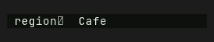

# TextInput — Old rev vs HEAD comparison

Part of `roadmap/jackin-termrock-parity`. Produced by plan 008. The verdict
below is recorded and applied via plan 009 — never filled by an executor.

- **Family**: TextInput
- **Old rev**: `5ff94ee117fd4a1b72fdd0d1b1847815055a93ac`
- **HEAD at comparison**: `5bcaac4b`
- **States covered**: 1 compared, 8 uncomparable, 0 HEAD-only
- **Produced by**: dedicated subagent run

## Compared states

### text-input/unicode

| Old rev | HEAD |
|---------|------|
|  |  |

Differences — every visible difference named, each classed:

| # | Difference | Class |
|---|------------|-------|
| 1 | Input value prefix changed from the two CJK characters `東京` (rendered as two double-width fallback boxes) to the six ASCII characters `region`; the following cursor and `Café` suffix retain their horizontal positions. | widget-level |
| 2 | Input-well background changed from a lighter charcoal-green to a darker near-black green. | palette-level |
| 3 | Value text changed from bright neutral white/gray to the HEAD palette's softer green-gray foreground. | palette-level |
| 4 | The cursor-highlighted emoji fallback glyph changed from bright phosphor green to the HEAD palette's pale green-gray accent. | palette-level |

## Uncomparable states

States with a HEAD story but no Old-rev construction path, from the
old-rev harness uncomparable list (reasons verbatim):

| Story id | Reason |
|----------|--------|
| text-input/basic | - `text-input/basic` (TextInput): component exists at 5ff94ee1 but this state has no Old-rev story counterpart and no equivalent public-constructor setup was defined at the pin |
| text-input/disabled | - `text-input/disabled` (TextInput): component exists at 5ff94ee1 but this state has no Old-rev story counterpart and no equivalent public-constructor setup was defined at the pin |
| text-input/focused | - `text-input/focused` (TextInput): component exists at 5ff94ee1 but this state has no Old-rev story counterpart and no equivalent public-constructor setup was defined at the pin |
| text-input/in-app | - `text-input/in-app` (TextInput): component exists at 5ff94ee1 but this state has no Old-rev story counterpart and no equivalent public-constructor setup was defined at the pin |
| text-input/invalid | - `text-input/invalid` (TextInput): component exists at 5ff94ee1 but this state has no Old-rev story counterpart and no equivalent public-constructor setup was defined at the pin |
| text-input/narrow | - `text-input/narrow` (TextInput): component exists at 5ff94ee1 but this state has no Old-rev story counterpart and no equivalent public-constructor setup was defined at the pin |
| text-input/prefix | - `text-input/prefix` (TextInput): component exists at 5ff94ee1 but this state has no Old-rev story counterpart and no equivalent public-constructor setup was defined at the pin |
| text-input/secret | - `text-input/secret` (TextInput): component exists at 5ff94ee1 but this state has no Old-rev story counterpart and no equivalent public-constructor setup was defined at the pin |

## HEAD-only states

HEAD states with no Old-rev render and no uncomparable entry (added after
the harness ran) — visible here, not compared:

None.

## Verdict

**Verdict**: _pending_
<!-- Allowed values: merge | restore | accept (merge = expected default: jackin-era base, current improvements kept on top; restore = Old-rev look; accept = record the divergence). The user rules (D1): replace `_pending_` with exactly one value — nothing else on the line. Plan 009 appends an `**Applied**: <date>` line below after application. -->
