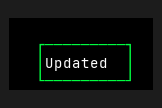
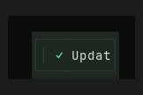
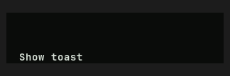

# Toast — Old rev vs HEAD comparison

Part of `roadmap/jackin-termrock-parity`. Produced by plan 008. The verdict
below is recorded and applied via plan 009 — never filled by an executor.

- **Family**: Toast
- **Old rev**: `5ff94ee117fd4a1b72fdd0d1b1847815055a93ac`
- **HEAD at comparison**: `5bcaac4b`
- **States covered**: 2 compared, 5 uncomparable, 0 HEAD-only
- **Produced by**: dedicated subagent run

## Compared states

### toast/narrow

| Old rev | HEAD |
|---------|------|
|  |  |

Differences — every visible difference named, each classed:

| # | Difference | Class |
|---|------------|-------|
| 1 | Canvas changed from neutral black to a green-tinted near-black. | palette-level |
| 2 | Toast border changed from a bright green single-line rectangle to a subdued dark-green container outline. | palette-level |
| 3 | Toast box became wider and taller, with increased internal padding. | widget-level |
| 4 | A green checkmark status glyph was added before the label. | widget-level |
| 5 | A dim vertical accent rule was added at the left of the toast content. | widget-level |
| 6 | The `Updated` label is clipped to `Updat` in HEAD. | widget-level |
| 7 | Label color changed from bright white to muted gray-green. | palette-level |

### toast/success

| Old rev | HEAD |
|---------|------|
|  |  |

Differences — every visible difference named, each classed:

| # | Difference | Class |
|---|------------|-------|
| 1 | Canvas changed from neutral black to a green-tinted near-black. | palette-level |
| 2 | The right-aligned bordered `Updated` toast is absent in HEAD. | widget-level |
| 3 | HEAD adds an unboxed `Show toast` trigger label at the lower left. | widget-level |
| 4 | Visible content alignment changed from right-centered to lower-left. | widget-level |
| 5 | Text color changed from bright white to muted gray-green. | palette-level |

## Uncomparable states

States with a HEAD story but no Old-rev construction path, from the
old-rev harness uncomparable list (reasons verbatim):

| Story id | Reason |
|----------|--------|
| toast/in-app | - `toast/in-app` (Toast): component exists at 5ff94ee1 but this state has no Old-rev story counterpart and no equivalent public-constructor setup was defined at the pin |
| toast/kinds | - `toast/kinds` (Toast): component exists at 5ff94ee1 but this state has no Old-rev story counterpart and no equivalent public-constructor setup was defined at the pin |
| toast/persistent | - `toast/persistent` (Toast): component exists at 5ff94ee1 but this state has no Old-rev story counterpart and no equivalent public-constructor setup was defined at the pin |
| toast/stack | - `toast/stack` (Toast): component exists at 5ff94ee1 but this state has no Old-rev story counterpart and no equivalent public-constructor setup was defined at the pin |
| toast/unicode | - `toast/unicode` (Toast): component exists at 5ff94ee1 but this state has no Old-rev story counterpart and no equivalent public-constructor setup was defined at the pin |

## HEAD-only states

HEAD states with no Old-rev render and no uncomparable entry (added after
the harness ran) — visible here, not compared:

None.

## Verdict

**Verdict**: _pending_
<!-- Allowed values: merge | restore | accept (merge = expected default: jackin-era base, current improvements kept on top; restore = Old-rev look; accept = record the divergence). The user rules (D1): replace `_pending_` with exactly one value — nothing else on the line. Plan 009 appends an `**Applied**: <date>` line below after application. -->
