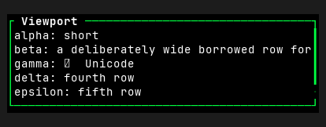
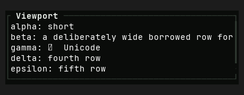

# Viewport — Old rev vs HEAD comparison

Part of `roadmap/jackin-termrock-parity`. Produced by plan 008. The verdict
below is recorded and applied via plan 009 — never filled by an executor.

- **Family**: Viewport
- **Old rev**: `5ff94ee117fd4a1b72fdd0d1b1847815055a93ac`
- **HEAD at comparison**: `5bcaac4b`
- **States covered**: 1 compared, 2 uncomparable, 0 HEAD-only
- **Produced by**: dedicated subagent run

## Compared states

### viewport/both-axes

| Old rev | HEAD |
|---------|------|
|  |  |

Differences — every visible difference named, each classed:

| # | Difference | Class |
|---|------------|-------|
| 1 | Viewport interior changed from neutral black to a green-tinted near-black canvas fill. | palette-level |
| 2 | Viewport border changed from bright phosphor green to a subdued dark green-gray while retaining the same single-line geometry. | palette-level |
| 3 | Right-edge scrollbar indicator changed from bright phosphor green to the same subdued dark green-gray, with its glyphs and placement unchanged. | palette-level |
| 4 | Title and body text changed from bright white to a slightly muted gray-white. | palette-level |

## Uncomparable states

States with a HEAD story but no Old-rev construction path, from the
old-rev harness uncomparable list (reasons verbatim):

| Story id | Reason |
|----------|--------|
| viewport/narrow | - `viewport/narrow` (Viewport): component exists at 5ff94ee1 but this state has no Old-rev story counterpart and no equivalent public-constructor setup was defined at the pin |
| viewport/unicode | - `viewport/unicode` (Viewport): component exists at 5ff94ee1 but this state has no Old-rev story counterpart and no equivalent public-constructor setup was defined at the pin |

## HEAD-only states

HEAD states with no Old-rev render and no uncomparable entry (added after
the harness ran) — visible here, not compared:

None.

## Verdict

**Verdict**: _pending_
<!-- Allowed values: merge | restore | accept (merge = expected default: jackin-era base, current improvements kept on top; restore = Old-rev look; accept = record the divergence). The user rules (D1): replace `_pending_` with exactly one value — nothing else on the line. Plan 009 appends an `**Applied**: <date>` line below after application. -->
